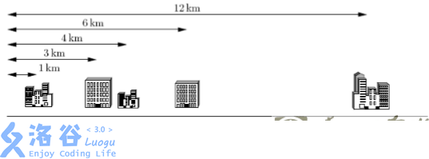

# 反悔贪心

## 题组 #1 

仅使用堆的反悔贪心。

- [P2949 [USACO09OPEN] Work Scheduling G](https://www.luogu.com.cn/problem/P2949)

- [P4053 [JSOI2007] 建筑抢修](https://www.luogu.com.cn/problem/P4053)

- [P2107 小Z的AK计划](https://www.luogu.com.cn/problem/P2107)

- [P3545 [POI2012] HUR-Warehouse Store](https://www.luogu.com.cn/problem/P3545)

- [https://www.luogu.com.cn/problem/P4823](https://www.luogu.com.cn/problem/P4823)

上述题目使用的都是最基础的反悔贪心。简单来说，就是在维护答案不劣的情况下尽可能多选。将选了的项目丢进堆中，当遇到有个项目，没有剩余空间可选时，考虑从堆中抛出最差的一项，用新物品替代它插入堆中。

## 题组 #2 

使用了堆和双向链表的反悔贪心。

### 例题 #1 种树

题目描述

cyrcyr 今天在种树，他在一条直线上挖了 $n$ 个坑。这 $n$ 个坑都可以种树，但为了保证每一棵树都有充足的养料，cyrcyr 不会在相邻的两个坑中种树。而且由于 cyrcyr 的树种不够，他至多会种 $k$ 棵树。假设 cyrcyr 有某种神能力，能预知自己在某个坑种树的获利会是多少（可能为负），请你帮助他计算出他的最大获利。

对于 $100\%$ 的数据，$1 \le n\leq 300000$，$1 \le k\leq \dfrac{n}{2}$，在一个地方种树获利的绝对值在 $10^6$ 以内。

---

这里就不是上面的反悔贪心了，而是反悔的返回贪心。我们发现如果我们继续按上面的做法，我们会遇到有个问题：如果我们撤销了j，那么原先不可选的j-1,j+1都可选了，此时我们的答案除了减去j，还要加上当前答案和 选j-1,j+1时的更优的差值。

发现了吗，现在我们的撤销操作不仅仅与被撤销的物品有关，还与其相邻的物品有关。那么怎么做呢？


我们考虑如果不选i的答案，那么我们就一定可以选i-1和i+1的答案。因此我们考虑维护有关链表


```C++
#include<bits/stdc++.h>
using namespace std;
#define int long long
#define itn int
#define mp make_pair
#define pii pair<int,int>
#define pf first 
#define ps second
#define rd read()
inline int read(){
	int x;
	cin>>x;
	return x;
}

const int N=3e5+5;
const int INF=1e9;
const int MOD=998244353;
/*

策略

*/


int pre[N],nxt[N];
bitset<N> del;
int a[N];


void delet(int x){
	if(!x)return ;
	nxt[pre[x]]=nxt[x];
	pre[nxt[x]]=pre[x];
	del[x]=1;

}

priority_queue<pii> pq;

void solve(){
	itn n=rd,K=rd;
	for(int i=1;i<=n;i++){
		a[i]=rd;
		pre[i]=i-1;
		nxt[i]=i+1;
		pq.push(mp(a[i],i));

	}

	int cnt=0;
	for(int i=1;i<=K;i++){
		while(del[pq.top().ps])pq.pop();
		if(pq.top().pf<0)break;
		cnt+=pq.top().pf;
		int x=pq.top().ps;

		pq.pop();

		a[x]=a[pre[x]]+a[nxt[x]]-a[x];
		pq.push(mp(a[x],x));
		delet(pre[x]);
		delet(nxt[x]);
	}


	cout<<cnt<<endl;

}

signed  main(){
	int T=1;
	while(T--){
		solve();
	}
	return 0;
}
```

### 例题 #2 生日礼物

题目描述

ftiasch 18 岁生日的时候，lqp18_31 给她看了一个神奇的序列 $A _ 1$, $A _ 2$, ..., $A _ N$。 她被允许选择不超过 $M$ 个连续的部分作为自己的生日礼物。

自然地，ftiasch 想要知道选择元素之和的最大值。你能帮助她吗?

输入格式

第 1 行，两个整数 $N$ ($1 \le  N \le 10 ^ {5}$ ) 和 $M$ ($0 \le M \le 10 ^ 5$)，表示序列的长度和可以选择的部分。

第 2 行， $N$ 个整数 $A_1$, $A_2$, ..., $A_N$ ($0 \le \mid A_i\mid \le 10^4$)，表示序列。

输出格式

一个整数，表示最大的和。

```C++
/*
                      Keyblinds Guide
                    ###################
      @Ntsc 2024

      - Ctrl+Alt+G then P : Enter luogu problem details
      - Ctrl+Alt+B : Run all cases in CPH
      - ctrl+D : choose this and dump to the next
      - ctrl+Shift+L : choose all like this
      - ctrl+K then ctrl+W: close all
      - Alt+la/ra : move mouse to pre/nxt pos'

*/
#include <bits/stdc++.h>
#include <queue>
using namespace std;

#define rep(i, l, r) for (int i = l, END##i = r; i <= END##i; ++i)
#define per(i, r, l) for (int i = r, END##i = l; i >= END##i; --i)
#define pb push_back
#define mp make_pair
#define int long long
#define ull unsigned long long
#define pii pair<int, int>
#define ps second
#define pf first

// #define innt int
#define itn int
// #define inr intw
// #define mian main
// #define iont int

#define rd read()
int read()
{
    int xx = 0, ff = 1;
    char ch = getchar();
    while (ch < '0' || ch > '9')
    {
        if (ch == '-')
            ff = -1;
        ch = getchar();
    }
    while (ch >= '0' && ch <= '9')
        xx = xx * 10 + (ch - '0'), ch = getchar();
    return xx * ff;
}
void write(int out)
{
    if (out < 0)
        putchar('-'), out = -out;
    if (out > 9)
        write(out / 10);
    putchar(out % 10 + '0');
}

#define ell dbg('\n')
const char el = '\n';
const bool enable_dbg = 1;
template <typename T, typename... Args>
void dbg(T s, Args... args)
{
    if constexpr (enable_dbg)
    {
        cerr << s;
        if (1) cerr << ' ';
        if constexpr (sizeof...(Args))
            dbg(args...);
    }
}

#define zerol = 1
#ifdef zerol
#define cdbg(x...)            \
    do                        \
    {                         \
        cerr << #x << " -> "; \
        err(x);               \
    } while (0)
void err()
{
    cerr << endl;
}
template <template <typename...> class T, typename t, typename... A>
void err(T<t> a, A... x)
{
    for (auto v : a) cerr << v << ' ';
    err(x...);
}
template <typename T, typename... A>
void err(T a, A... x)
{
    cerr << a << ' ';
    err(x...);
}
#else
#define dbg(...)
#endif

const int N = 3e5 + 5;
const int INF = 1e18;
const int M = 1e7;
const int MOD = 1e9 + 7;

struct node
{
    int v, id;
    bool operator<(const node &b) const
    {
        return abs(v) > abs(b.v);
    }
};

int n, m, k, x, ans, cnt = 1;
int a[N], l[N], r[N];
bool f[N];

priority_queue<node> pq;

bool check(int x)
{
    return ((0 < l[x] && r[x] < n + 1) || a[x] > 0);
}
void del(int x)
{
    f[x] = 1;
    l[r[x]] = l[x], r[l[x]] = r[x];
}

void solve()
{
    n = rd, m = rd;
    for (int i = 1; i <= n; i++)
    {
        x = rd;
        if (!x)
            continue;
        if ((x >= 0 && a[cnt] >= 0) || (x <= 0 && a[cnt] <= 0))
            a[cnt] += x;
        else
            a[++cnt] = x;
    }
    n = cnt;
    for (int i = 1; i <= n; i++)
    {
        l[i] = i - 1, r[i] = i + 1;
        if (a[i] > 0)
        {
            k++;
            ans += a[i];
        }
        pq.push({a[i], i});
    }
    while (k > m)
    {
        if (pq.empty())
            break;
        x = pq.top().id;
        pq.pop();
        if (f[x])
            continue;
        if (check(x))
        {
            ans -= abs(a[x]);
            a[x] += a[l[x]] + a[r[x]];
            del(l[x]), del(r[x]);
            pq.push({a[x], x});
            k--;
        }
    }

    cout << ans << endl;
}

signed main()
{
    // freopen(".in","r",stdin);
    // freopen(".in","w",stdout);

    int T = 1;
    while (T--)
    {
        solve();
    }
    return 0;
}
```

## 题组 #3 

使用3个堆，维护加工元素分为两组，使得经过最优的反悔贪心。

### 例题 #1 Olympiad in Programming and Sports

有 $n$ 个学生每人有两种技能，分别是 $a,b$ 表示编程能力和运动能力。你需要将他们分为两个团队分别参加编程比赛和体育比赛，编程团队有 $p$ 人，体育团队有 $s$ 人，一个学生只能参加其中一项。每个团队的力量是其成员在对应领域能力总和，请问如何分配能使得两个团队的实力和最大？

**输入**

共三行，第一行包含三个正整数 $n,p,s$。

第二行有 $n$ 个整数 $a_1,a_2\cdots a_n$，第三行，有 $n$ 个整数$b_1,b_2\cdots b_n$。

**输出**

第一行输出整个团队最大的实力，然后给出一种构造方案即可。

**数据范围**

- $2<\le n\le 3\times 10^3$ 且 $p+s\le n$。

- $1\le a_i,b_i\le 3000$。

---


```C++
/*  Erica N  */
#include <bits/stdc++.h>
using namespace std;

#define pb push_back
#define mp make_pair
#define int long long
#define ull unsigned long long
#define pii pair<int, int>
#define ps second
#define pf first
#define itn int

#define rd read()
int read(){
    int xx = 0, ff = 1;char ch = getchar();
    while (ch < '0' || ch > '9') {if (ch == '-')ff = -1; ch = getchar();}
    while (ch >= '0' && ch <= '9')xx = xx * 10 + (ch - '0'), ch = getchar();
    return xx * ff;
}

#define cdbg(x...) do { cerr << #x << " -> "; err(x); } while (0)
void err() { cerr << endl; }
template<template<typename...> class T, typename t, typename... A>
void err(T<t> a, A... x) { for (auto v: a) cerr << v << ' '; err(x...); }
template<typename T, typename... A>
void err(T a, A... x) { cerr << a << ' '; err(x...); }


const int N = 3e5 + 5;
const int INF = 1e18;
const int M = 1e7;
const int MOD = 1e9 + 7;


struct node{
    int a,b,id;
}t[N];


bool cmp(node a,node b){
    return a.a>b.a;
}

priority_queue<pii> pa,pb,pab;

set<int> ua,ub;

void solve(){
    int n=rd,p=rd,s=rd;
    for(int i=1;i<=n;i++){
        t[i].a=rd;
        t[i].id=i;
    }
    for(int i=1;i<=n;i++){
        t[i].b=rd;
    }

    int ans=0;

    sort(t+1,t+n+1,cmp);

    int sum=0;

    for(int i=1;i<=p;i++){
        pab.push(mp(t[i].b-t[i].a,i));
        ua.insert(t[i].id);
        sum+=t[i].a;
    }

    for(int i=p+1;i<=n;i++){
        pa.push(mp(t[i].a,i));
        pb.push(mp(t[i].b,i));
    }

    for(int i=1;i<=s;i++){
        while(pa.size()&&ua.find(t[pa.top().ps].id)!=ua.end())pa.pop();
        while(pa.size()&&ub.find(t[pa.top().ps].id)!=ub.end())pa.pop();
        while(pb.size()&&ub.find(t[pb.top().ps].id)!=ub.end())pb.pop();
        while(pb.size()&&ua.find(t[pb.top().ps].id)!=ua.end())pb.pop();

        int a=pab.top().pf+pa.top().pf;
        if(!pa.size())a=-INF;
        int b=pb.top().pf;
        if(a>b){
            sum+=a;
            int tb=pab.top().ps;
            ub.insert(t[tb].id);
            ua.erase(t[tb].id);
            pab.pop();
            int ta=pa.top().ps;
            ua.insert(t[ta].id);
            pa.pop();
            pab.push(mp(t[ta].b-t[ta].a,ta));
        }else{
            sum+=b;
            ub.insert(t[pb.top().ps].id);
            pb.pop();
        }
    }


    cout<<sum<<endl;
    for(auto it=ua.begin();it!=ua.end();it++){
        cout<<*it<<' ';
    }

    cout<<endl;
    
    for(auto it=ub.begin();it!=ub.end();it++){
        cout<<*it<<' ';
    }

}

signed main() {
    // freopen(".in","r",stdin);
    // freopen(".out","w",stdout);

    int T=1;
    while(T--){
    	solve();
    }
    return 0;
}
```

### 例题 #2 [USACO12FEB] Cow Coupons G

FJ 准备买一些新奶牛。市场上有 $N$ 头奶牛，第 $i$ 头奶牛价格为 $P_i$。FJ 有 $K$ 张优惠券，使用优惠券购买第 $i$ 头奶牛时价格会降为 $C_i$，当然每头奶牛只能使用一次优惠券。FJ 想知道花不超过 $M$ 的钱最多可以买多少奶牛？

- $1 \le K \le N \le 5 \times 10^4$

- $1 \le C_i \le P_i \le 10^9$

- $1 \le M \le 10^{14}$

## 练习

### 练习 #1 Buy Low Sell High

题面翻译

题目:
已知接下来N天的股票价格,每天你可以买进一股股票,卖出一股股票,或者什么也不做.N天之后你拥有的股票应为0,当然,希望这N天内能够赚足够多的钱.
输入:
第一行一个整数天数N(2<=N<=300000).
第二行N个数字p1,p2...pN(1<=pi<=10^6),表示每天的价格.
输出: N天结束后能获得的最大利润.
样例解释:
样例1:分别在价格为5,4,2的时候买入,分别在价格为9,12,10的时候卖出,总利润为$-5-4+9+12-2+10=20$ .
翻译贡献者UID：36080

---

这道题一开始也许我们并不会想到贪心，因为很明显没有明确的阶段嘛，并且好像贪心选举对后面会产生影响。

但实际上本题就是一种贪心。

我们首先考虑贪心策略。我们把每一天看成一个物品，假设当前我们在第i+1天，那么我们一共有i个物品（不排除一些物品已经被选择）。那么我们就贪心第选择差价最大的物品即可。

可是这个策略很明显只局限于当前阶段，即仅限于第i+1及以前的信息，无法顾及后面的信息。那么怎么办呢？我们可以类比网络流的反悔边，就可以大致知道做法了。假设第a天的股票在第b天卖出，但是我们发现如果其在第c天卖出会更有，那么我们就执行：买第b天的股票并且在第c天卖出。这样就等价于我们买了第a天的股票后在第c天卖出了。


那么这个物品的价值 val 究竟应该是多少呢？设第 i 天的价格为 $a_i$​，则有 $a_j​−a_i​+a_k​−val=a_k​−a_i​$，化简得 $val=a_j$​。于是，我们便设计出了一个新的算法：维护一个可重集合，代表「可选的物品的价格」。从前向后遍历每一天，对于第 i 天，找到集合中最小的价格 $a_j$​，并向集合中插入 $a_i$​，代表 $a_i$​ 这一天可选。若 $a_i​>a_j​$，则把答案加上 $a_i​−a_j​$，并向集合中再次加入 $a_i$$​$，代表假想的反悔物品，并将 $a_j$​ 从集合中删除。我们可以使用堆维护这个集合，时间复杂度 $O(n \log n)$。

---

```C++
#include<bits/stdc++.h>
using namespace std;
#define int long long
#define pii pair<int,int>
#define ps second
#define pf first
 
 
#define rd read()
inline int read(){
	int xx=0,ff=1;
	char c=getchar();
	while(c<'0'||c>'9') {if(c=='-') ff=-1;c=getchar();}
	while(c>='0'&&c<='9') xx=xx*10+(c-'0'),c=getchar();
	return xx*ff;
}
inline void write(int out){
	if(out<0) putchar('-'),out=-out;
	if(out>9) write(out/10);
	putchar(out%10+'0');
}
 
 
const int M=2e6+5;
const int N=3e5+5;
const int INF=1e9+5;
const int MOD=1e9+7;

int n,ans;
priority_queue<int> q;

signed main(){
    n=rd;
    for(int i=1;i<=n;i++){
        int k=rd;
        if(q.size()&&-q.top()<k)ans+=k+q.top(),q.pop(),q.push(-k);
        q.push(-k);
    }
    cout<<ans<<endl;
}
```

### 练习 #2 BACKUP - Backup Files

你在一家 IT 公司为大型写字楼或办公楼(offices)的计算机数据做备份。然而数据备份的工作是枯燥乏味的，因此你想设计一个系统让不同的办公楼彼此之间互相备份，而你则坐在家中尽享计算机游戏的乐趣。

已知办公楼都位于同一条街上。你决定给这些办公楼配对(两个一组)。每一对办公楼可以通过在这两个建筑物之间铺设网络电缆使得它们可以互相备份。

然而，网络电缆的费用很高。当地电信公司仅能为你提供 K 条网络电缆，这意味着你仅能为 K 对办公楼(或总计 2K 个办公楼)安排备份。任一个办公楼都属于唯一的配对组(换句话说，这 2K 个办公楼一定是相异的)。

此外，电信公司需按网络电缆的长度(公里数)收费。因而，你需要选择这 K对办公楼使得电缆的总长度尽可能短。换句话说，你需要选择这 K 对办公楼，使得每一对办公楼之间的距离之和(总距离)尽可能小。

下面给出一个示例，假定你有 5 个客户，其办公楼都在一条街上，如下图所示。这 5 个办公楼分别位于距离大街起点 1km, 3km, 4km, 6km 和 12km 处。电信公司仅为你提供 K=2 条电缆。



上例中最好的配对方案是将第 1 个和第 2 个办公楼相连，第 3 个和第 4 个办公楼相连。这样可按要求使用 K=2 条电缆。第 1 条电缆的长度是 3km―1km = 2km，第 2 条电缆的长度是 6km―4km = 2 km。这种配对方案需要总长 4km 的网络电缆，满足距离之和最小的要求。

输入输出格式

输入格式：

输入文件的第一行包含整数 n 和 k，其中 n(1≤n≤100 000)表示办公楼的数目，k(1≤k≤n/2)表示可利用的网络电缆的数目。

接下来的 n 行每行仅包含一个整数(0≤s≤1000 000 000), 表示每个办公楼到大街起点处的距离。这些整数将按照从小到大的顺序依次出现。

输出格式：

输出文件应当由一个正整数组成，给出将 2K 个相异的办公楼连成 K 对所需的网络电缆的最小总长度。

---

将$d_{i+1}-d_{i}$看作一个物品，然后选K个不相邻的物品求最小代价。


注意，将a[pre]+a[nxt]-a[x]加入时，如果不存在pre或者nxt，应当加入inf

因为在求最大值的题目中，选了不存在的等效于选0，没有影响。但是在本题中不可以选不存在的！因为这样无法构成一条链接。

```C++
#include<bits/stdc++.h>
using namespace std;
#define int long long
#define itn int
#define mp make_pair
#define pii pair<int,int>
#define pf first 
#define ps second
#define rd read()
inline int read(){
	int x;
	cin>>x;
	return x;
}

const int N=3e5+5;
const int INF=1e9;
const int MOD=998244353;
/*

策略

选择K个配对使得配对总距离最小
那么假设我们选择配对i,i+1,那么我们就不可以配对i-1,i i+1,i+2。因此
看作有i-1个点，点i代表配对i,i+1，这样就不可以选择相邻的点，和之前的一样了。

*/


int d[N],a[N];
bitset<N> del;
int pre[N],nxt[N];
priority_queue<pii>pq;

void delet(int x){
	del[x]=1;
	pre[nxt[x]]=pre[x];
	nxt[pre[x]]=nxt[x];
}

void solve(){

	while(pq.size())pq.pop();
	del.reset();
	memset(pre,0,sizeof pre);
	memset(nxt,0,sizeof nxt);
	memset(d,0,sizeof d);
	memset(a,0,sizeof a);

	int n=rd,K=rd;
	for(int i=1;i<=n;i++){
		d[i]=rd;
	}

	for(int i=1;i<n;i++){
		a[i]=d[i+1]-d[i];
		pre[i]=i-1;
		nxt[i]=i+1;
		pq.push(mp(-a[i],i));
	}
	nxt[n-1]=0;

	int cnt=0;
	for(int i=1;i<=K;i++){
		while(del[pq.top().ps])pq.pop();
		cnt+=-pq.top().pf;
		int x=pq.top().ps;
		pq.pop();

		if(pre[x]&&nxt[x])a[x]=a[pre[x]]+a[nxt[x]]-a[x];
		else a[x]=INF;
		pq.push(mp(-a[x],x));
		delet(pre[x]);
		delet(nxt[x]);
	}


	cout<<cnt<<endl;

	
}
signed  main(){
	int T=rd;
	while(T--){

		solve();
		// if(T)puts("");
	}
	return 0;
}
```

### 练习

[www.luogu.com.cn](https://www.luogu.com.cn/training/8793#problems)


[www.luogu.com.cn](https://www.luogu.com.cn/problem/P4823)


```C++
/*                                                                                
                      Keyblinds Guide
     				###################
      @Ntsc 2024

      - Ctrl+Alt+G then P : Enter luogu problem details
      - Ctrl+Alt+B : Run all cases in CPH
      - ctrl+D : choose this and dump to the next
      - ctrl+Shift+L : choose all like this
      - ctrl+K then ctrl+W: close all
      - Alt+la/ra : move mouse to pre/nxt pos'
	  
*/
#include <bits/stdc++.h>
#include <queue>
using namespace std;

#define rep(i, l, r) for (int i = l, END##i = r; i <= END##i; ++i)
#define per(i, r, l) for (int i = r, END##i = l; i >= END##i; --i)
#define pb push_back
#define mp make_pair
#define int long long
#define ull unsigned long long
#define pii pair<int, int>
#define ps second
#define pf first

// #define innt int
#define itn int
// #define inr intw
// #define mian main
// #define iont int

#define rd read()
int read(){
    int xx = 0, ff = 1;
    char ch = getchar();
    while (ch < '0' || ch > '9') {
		if (ch == '-')
			ff = -1;
		ch = getchar();
    }
    while (ch >= '0' && ch <= '9')
      xx = xx * 10 + (ch - '0'), ch = getchar();
    return xx * ff;
}
void write(int out) {
	if (out < 0)
		putchar('-'), out = -out;
	if (out > 9)
		write(out / 10);
	putchar(out % 10 + '0');
}

#define ell dbg('\n')
const char el='\n';
const bool enable_dbg = 1;
template <typename T,typename... Args>
void dbg(T s,Args... args) {
	if constexpr (enable_dbg){
    cerr << s;
    if(1)cerr<<' ';
		if constexpr (sizeof...(Args))
			dbg(args...);
	}
}

#define zerol = 1
#ifdef zerol
#define cdbg(x...) do { cerr << #x << " -> "; err(x); } while (0)
void err() { cerr << endl; }
template<template<typename...> class T, typename t, typename... A>
void err(T<t> a, A... x) { for (auto v: a) cerr << v << ' '; err(x...); }
template<typename T, typename... A>
void err(T a, A... x) { cerr << a << ' '; err(x...); }
#else
#define dbg(...)
#endif


const int N = 3e5 + 5;
const int INF = 1e18;
const int M = 1e7;
const int MOD = 1e9 + 7;


struct node{
    int a,b;
}t[N];

int h;
bool cmp(node a,node b){
    return h-a.a-a.b>h-b.a-b.b;
}

int suf[N];

priority_queue<pii> pq;
void solve(){
    int n=rd;
    int sum=0;
    for(int i=1;i<=n;i++){
        t[i].a=rd;t[i].b=rd;

        sum+=t[i].a;
    }
    h=rd;
    sort(t+1,t+n+1,cmp);


    for(int i=n;i;i--){
        suf[i]=suf[i+1]+t[i].a;
    }

    int tot=0;
    int ans=0;
    
    for(int i=1;i<=n;i++){
        if(tot+suf[i]+t[i].b>=h){
            ans++;
            pq.push(mp(t[i].a,i));
        }else{
            if(pq.size()){
                int x=pq.top().ps;
                if(t[x].a>t[i].a){
                    pq.pop();

                    tot+=t[x].a;
                    pq.push(mp(t[i].a,i));
                }else tot+=t[i].a;
            }else tot+=t[i].a;
        }
    }


    cout<<ans<<endl;


}

signed main() {
    // freopen(".in","r",stdin);
    // freopen(".in","w",stdout);

    int T=1;
    while(T--){
    	solve();
    }
    return 0;
}
```

