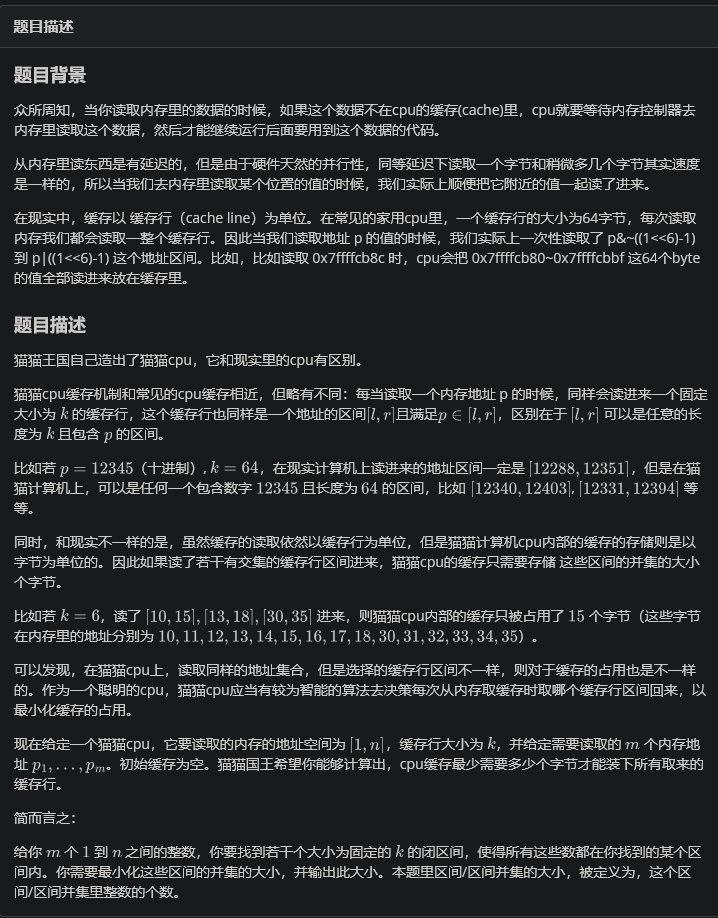
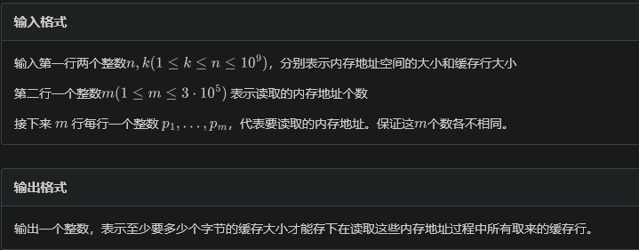

# 尺取

尺取，又称双指针，two pointers。

## 例题 #1 逛画展

题目描述

博览馆正在展出由世上最佳的 $m$ 位画家所画的图画。

游客在购买门票时必须说明两个数字，$a$ 和 $b$，代表他要看展览中的第 $a$ 幅至第 $b$ 幅画（包含 $a,b$）之间的所有图画，而门票的价钱就是一张图画一元。

Sept 希望入场后可以看到所有名师的图画。当然，他想最小化购买门票的价格。

请求出他购买门票时应选择的 $a,b$，数据保证一定有解。

若存在多组解，**输出 $a$ 最小的那组**。

输入格式

第一行两个整数 $n,m$，分别表示博览馆内的图画总数及这些图画是由多少位名师的画所绘画的。

第二行包含 $n$ 个整数 $a_i$，代表画第 $i$ 幅画的名师的编号。

输出格式

一行两个整数 $a,b$。

- 对于 $100\%$ 的数据，有 $1\leq n\le10^6$，$1 \leq a_i \leq m\le2\times10^3$。

---

```C++
/*  Erica N  */
#include <bits/stdc++.h>
using namespace std;

#define pb push_back
#define mp make_pair
#define int long long
#define ull unsigned long long
#define pii pair<int, int>
#define ps second
#define pf first
#define itn int

#define rd read()
int read(){
    int xx = 0, ff = 1;char ch = getchar();
    while (ch < '0' || ch > '9') {if (ch == '-')ff = -1; ch = getchar();}
    while (ch >= '0' && ch <= '9')xx = xx * 10 + (ch - '0'), ch = getchar();
    return xx * ff;
}

#define cdbg(x...) do { cerr << #x << " -> "; err(x); } while (0)
void err() { cerr << endl; }
template<template<typename...> class T, typename t, typename... A>
void err(T<t> a, A... x) { for (auto v: a) cerr << v << ' '; err(x...); }
template<typename T, typename... A>
void err(T a, A... x) { cerr << a << ' '; err(x...); }


const int N = 3e6 + 5;
const int INF = 1e18;
const int M = 1e7;
const int MOD = 1e9 + 7;


int vis[N];
int a[N];

void solve(){
    int n=rd,m=rd;
    int cnt=0;
    int l=1;


    for(int i=1;i<=n;i++){
        a[i]=rd;
    }

    int ansr=INF,ansl=0;
    for(int r=1;r<=n;r++){
        vis[a[r]]++;
        if(vis[a[r]]==1)cnt++;
        while(l<r&&cnt==m){
            vis[a[l]]--;
            if(!vis[a[l]])cnt--;
            l++;
        }
        if(l>1){
            l--;
            vis[a[l]]++;
            if(vis[a[l]]==1)cnt++;
        }
        if(cnt==m){
            if(r-l+1<ansr-ansl+1){
                ansr=r;
                ansl=l;
            }
        }
    }

    cout<<ansl<<' '<<ansr<<endl;
}

signed main() {
    // freopen(".in","r",stdin);
    // freopen(".out","w",stdout);

    int T=1;
    while(T--){
    	solve();
    }
    return 0;
}
```

## 例题 #2 尺取+分治 Petya and Array

有一个长度为 $n$ 的序列 $a$，和一个数 $t$，求有多少个区间 $[l,r]$ 满足 $a_l+a_{l+1}+...+a_{r} <t $ 且 $l\le r$。$a_i$ 可能为负数。

---

首先考虑分治，讨论跨mid的答案。问题转化为求多少给(r,l)使得$pre_r-pre_{l-1}<t$。

我们注意到要求是应该连续的子串和，a不可以排序，但是pre可以啊！

pre只是代表一个前缀和，排序后由不是代表将a排序，所以是可以排序的。因此让左右两部分别排序，然后尺取即可。

尺取在分治（后缀cdq分治）中是很常用的手段。

```C++
/*  Erica N  */
#include <bits/stdc++.h>
using namespace std;

#define pb push_back
#define mp make_pair
#define int long long
#define ull unsigned long long
#define pii pair<int, int>
#define ps second
#define pf first
#define itn int

#define rd read()
int read(){
    int xx = 0, ff = 1;char ch = getchar();
    while (ch < '0' || ch > '9') {if (ch == '-')ff = -1; ch = getchar();}
    while (ch >= '0' && ch <= '9')xx = xx * 10 + (ch - '0'), ch = getchar();
    return xx * ff;
}

#define cdbg(x...) do { cerr << #x << " -> "; err(x); } while (0)
void err() { cerr << endl; }
template<template<typename...> class T, typename t, typename... A>
void err(T<t> a, A... x) { for (auto v: a) cerr << v << ' '; err(x...); }
template<typename T, typename... A>
void err(T a, A... x) { cerr << a << ' '; err(x...); }


const int N = 3e5 + 5;
const int INF = 1e18;
const int M = 1e7;
const int MOD = 1e9 + 7;


int p[N];
int ans;
int t;
int n;

void solve(int l,int r){
    int mid=l+r>>1;
    if(l==r){
        // if(p[l]-p[l-1]<t)ans++; 已经统计过了
        return ;
    }

    solve(l,mid);
    solve(mid+1,r);

    itn a=l;
    //p[r]-p[l-1]<t
    for(int b=mid+1;b<=r;b++){
        while(a<=mid&&p[b]-p[a]>=t)a++;
        ans+=mid-a+1;
    }

    sort(p+l,p+r+1);
}

void solve(){
     n=rd,t=rd;
    for(int i=1;i<=n;i++){
        p[i]=p[i-1]+rd;
    }

    solve(0,n);
    cout<<ans<<endl;
}

signed main() {
    // freopen(".in","r",stdin);
    // freopen(".out","w",stdout);

    int T=1;
    while(T--){
    	solve();
    }
    return 0;
}
```

## 例题 #3 单调性优化 dp

尺取在某方面可以类似单调队列来优化dp






---

我们可以写出一个简单的O(n^2)的dp。我们定义f_{i,j}为覆盖前i个地址，且i置为最后一个区间的左/右端点所需要的最少字节数。那么O(n^2)的思路就是遍历i，从j转移。

```C++


/*  Erica N  */
#include <bits/stdc++.h>
using namespace std;

#define pb push_back
#define mp make_pair
#define int long long
#define ull unsigned long long
#define pii pair<int, int>
#define ps second
#define pf first
#define itn int

#define rd read()
int read(){
    int xx = 0, ff = 1;char ch = getchar();
    while (ch < '0' || ch > '9') {if (ch == '-')ff = -1; ch = getchar();}
    while (ch >= '0' && ch <= '9')xx = xx * 10 + (ch - '0'), ch = getchar();
    return xx * ff;
}

#define cdbg(x...) do { cerr << #x << " -> "; err(x); } while (0)
void err() { cerr << endl; }
template<template<typename...> class T, typename t, typename... A>
void err(T<t> a, A... x) { for (auto v: a) cerr << v << ' '; err(x...); }
template<typename T, typename... A>
void err(T a, A... x) { cerr << a << ' '; err(x...); }


const int N = 3e5 + 5;
const int INF = 1e18;
const int M = 1e7;
const int MOD = 1e9 + 7;
/*

选择总长度最小的区间(区间长度均为K)集合，使得集合内包含所有p

贪心？
dp？
dp！
f_{i} 覆盖前i个数需要的最短集合长度
单调队列优化
*/

int p[N];
 int f[N][2]; //覆盖前i个点，且最后一个区间以i为左/右端点

 list<int> ls;

void solve(){
    int n=rd;
    int K=rd;
    int m=rd;
    for(int i=1;i<=m;i++){
        p[i]=rd;
    }
    sort(p+1,p+m+1);
    memset(f,0x3f3f,sizeof f);
    f[0][0]=f[0][1]=0;
    p[0]=-INF;
    // ls.push_back(0);
    for(int i=1;i<=m;i++){
        // while(ls.size()&&p[ls.front()+1]<=p[i]-K)ls.pop_front();
        // if(ls.size())f[i][1]=f[ls.front()][1]+K;
        // else f[i][1]=K;
        // while(ls.size()&&f[ls.back()][1]>=f[i][1])ls.pop_back();
        // ls.push_back(i);
        
        for(int j=0;j<i;j++){
            if(p[j+1]>p[i]-K+1){
                f[i][1]=min(f[i][1],f[j][1]+K-max(0ll,K-(p[i]-p[j])));
                // cdbg("f1<-j1",i,j);
            }

            bool flg=0;
            auto loc=lower_bound(p+1,p+m+1,p[i]-K+1);
            if(loc==p)flg=1;
            else {
                loc--;
                if(p[j]+K-1>=*loc)flg=1;
            }
            if(flg){
                f[i][1]=min(f[i][1],f[j][0]+K-max(0ll,min(2*K-(p[i]-p[j]+1),p[i]-p[j]+1)));
                // cdbg("f1<-j0",i,j,K,f[j][0],min(2*K-(p[i]-p[j]+1),p[i]-p[j]+1));
            }
        }


        for(int j=0;j<i;j++){
            if(p[j]+K-1>=p[i-1])
                f[i][0]=min(f[i][0]+K,f[i-1][0]+K-max(0ll,K-(p[i]-p[j])));
        }

        f[i][0]=min(f[i][0],f[i-1][1]+K);
    }
    // for(int i=1;i<=m;i++){
    //     cdbg(f[i][1]);
    //     cdbg(f[i][0]);
    // }
    cout<<min(f[m][1],f[m][0])<<endl;


}

signed main() {
    freopen("cpu.in","r",stdin);
    freopen("cpu.out","w",stdout);

    int T=1;
    while(T--){
    	solve();
    }
    return 0;
}
```

那么怎么样尺取呢？我们发现每次我们转移的区间都是一个长度为K的且以p_i结尾的区间，于是我们就可以维护指针l，让l随着i移动而移动，并且每次取l处的dp值转移到i。

这里其实结合了贪心。

我们去掉j维度，那么考虑在i处的答案

- 要么就是从l-1处转移过来，f_{l-1}+K

- 要么从[l,i)中选择一个j，f_{j}+K+(p_i-p_j)。此时已经不需要考虑K了，因为[l,i)到i的距离都≤K，因此代价就是p_i-p_j。

于是我们使用变量mn维护[l,i)区间内的代价最小的j。这个很简单，分离一下即可。那么超出l的呢？我们不用管，因为它一定更劣。


这启示我们若干需要用单调队列优化dp，那么dp就应该更加普适，而不是由各种各样的情况。如果我们按O(n^2)那样定义，那么就很难尺取了。


```C++
/*  Erica N  */
#include <bits/stdc++.h>
using namespace std;

#define pb push_back
#define mp make_pair
#define int long long
#define ull unsigned long long
#define pii pair<int, int>
#define ps second
#define pf first
#define itn int

#define rd read()
int read(){
    int xx = 0, ff = 1;char ch = getchar();
    while (ch < '0' || ch > '9') {if (ch == '-')ff = -1; ch = getchar();}
    while (ch >= '0' && ch <= '9')xx = xx * 10 + (ch - '0'), ch = getchar();
    return xx * ff;
}

#define cdbg(x...) do { cerr << #x << " -> "; err(x); } while (0)
void err() { cerr << endl; }
template<template<typename...> class T, typename t, typename... A>
void err(T<t> a, A... x) { for (auto v: a) cerr << v << ' '; err(x...); }
template<typename T, typename... A>
void err(T a, A... x) { cerr << a << ' '; err(x...); }


const int N = 3e5 + 5;
const int INF = 1e18;
const int M = 1e7;
const int MOD = 1e9 + 7;


int p[N];
int f[N];


void solve(){
    int n=rd,K=rd,m=rd;
    for(int i=1;i<=m;i++){
        p[i]=rd;
    }
    sort(p+1,p+m+1);
    int l=1;
    int mn=INF;
    for(int i=1;i<=m;i++){
        while(l<i&&p[i]-p[l]>=K){
            mn=min(mn,f[l-1]-p[l])
            l++;
        }
        f[i]=min(f[l-1]+K,p[i]+mn+1);
    }

    cout<<f[m]<<endl;
}

signed main() {
    // freopen(".in","r",stdin);
    // freopen(".in","w",stdout);

    int T=1;
    while(T--){
    	solve();
    }
    return 0;
}
```

## 练习 #1 Cannon

**题目大意：**

有一门大炮，坐标在$(0,0)$，和$m$堵墙，现在大炮要射$n$发炮弹，每发炮弹的初始速度$v$是一样的，射击角度为$α(0<α<π/4)$，假设射击后经过时间$t$，重力加速度$g=9.8$，则有：

$v_x(t)=v*cos(α)$

$v_y(t)=v*sin(α)-g*t$

$x(t)=v_x(t)*t$

$y(t)=v*sin(α)*t-g*t^2/2$

给定$m$堵墙墙顶坐标$(x_i,y_i)$，墙垂直于$x$坐标轴，炮弹如果打到墙上，就会卡住；如果掉到地上，也不会再滚动。

求这$n$发炮弹最终的位置

**输入格式：**

第一行两个整数，即$n,v(1<=n<=10^4,1<=v<=1000)$

下面$n$行，每行一个实数，即每发炮弹的$α$

再一行，一个整数，即$m(1<=m<=10^5)$

下面$m$行，每行两个实数，即$x_i,y_i(1<=x_i,y_i<=1000)$

**输出格式：**

$n$行，每行两个实数，即这发炮弹最后的坐标，误差不超过$10^{-4}$即可

感谢@守望 提供翻译

---

因为alpha≤45^。，因此角度越大，距离越远。按角度排序后，可以通过的墙的数量一定是点掉不降的。

因此维护指针表示当前的炮弹至少可以通过前多少面墙壁。

```C++
/*  Erica N  */
#include <bits/stdc++.h>
using namespace std;

#define pb push_back
#define mp make_pair
#define int long long
#define ull unsigned long long
#define pii pair<int, int>
#define ps second
#define pf first
#define itn int

#define rd read()
// int read(){
//     int xx = 0, ff = 1;char ch = getchar();
//     while (ch < '0' || ch > '9') {if (ch == '-')ff = -1; ch = getchar();}
//     while (ch >= '0' && ch <= '9')xx = xx * 10 + (ch - '0'), ch = getchar();
//     return xx * ff;
// }

double read(){
    double x;
    cin>>x;
    return x;
}

#define cdbg(x...) do { cerr << #x << " -> "; err(x); } while (0)
void err() { cerr << endl; }
template<template<typename...> class T, typename t, typename... A>
void err(T<t> a, A... x) { for (auto v: a) cerr << v << ' '; err(x...); }
template<typename T, typename... A>
void err(T a, A... x) { cerr << a << ' '; err(x...); }


const int N = 3e5 + 5;
const int INF = 1e18;
const int M = 1e7;
const int MOD = 1e9 + 7;


pair<double,double> a[N],w[N],ans[N];
double v;
const double g=9.8;
inline int getHbyX(int s,int q){
    double vx=v*cos(a[s].pf);
    cdbg(vx);
    double t=w[q].pf/vx;
    double h=v*sin(a[s].pf)*t-g*t*t/2;
    return h;
}

inline double getXbyAlp(int s){
    double vy=v*sin(a[s].pf);
    double vx=v*cos(a[s].pf);
    double t=vy*2/g;
    double x=vx*t;
    return x;
}

void solve(){
    int n=rd;
    v=rd;
    for(int i=1;i<=n;i++){
        a[i]=mp(rd,i);
    }

    itn m=rd;
    for(int i=1;i<=m;i++){
        double a=rd,b=rd;
        w[i]=mp(a,b);
    }


    sort(w+1,w+m+1);
    sort(a+1,a+n+1);

    //角度越大，射程越远

    cdbg("OK");
    int r=1;
    for(int i=1;i<=n;i++){
        cdbg(n,m,i);
        while(r<=m&&getHbyX(i,r)>w[r].ps)r++;//找到第一面可以挡下来的墙
        if(getHbyX(i,r)<=0||r>m){//掉在地上
            ans[(int)a[i].ps]=mp(getXbyAlp(i),0.);
        }else{//卡在墙里
            ans[(int)a[i].ps]=mp(w[r].pf,getHbyX(i,r));
        }
        cdbg(i);
    }


    for(int i=1;i<=n;i++){
        printf("%.6lf %.6lf\n",ans[i].pf,ans[i].ps);
    }


}

signed main() {
    // freopen(".in","r",stdin);
    // freopen(".out","w",stdout);

    int T=1;
    while(T--){
    	solve();
    }
    return 0;
}
```

## 练习 #2 Trucks and Cities

题意简述

有$n$个城市坐落在一条数轴上，第$i$个城市位于位置$a_i$．

城市之间有$m$辆卡车穿行．每辆卡车有四个参数：$s_i$为起点编号，$f_i$为终点编号，$c_i$表示每行驶$1$个单位长度需要消耗的油量，$r_i$表示可以在路途中加油的次数．

当卡车到达一个城市的时候可以将油加满（当然也可以不加），在路中无法加油，但是路途中总加油次数不能超过$r_i$．

所有卡车的油箱都是一样大的，我们称它的容积为$V$．试求一个最小的$V$，使得对于所有的卡车都存在一种方案，在路途中任意时刻油箱内的油量大于等于$0$且路途中总加油次数小于等于$r_i$的情况下从起点城市到达终点城市．

输入数据

第一行两个正整数$n,m(n \leq 400 , m \leq 250000)$表示城市数量与卡车数量

接下来一行$n$个正整数$a_i(1 \leq a_i \leq 10^9 , a_i \leq a_{i+1})$描述每一个城市的位置

接下来$m$行每行四个整数$s_i,t_i,c_i,r_i(1 \leq s_i < t_i \leq n , 1 \leq c_i \leq 10^9 , 0 \leq r_i \leq n)$描述一辆卡车

输出数据

输出一行表示最小油箱容积

---

因为卡车很多，并且我们没有 O(nm)的做法，一次考虑依赖n的做法。

那么如何对每一个卡车判断满足条件需要的最小的油箱容量呢？

我们考虑卡车(s,f,r,c)，那么我们只需要将s→f的路程划分为最多r+1段，取每段长度的最大值即可。我们要最小化整个最大值。

这样我们发现就和某个卡车的信息无关了，只和路长有关，于是我们考虑预处理出将s→f的路程划分为最多r+1段，每段长度的最大值的最小值（下称代价）即可。

那么就是区间dp套路。f_{i,j,k}表示将区间[i,j]划分为k段时的最小代价。

于是我们枚举i,j,k,再枚举一个断点，以及k'。不不，我们只需要枚举断点mid即可，我们将[mid,k]作为一整段加入，就可以降低时间复杂度为O(n^4)。

那么转移就是$f_{i,j,k}=\min \max(f_{i,mid,k-1},dist(mdi,j))$。

注意到$f_{i,mid,k-1}$随mid递增，dist(mid,j)随mid递减，因此必然有一个l两个函数在[l,l+1]之间交会。如果可以快速求出这个l……发现每次枚举区间长度后，更新的f值代表的区间都是右移的，于是l也可以尺取右移。

这是经典的“双一次函数（斜率一正一负）尺取”。


```C++
/*  Erica N  */
#include <bits/stdc++.h>
using namespace std;

#define pb push_back
#define mp make_pair
#define int long long
#define ull unsigned long long
#define pii pair<int, int>
#define ps second
#define pf first
#define itn int

#define rd read()
int read(){
    int xx = 0, ff = 1;char ch = getchar();
    while (ch < '0' || ch > '9') {if (ch == '-')ff = -1; ch = getchar();}
    while (ch >= '0' && ch <= '9')xx = xx * 10 + (ch - '0'), ch = getchar();
    return xx * ff;
}

#define cdbg(x...) do { cerr << #x << " -> "; err(x); } while (0)
void err() { cerr << endl; }
template<template<typename...> class T, typename t, typename... A>
void err(T<t> a, A... x) { for (auto v: a) cerr << v << ' '; err(x...); }
template<typename T, typename... A>
void err(T a, A... x) { cerr << a << ' '; err(x...); }


const int N = 400 + 5;
const int INF = 1e18;
const int M = 1e7;
const int MOD = 1e9 + 7;


struct node{
    int s,f,c;
};

int f[N][N][2];
int a[N];


vector<node> q[N];

void solve(){
    int n=rd,m=rd;
    for(int i=1;i<=n;i++){
        a[i]=rd;
    }

    int ans=0;
    for(int i=1;i<=m;i++){
        int s=rd,f=rd,c=rd,r=rd;
        q[r].pb({s,f,c});

    }
    memset(f,0x3f3f,sizeof f);
    for(int i=1;i<=n;i++)f[i][i][0]=0;

    for(int k=1;k<=n+1;k++){
        for(int i=1;i<=n;i++){
            int mid=i;
            for(int j=i+1;j<=n;j++){

                while(f[i][mid+1][k&1^1]<a[j]-a[mid+1])mid++;
                if(j>n)break;
                    f[i][j][k&1]=min(f[i][j][k&1],max(f[i][mid][k&1^1],a[j]-a[mid]));
                    f[i][j][k&1]=min(f[i][j][k&1],max(f[i][mid+1][k&1^1],a[j]-a[mid+1]));
            }
        }

        for(auto v:q[k-1]){
            ans=max(ans,f[v.s][v.f][k&1]*v.c);
        }
    }


    cout<<ans<<endl;
    
}

signed main() {
    // freopen(".in","r",stdin);
    // freopen(".out","w",stdout);

    int T=1;
    while(T--){
    	solve();
    }
    return 0;
}
```


