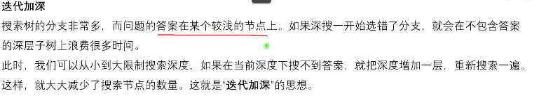

# 搜索优化

## 迭代加深

[226 迭代加深 Addition Chains_哔哩哔哩_bilibili](https://www.bilibili.com/video/BV1UW4y1S7Te/?spm_id_from=333.999.0.0&vd_source=f45ea4e1e4b3b73d5f07c57b46c43aba)



核心代码

```C++
    int dep=1;
	while(!dfs(1))d++;//一直d++找到找到答案 
	...
```

### 例题 #1

Addition Chains

**题目描述**

一个与 $n$ 有关的整数加成序列 $<a_0,a_1,a_2,...,a_m>$ 满足以下四个条件：
$1.a_0=1
$$2.a_m=n
$$3.a_0<a_1<a_2<...<a_{m-1}<a_m
$$4.$ 对于每一个 $k(1≤k≤m)$ 都存在有两个整数 $i$ 和 $j(0≤i,j≤k-1,i$ 和 $j$ 可以相等 $)$ ，使得 $a_k=a_i+a_j
$你的任务是：给定一个整数 $n$ ,找出符合上述四个条件的长度最小的整数加成序列。如果有多个满足要求的答案，只需要输出任意一个解即可。
举个例子，序列 $<1,2,3,5>$ 和 $<1,2,4,5>$ 均为 $n=5$ 时的解。

**输入格式**

输入包含多组数据。每组数据仅一行包含一个整数 $n(1≤n≤10000)$ 。在最后一组数据之后是一个 $0$ 。

**输出格式**

对于每组数据，输出一行所求的整数加成序列，每个整数之间以空格隔开。

感谢@Iowa_BattleShip 提供的翻译

**代码**

UVA不忽略行末空格！

```C++
/*                                                                                
                      Keyblinds Guide
     				###################
      @Ntsc 2024

      - Ctrl+Alt+G then P : Enter luogu problem details
      - Ctrl+Alt+B : Run all cases in CPH
      - ctrl+D : choose this and dump to the next
      - ctrl+Shift+L : choose all like this
      - ctrl+K then ctrl+W: close all
      - Alt+la/ra : move mouse to pre/nxt pos'
	  
*/
#include <bits/stdc++.h>
#include <queue>
using namespace std;

#define rep(i, l, r) for (int i = l, END##i = r; i <= END##i; ++i)
#define per(i, r, l) for (int i = r, END##i = l; i >= END##i; --i)
#define pb push_back
#define mp make_pair
#define int long long
#define ull unsigned long long
#define pii pair<int, int>
#define ps second
#define pf first

// #define innt int
#define itn int
// #define inr intw
// #define mian main
// #define iont int

#define rd read()
int read(){
    int xx = 0, ff = 1;
    char ch = getchar();
    while (ch < '0' || ch > '9') {
		if (ch == '-')
			ff = -1;
		ch = getchar();
    }
    while (ch >= '0' && ch <= '9')
      xx = xx * 10 + (ch - '0'), ch = getchar();
    return xx * ff;
}
void write(int out) {
	if (out < 0)
		putchar('-'), out = -out;
	if (out > 9)
		write(out / 10);
	putchar(out % 10 + '0');
}

#define ell dbg('\n')
const char el='\n';
const bool enable_dbg = 1;
template <typename T,typename... Args>
void dbg(T s,Args... args) {
	if constexpr (enable_dbg){
    cerr << s;
    if(1)cerr<<' ';
		if constexpr (sizeof...(Args))
			dbg(args...);
	}
}

#define zerol = 1
#ifdef zerol
#define cdbg(x...) do { cerr << #x << " -> "; err(x); } while (0)
void err() { cerr << endl; }
template<template<typename...> class T, typename t, typename... A>
void err(T<t> a, A... x) { for (auto v: a) cerr << v << ' '; err(x...); }
template<typename T, typename... A>
void err(T a, A... x) { cerr << a << ' '; err(x...); }
#else
#define dbg(...)
#endif


const int N = 3e5 + 5;
const int INF = 1e18;
const int M = 1e7;
const int MOD = 1e9 + 7;


int n;
int dep;
itn p[N];
bool dfs(int x){
    if(x>dep){
        // for(int i=1;i<=dep;i++){
        //         cerr<<p[i]<<' ';

        //     }
        //     cerr<<endl;

        if(p[x-1]==n){
            for(int i=1;i<dep;i++){
                write(p[i]);
                putchar(' ');

            }
            write(p[dep]);
            puts("");
            // f=1;
            return 1;
        }
        return 0;
    }
    int f=0;
    for(int i=x-1;i;i--){
        for(int j=x-1;j;j--){// 剪枝
            p[x]=p[i]+p[j];
            int t=p[x];
            for(int k=x+1;k<=dep;k++)t<<=1;// 巨大剪枝，后一项最多是前一项的2倍
            if(t<n)break;
            f|=dfs(x+1);
            if(f)return 1;
        }
    }
    return f;
}

void solve(){
    p[1]=1;
    n=rd;
    if(!n)exit(0);
    dep=ceil(log2(n));
    if(n==1){
        cout<<1<<endl;
        return ;
    }
    while(!dfs(2))dep++;
}

signed main() {
    // freopen(".in","r",stdin);
    // freopen(".in","w",stdout);

    int T=1;
    while(T){
    	solve();
    }
    return 0;
}
```

## 折半搜索 meet in the middle

折半搜索可以让我们用$O(2n^{\frac{k}{2}})$完成O(n^k)的搜索。

具体实现看图


### 例题 #1 [CEOI2015 Day2] 世界冰球锦标赛

题目描述

**译自 [CEOI2015](https://ceoi2015.fi.muni.cz/tasks.php) Day2 T1「[Ice Hockey World Championship](https://ceoi2015.fi.muni.cz/day2/eng/day2task1-eng.pdf)」**

> 今年的世界冰球锦标赛在捷克举行。Bobek 已经抵达布拉格，他不是任何团队的粉丝，也没有时间观念。他只是单纯的想去看几场比赛。如果他有足够的钱，他会去看所有的比赛。不幸的是，他的财产十分有限，他决定把所有财产都用来买门票。

给出 Bobek 的预算和每场比赛的票价，试求：如果总票价不超过预算，他有多少种观赛方案。如果存在以其中一种方案观看某场比赛而另一种方案不观看，则认为这两种方案不同。

输入格式

第一行，两个正整数 $N$ 和 $M(1 \leq N \leq 40,1 \leq M \leq 10^{18})$，表示比赛的个数和 Bobek 那家徒四壁的财产。

第二行，$N$ 个以空格分隔的正整数，均不超过 $10^{16}$，代表每场比赛门票的价格。

输出格式

输出一行，表示方案的个数。由于 $N$ 十分大，注意：答案 $\le 2^{40}$。

我们发现如果这里使用普通搜索的话时间复杂度是$O(2^n)$的，过不去。但是如果使用折半搜索，那么就可以变成$O(2\times 2^{n/2})$，可以过去了。

```C++

#include <bits/stdc++.h>
#include <queue>
#define rep(l, r, i) for (int i = l, END##i = r; i <= END##i; ++i)
#define per(r, l, i) for (int i = r, END##i = l; i >= END##i; --i)
using namespace std;
#define pb push_back
#define mp make_pair
#define int long long
#define pii pair<int, int>
#define ps second
#define pf first

#define X(j) i[j]
#define Y(j) (dp[j] + (i[j] + L) * (i[j] + L))

#define rd read()
int read() {
    int xx = 0, ff = 1;
    char ch = getchar();
    while (ch < '0' || ch > '9') {
		if (ch == '-')
			ff = -1;
		ch = getchar();
    }
    while (ch >= '0' && ch <= '9')
      xx = xx * 10 + (ch - '0'), ch = getchar();
    return xx * ff;
}
void write(int out) {
	if (out < 0)
		putchar('-'), out = -out;
	if (out > 9)
		write(out / 10);
	putchar(out % 10 + '0');
}

const int N = 3e6 + 5;
const int INF = 1e18;

int c[N],n,m;
int suma[N],sumb[N];
int cnta,cntb;

void dfs(int l,int r,int sum,int a[],int& cnt){
    if(sum>m)return ;
    if(l>r){
        a[++cnt]=sum;
        return ;
    }
    dfs(l+1,r,sum+c[l],a,cnt);
    dfs(l+1,r,sum,a,cnt);
}


void solve(){
    n=rd,m=rd;
    for(int i=1;i<=n;i++){
        c[i]=rd;
    }
    // cerr<<"OK";
    int mid=n>>1;
    dfs(1,mid,0,suma,cnta);
    dfs(mid+1,n,0,sumb,cntb);
    sort(suma+1,suma+1+cnta);
    int ans=0;
    for(int i=1;i<=cntb;i++){
        ans+=upper_bound(suma+1,suma+1+cnta,m-sumb[i])-suma-1;
    }
    cout<<ans<<endl;

}

signed main() {
    int T=1;
    while(T--){
    	solve();
    }
    return 0;
}
```

### 例题 #2 送礼物

题目描述

作为惩罚，GY 被遣送去帮助某神牛给女生送礼物 (GY：貌似是个好差事）但是在 GY 看到礼物之后，他就不这么认为了。某神牛有 $N$ 个礼物，且异常沉重，但是 GY 的力气也异常的大 (-_-b)，他一次可以搬动重量和在 $w$ 以下的任意多个物品。GY 希望一次搬掉尽量重的一些物品，请你告诉他在他的力气范围内一次性能搬动的最大重量是多少。

对于所有测试数据，$1 \le N \le 46$, $1 \le W,G[i] \le 2^{31}-1$。

---

折半搜索模板了。

先折半，把两边的所有组成情况都搜出来，然后枚举左边，二分匹配最大的右边。

```C++
/*                                                                                
                      Keyblinds Guide
     				###################
      @Ntsc 2024

      - Ctrl+Alt+G then P : Enter luogu problem details
      - Ctrl+Alt+B : Run all cases in CPH
      - ctrl+D : choose this and dump to the next
      - ctrl+Shift+L : choose all like this
      - ctrl+K then ctrl+W: close all
      - Alt+la/ra : move mouse to pre/nxt pos'
	  
*/
#include <bits/stdc++.h>
#include <queue>
using namespace std;

#define rep(i, l, r) for (int i = l, END##i = r; i <= END##i; ++i)
#define per(i, r, l) for (int i = r, END##i = l; i >= END##i; --i)
#define pb push_back
#define mp make_pair
#define int long long
#define ull unsigned long long
#define pii pair<int, int>
#define ps second
#define pf first

// #define innt int
#define itn int
// #define inr intw
// #define mian main
// #define iont int

#define rd read()
int read(){
    int xx = 0, ff = 1;
    char ch = getchar();
    while (ch < '0' || ch > '9') {
		if (ch == '-')
			ff = -1;
		ch = getchar();
    }
    while (ch >= '0' && ch <= '9')
      xx = xx * 10 + (ch - '0'), ch = getchar();
    return xx * ff;
}
void write(int out) {
	if (out < 0)
		putchar('-'), out = -out;
	if (out > 9)
		write(out / 10);
	putchar(out % 10 + '0');
}

#define ell dbg('\n')
const char el='\n';
const bool enable_dbg = 1;
template <typename T,typename... Args>
void dbg(T s,Args... args) {
	if constexpr (enable_dbg){
    cerr << s;
    if(1)cerr<<' ';
		if constexpr (sizeof...(Args))
			dbg(args...);
	}
}

#define zerol = 1
#ifdef zerol
#define cdbg(x...) do { cerr << #x << " -> "; err(x); } while (0)
void err() { cerr << endl; }
template<template<typename...> class T, typename t, typename... A>
void err(T<t> a, A... x) { for (auto v: a) cerr << v << ' '; err(x...); }
template<typename T, typename... A>
void err(T a, A... x) { cerr << a << ' '; err(x...); }
#else
#define dbg(...)
#endif


const int N = 1e7 + 5;
const int INF = 1e18;
const int M = 1e7;
const int MOD = 1e9 + 7;


int a[N],cnta;
int b[N],cntb;

int w[N];
int n,m;

void dfs(int x,int l,int r,int sum){
    if(sum>m)return;
    if(x>r){
        a[++cnta]=sum;
        return ;
    }
    dfs(x+1,l,r,sum+w[x]);
    dfs(x+1,l,r,sum);
}


void dfs2(int x,int l,int r,int sum){
    if(sum>m)return;

    if(x>r){
        b[++cntb]=sum;
        return ;
    }
    dfs2(x+1,l,r,sum+w[x]);
    dfs2(x+1,l,r,sum);
}


void solve(){
    m=rd,n=rd;
    for(int i=1;i<=n;i++){
        w[i]=rd;
    }
    int mid=n>>1;

    dfs(1,1,mid,0);
    dfs2(mid+1,mid+1,n,0);


    sort(b+1,b+cntb+1);

    int ans=0;
    for(int i=1;i<=cnta;i++){
        auto loc=upper_bound(b+1,b+cntb+1,m-a[i]);
        loc--;
        if(*loc+a[i]>=m)continue;
        ans=max(ans,*loc+a[i]);
    }

    cout<<ans<<endl;


}

signed main() {
    // freopen(".in","r",stdin);
    // freopen(".in","w",stdout);

    int T=1;
    while(T--){
    	solve();
    }
    return 0;
}
```

## 例题 #3 [USACO09NOV] Lights G

给出一张 $n$ 个点 $m$ 条边的无向图，每个点的初始状态都为 $0$。

你可以操作任意一个点，操作结束后该点以及所有与该点相邻的点的状态都会改变，由 $0$ 变成 $1$ 或由 $1$ 变成 $0$。

你需要求出最少的操作次数，使得在所有操作完成之后所有 $n$ 个点的状态都是 $1$。

输入格式

第一行两个整数 $n, m$。

之后 $m$ 行，每行两个整数 $a, b$，表示在点 $a, b$ 之间有一条边。

输出格式

一行一个整数，表示最少需要的操作次数。

本题保证有解。

对于 $100\%$ 的数据，$1\le n\le35,1\le m\le595, 1\le a,b\le n$。保证没有重边和自环。

---

本题正解是高斯消元 [高斯消元](https://flowus.cn/1c4fe10e-75c4-4f6f-9bcf-79142f3d5b65)，但是这里我们看见一使用 折半搜索 很愉快的水掉。

我们发现一个性质：一个灯被选择的次数≤1。所以我们只需要枚举每个灯选或者不选，然后模拟即可。

但是我们发现这样的时间复杂度是$O(2^n)$的，所以我们需要meet in the middle 来优化为$O(2^{n/2})$


    - 注意，即使只有两种状态，并且后搜改的，也要还原！否则在回溯时会出锅。如：0 1 回溯 1 0 此时状态却是1 1 .

```C++
/*
                      Keyblinds Guide
     				###################
      @Ntsc 2024

      - Ctrl+Alt+getId then P : Enter luogu problem details
      - Ctrl+Alt+B : Run all cases in CPH
      - ctrl+D : choose this and dump to the next
      - ctrl+Shift+L : choose all like this
      - ctrl+K then ctrl+W: close all
      - Alt+la/ra : move mouse to pre/nxt pos'

*/
#include <bits/stdc++.h>
#include <queue>
using namespace std;

#define rep(i, l, r) for (int i = l, END##i = r; i <= END##i; ++i)
#define per(i, r, l) for (int i = r, END##i = l; i >= END##i; --i)
#define pb push_back
#define int long long
#define ull unsigned long long
#define pii pair<int, int>
#define ps second
#define pf first
#define mp make_pair

// #define innt int
#define itn int
// #define inr intw
// #define mian main
// #define iont int

#define rd read()
int read() {
	int xx = 0, ff = 1;
	char ch = getchar();
	while (ch < '0' || ch > '9') {
		if (ch == '-')
			ff = -1;
		ch = getchar();
	}
	while (ch >= '0' && ch <= '9')
		xx = xx * 10 + (ch - '0'), ch = getchar();
	return xx * ff;
}
void write(int out) {
	if (out < 0)
		putchar('-'), out = -out;
	if (out > 9)
		write(out / 10);
	putchar(out % 10 + '0');
}

#define ell dbg('\n')
const char el='\n';
const bool enable_dbg = 1;
template <typename T,typename... Args>
void dbg(T s,Args... args) {
	if constexpr (enable_dbg) {
		cerr << s;
		if(1)cerr<<' ';
		if constexpr (sizeof...(Args))
			dbg(args...);
	}
}

#define zerol = 1
#ifdef zerol
#define cdbg(x...) do { cerr << #x << " -> "; err(x); } while (0)
void err() {
	cerr << endl;
}
template<template<typename...> class T, typename t, typename... A>
void err(T<t> a, A... x) {
	for (auto v: a) cerr << v << ' ';
	err(x...);
}
template<typename T, typename... A>
void err(T a, A... x) {
	cerr << a << ' ';
	err(x...);
}
#else
#define dbg(...)
#endif


const int N = 50 + 10;
const int INF = 2e9;
const int M = 1e3 + 10;
const int MOD = 1e9 + 7;


/*
我们考虑如何匹配
因为开关一个灯会影响其他灯，所以我们枚举每个灯是否开关，状态中记录的不是
每个灯是否开关，而是最后的结果
匹配时找异或和为全集的即可。

*/

int n,m;
vector<int> e[N];
void add(int a,int b){
    e[a].pb(b);
    e[b].pb(a);
}
map<int,int> vis;
bitset<N> p;

int ans=INF;

void dfs(int x,int r,int cnt){
    if(x>r){
        int res=0;
        for(int i=1;i<=n;i++){
            res<<=1;
            res|=p[i];
        }

        // cdbg(res);
        if(vis[res]==0)vis[res]=cnt;
        vis[res]=min(vis[res],cnt);
        return ;
    }
    dfs(x+1,r,cnt);

    for(auto v:e[x]){
        p[v]=p[v]^1;
    }
    p[x]=p[x]^1;
    dfs(x+1,r,cnt+1);

    for(auto v:e[x]){
        p[v]=p[v]^1;
    }
    p[x]=p[x]^1;
}

void dfs2(int x,int r,int cnt){
    if(x>r){
        int res=0;
        for(int i=1;i<=n;i++){
            res<<=1;
            res|=p[i];
        }
        res=((1ll<<n)-1ll)^res;
        if(vis[res])ans=min(ans,vis[res]+cnt);
        if(res==0)ans=min(ans,cnt);
        return ;
    }
    dfs2(x+1,r,cnt);

    for(auto v:e[x]){
        p[v]=p[v]^1;
    }
    p[x]=p[x]^1;
    dfs2(x+1,r,cnt+1);

    for(auto v:e[x]){
        p[v]=p[v]^1;
    }
    p[x]=p[x]^1;
}

void solve(){
     n=rd,m=rd;
    for(int i=1;i<=m;i++){
        add(rd,rd);
    }

    int mid=n>>1;

    dfs(1,mid,0);
    p.reset();
    dfs2(mid+1,n,0);

    cout<<ans<<endl;
}

signed main() {
    // freopen("kujou.in","r",stdin);
    // freopen("kujou.out","w",stdout);

    int T=1;
    while(T--){
    	solve();
    }

    return 0;
}

```

