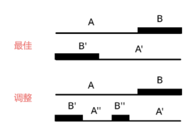

# Charming Meals

## 题面翻译

捷克菜有 $n$ 道开胃菜和 $n$ 道主菜。开胃菜的辣度为 $a_i$ ，主菜的辣度为 $b_i$ 。

一顿典型的捷克餐正好由一道开胃菜和一道主菜组成。您想把 $n$ 道开胃菜和 $n$ 道主菜搭配成 $n$ 餐，每道开胃菜和每道主菜正好包含在一餐中。

您的餐点应该给食客带来惊喜，因此您希望同一餐点的两个部分的辣度尽可能不同。一餐的魅力在于开胃菜的辣度和主菜的辣度之间的差异（绝对值）。因此，由辣度为 $x$ 的开胃菜和辣度为 $y$ 的主菜组成的一餐的魅力等于 $|x-y|$ 。

您希望最大化所得到的 $n$ 餐点的最小魅力值。最小魅力值的最大值是多少？

## 思路

把 $a,b$ 从小到大排序，考虑匹配。

那么怎么样匹配呢？我们假设 $a_i$ 和 $b_{p_i}$ 匹配，那么一种是前者大于后者，一种是后者大于前者。

如果我们现在要贪心地让最小的差值最大，那么我们应该选择 $a$ 中的前几项和 $b$ 中的最后几项匹配（后附证明）。具体来说，就是

- 设定一个 $p$，让 $a_{1\sim t}$ 按顺序和 $b_{n-p+1\sim n}$ 匹配

- 剩下的同样按顺序匹配。

那么我们怎么样知道一个最优的 $p$ 呢？枚举就好了！

所以我们只需要枚举 $p$ 的值，对于每一个 $p$，我们计算每一对匹配的差值，取其中最小值作为这个 $p$ 的答案。在所有的答案中选择最大的即可。

---

证明我们应该选择 $a$ 中的前几项和 $b$ 中的最后几项匹配：





设对于当前的 $p$，最佳情况下匹配为 $(A,A')(B,B')$，调整后匹配为 $(A,A'+A'')(B,B'+B'')$，其中 $A'+A''$ 表示将区间 $A',A''$ 顺次连接。

那么我们就发现，如果 $B$ 与 $B''$ 匹配，其中的匹配的差值的最小值一定劣于（即小于）$B$ 与 $A''$ 匹配的情况。所以应当与 $A''$ 匹配。对 $A$ 的证明也相同。

```C++
void check(int t){
    int res=INF;
    for(int i=1;i<=t;i++){
        res=min(res,abs(a[i]-b[i+n-t]));
    }
    for(int i=t+1;i<=n;i++){
        res=min(res,abs(a[i]-b[i-t]));
    }
    ans=max(ans,res);
}

void solve(){
    ans=0;
    n=rd;//快读
    for(int i=1;i<=n;i++){
        a[i]=rd;
    }
    for(int i=1;i<=n;i++){
        b[i]=rd;
    }

    sort(a+1,a+n+1);
    sort(b+1,b+n+1);

    for(int t=1;t<=n;t++){
        check(t);
    }
    cout<<ans<<endl;
}

```

