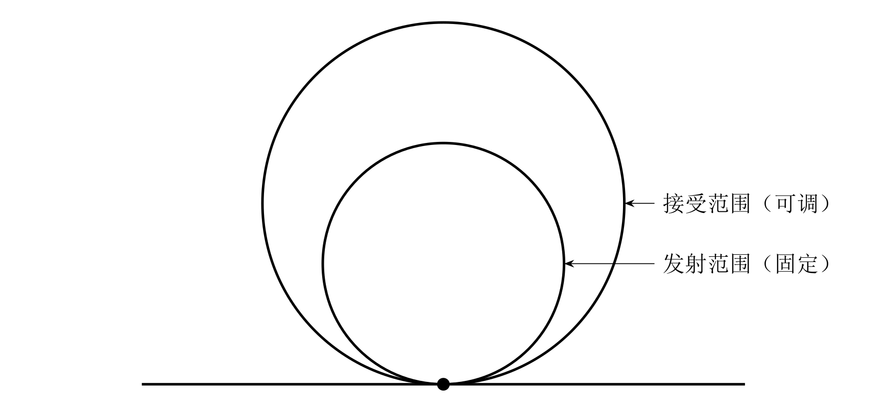
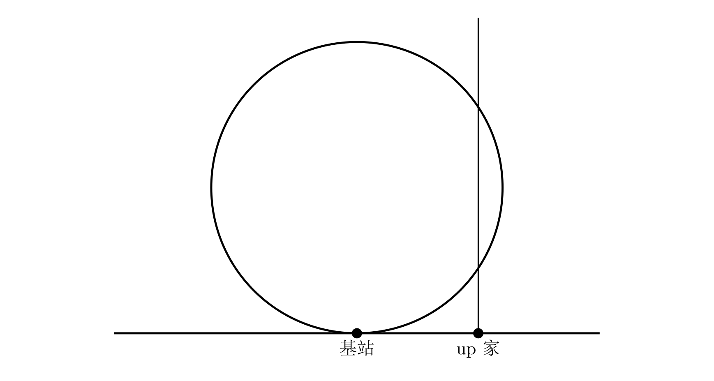
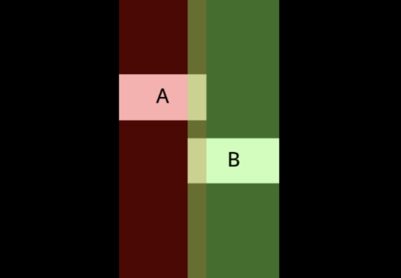
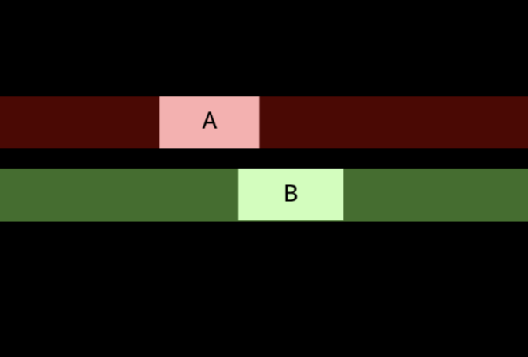
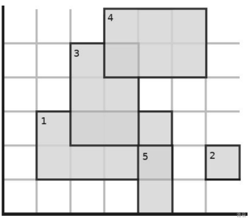

# [SDOI2012] 基站建设

## 题目描述

up 主家终于买电脑了，但是接下来有各种问题要处理。首要解决的问题就是网络问题。他要从移动公司开始，通过一些基站来传递网络到他家。

为了简化问题，我们假设移动公司，所有的基站、up 主家位于同一条直线上，他们都位于这一条直线上的某一点 $x$，这些点**可能**会重合。每个基站发射和接收的范围都是一个切于地面的圆，发射的半径 $r$ 是固定的，接收半径 $r'$ 是可调的的。如下图：



一个点 $i$ 如果能从另一个点 $j$ 接收到信号（当且仅当 $x_j<x_i$），必须满足 $i$ 的接收范围与 $j$ 的发射范围相切，并且需要付 $\sqrt{r'_i}$ 的额外费用。同时启动每一个点 $i$ 都需要费用 $v_i$。

当然一个点如果能够发射的 up 主家只需要这个点的发射范围与 up 主家所在的竖线相切或相交即可，如下图：



当然费用越少就越好咯，于是 up 主想要请你帮他的忙。

## 思路

坏了，这题好像不是常规的cdq。这道题不是常规cdq的统计数量题，而是类似dp的一种东西……dp？那么我们就来试试看吧！

首先写一个暴力dp出来。

f_{i,j}表示

## 输入格式

第一行两个整数 $n, m$。表示基站个数（包括移动公司），up 主家的坐标。（保证大于等于所有基站的坐标）

记下来 $n$ 行，每行三个整数 $x_i$，$r_i$，$v_i$，表示每个基站的坐标，发射范围以及费用。

$x_i$ 是按照坐标从小到大输入的，移动公司位于最小的那个坐标。

$r$ 为 $1\dots n$ 的排列。

## 输出格式

一个实数，保留小数点后三位。

## 样例 #1

### 样例输入 #1

```C++
10 33
5 4 660
10 2 2040
11 6 3207
14 5 2006
18 3 6130
19 9 3363
22 1 1265
25 8 2836
27 10 7961
29 7 9075
```

### 样例输出 #1

```C++
3501.000
```

## 提示

对于 $100\%$ 的数据 $n\le5\times 10^5$，$x_i,m \le 10^{12}$，$v_i \le 10000$

# 「DTOI-2」星之河

## 题目背景

> 星稀河影转，霜重月华孤。

## 题目描述

星之统治者有一个星盘，其可以被抽象为一棵根节点为 $1$ 的树。树上每个节点 $i$ 有一颗红星、一颗蓝星，亮度分别记为 $\text{Red}_i,\text{Blue}_i$。

现在，星之统治者想要知道，对于每个节点 $x$，其子树内（不包括该节点）有多少节点满足：其红星亮度小于等于 $x$ 的红星亮度，且其蓝星亮度小于等于 $x$ 的蓝星亮度。

你需要按编号顺序依次输出每个节点的答案。为减少输出量，**如果答案为 $0$ 则不必输出。**

## 思路

这道题的偏序关系比较明显，主要就是我们要处理“子树中”这个条件。

也许我们会想到dfs序，但是有一点就是我们不能通过dfs序区分这两个节点是在同一条链上还是不同链上，而后者是不被允许的。

所以如果不考虑偏序维度数量，也许我们可以考虑欧拉序。

我们用in_i,out_i来分别表示也该节点的入欧拉序和出欧拉序，那么i在j子树内就可以转化为in_i>in_j,in_i<out_j。一个等效的做法就是用sfd序和子树大小数组sz来实现，就是dfn_i>dfn_j,dfn_i<dfn_j+sz_j。

好了，现在我们要实现的是一个四维偏序。我们看看自己可不可以解决。

还用线段树吗？我们看看可不可行。如果把线段树的节点顺序看作dfn，那我们貌似可以使用节点值来维护“数量”这个信息。

具体方法：

实现我们排序解决红星维度，然后分治解决蓝星维度。然后我们使用线段树来查询满足前两个维度且对于当前的j满足dfn_i>dfn_j,dfn_i<dfn_j+sz_j的i的数量。在记录结果后，我们将dfn_j加入进线段树去。

所以现在开始尝试吧！

## 代码时间

```C++

```


## 输入格式

第一行两个整数分别表示 $n$。

接下来 $n-1$ 行每行两个正整数 $u,v$，表示存在 $(u,v)$ 这条树边。

接下来 $n$ 行每行两个整数分别表示 $\text{Red}_i, \text{Blue}_i$。

## 输出格式

每个答案非 $0$ 的节点一行，每行一个整数表示答案。

## 样例 #1

### 样例输入 #1

```C++
10
2 1
3 1
4 3
5 1
6 4
7 2
8 2
9 4
10 3
3 1
2 4
-3 3
4 -2
-2 3
-3 -6
-5 -1
-4 -7
-5 -1
-7 -7
```

### 样例输出 #1

```C++
5
2
3
1
```

## 提示

### 样例解释

对于节点 $1$，小于等于他的子节点有 $6,7,8,9,10$，因此输出 $5$。
对于节点 $4$，小于等于他的子节点有 $6$，因此输出 $1$。
对于节点 $5 $ 至 $10$，没有小于等于他的子节点，因此不输出。

### 数据范围

|$\textbf{Subtask}$|$n\le$|特殊性质|总分数|
|-|-|-|-|
|$1$|$1000$|无|$10$|
|$2$|$5\times 10^4$|无|$20$|
|$3$|$10^5$|$-200\le \text{Red}_i, \text{Blue}_i \le 200$|$20$|
|$4$|$2\times 10^5$|树的形态是链|$20$|
|$5$|$2\times 10^5$|无|$30$|

对于所有数据，保证 $n \le 2\times 10^5$，$-10^9 \le \text{Red}_i, \text{Blue}_i \le 10^9$。

# [COCI2018-2019#2] Sunčanje

## 题目描述

Slavko 做了一个不寻常的梦。在一个晴朗的早上，$N$ 个白色的矩形一个接着一个爬上了 Slavko 家的屋顶，并在屋顶上晒太阳。每个矩形在屋顶都选定了一个位置，使得它的边与屋顶的棱角平行。有些矩形可能会覆盖在其它矩形所在的位置上。每个矩形的长、宽分别为 $A_i,B_i$，其与屋顶左方和下方的棱角的距离分别为 $X_i,Y_i$。

日落后，矩形们从屋顶上下来，并睡了一觉。次日，它们发现，有些矩形变成了黄色，而有些仍为白色。变为黄色的矩形都是完全暴露在阳光下的。

请判断每个矩形是否变为了黄色。

## 思路

看起来我们要先倒序去枚举。那么我们实行按以时间为一个维度，那么还有别的维度呢？

我们考察一个矩形被覆盖的条件——或者说不被的条件是什么。

显然应该是不存在一个之前加入的矩形覆盖了这个矩形，换成数学语言就是

矩形B(x',y',x'+a',y'+b')和矩形A(x,y,x+a,y+b)重合的情况有

- (x',y')属于矩形A

- (x'+a',y'+b')属于矩形A

- emm好吧写不下去了。

---

注意了，这里是一个知识点。给出**坐标信息**，怎么样节点的列出表达式**表示矩形相交**呢？

我们看下图







我们发现，我们分别把两个矩形看成横条和竖条，如果两个有交集，那么这两个矩形就是相交的！

所以我们给给出矩形坐标信息A(a,b,x,y),B(a',b',x',y')，这里给出的是左下角和右上角的坐标，那两个矩形相交的表示就是：

- a<x',x>a'

- b<y',y>b'

我们来看看有没有顺序要求——就算是我们看看第一幅图中如果我们把A,B位置互换……也是正确的！也就是说上面的不等式组包含了所有情况而省略了分类讨论！

---

考虑回到本题，那么给出这么多不等式关系，那么明示使用的是CDQ分治了。我们看看好像我们有5个维度的偏序信息！这是不可接受的，所以我们要考虑优化。

注意我们有一个很重要的地方就是矩形的左下角坐标和右上角坐标是有一定的联系的。但是好像没有什么用处。

---

我们先一步步来。先按照时间排序，然后分治下去，在合并时左边按a排序，右边按x'排序，这样我们就可以解决前两个偏序。

那么我们在怎么样维护后面的偏序呢？我们看三维偏序可以使用数据结构（例如线段树），那么我们这里是否可以使用线段树一次性解决三个偏序？

看上去好像不可思议，但题解告诉我们能行。

我们考虑把线段树看成一个容器，对于每一个时间点，线段树中含有的矩形都是满足前两个偏序条件的。那我们考虑后面三个偏序条件，我们发现这个“容器”明显还有我们没有遇到的东西——值域（即节点顺序）和值。

于是我们就可以把节点顺序的那个维度看成是y坐标（即b坐标），那么我们发现b<y',y>b'就可以转化为数轴上区间和区间之间是否有交集的问题了。这样我们就成功地转化了两个偏序关系。最后一个偏序关系我们发现是x>a'，其实就一个东西——x坐标（即a坐标），并且我们很明显知道这里我们是想要x越大越好，所以我们的线段树应该是一个区间修改，区间查询的最大值线段树。

那么基本思路有了，我们开始——

注意还要离散化。

## 代码时间

未调试

```C++

#include <bits/stdc++.h>
#include <queue>
using namespace std;

#define rep(i, l, r) for (int i = l, END##i = r; i <= END##i; ++i)
#define per(i, r, l) for (int i = r, END##i = l; i >= END##i; --i)
#define pb push_back
#define mp make_pair
#define int long long
#define pii pair<int, int>
#define ps second
#define pf first

// #define innt int
// #define inr int
// #define mian main
// #define iont int

#define rd read()
int read(){
    int xx = 0, ff = 1;
    char ch = getchar();
    while (ch < '0' || ch > '9') {
		if (ch == '-')
			ff = -1;
		ch = getchar();
    }
    while (ch >= '0' && ch <= '9')
      xx = xx * 10 + (ch - '0'), ch = getchar();
    return xx * ff;
}
void write(int out) {
	if (out < 0)
		putchar('-'), out = -out;
	if (out > 9)
		write(out / 10);
	putchar(out % 10 + '0');
}

const bool enable_dbg = false;
template <typename T,typename... Args>
void dbg(bool flg,T s,Args... args) {
	if constexpr (enable_dbg){
		cout << s;
		if constexpr (sizeof...(Args))
			dbg(flg,args...);
	}
}

const int N = 3e5 + 5;
const int INF = 1e18;
const int M = 1e7;
const int MOD = 1e9 + 7;


int  n;

///SGT

int t[N<<2],tag[N<<2];

void pushup(int x){
    t[x]=max(t[x<<1],t[x<<1|1]);
}

void addtag(int x,int tg){
    tag[x]=max(tag[x],tg);//区间修改,应该取最大值而不是直接覆盖
    t[x]=max(t[x],tg);
}

void pushdown(int x){
    if(~tag[x]){
        addtag(x<<1,tag[x]);
        addtag(x<<1|1,tag[x]);
        tag[x]=-1;
    }
}

void change(int x,int l,int r,int pl,int pr,int v){
    if(l>=pl&&r<=pr){
        addtag(x,v);
        return ;
    }
    pushdown(x);
    int mid=l+r>>1;
    if(pl<=mid)change(x<<1,l,mid,pl,pr,v);
    if(pr>mid)change(x<<1|1,mid+1,r,pl,pr,v);
    pushup(x);
}


int query(int x,int l,int r,int pl,int pr){
    if(pl<=l&&pr>=r){
        return t[x];
    }
    pushdown(x);
    int mid=l+r>>1;
    int res=0;
    if(pl<=mid)res=max(res,query(x<<1,l,mid,pl,pr));
    if(pr>mid)res=max(res,query(x<<1|1,mid+1,r,pl,pr));
    // pushup(x);//好像不需要
}

//CDQ

int ans[N];

struct node{
    int a,b,x,y;
    int id;
}c[N];

bool cmp(node A,node B){
    return A.a<B.a;
}
bool cmp2(node A,node B){
    return A.x<B.x;
}

void add(int i){
    change(1,1,n,c[i].b,c[i].y,c[i].x);
    int mx=query(1,1,n,c[i].b,c[i].y);
    if(mx>c[i].a)ans[c[i].id]=1;
}

void cdq(int l,int r){
    if(l==r)return ;
    int mid=l+r>>1;
    cdq(l,mid);cdq(mid+1,r);
    sort(c+l,c+mid+1,cmp);
    sort(c+mid+1,c+r+1,cmp2);

    memset(t,0,sizeof t);
    memset(tag,-1,sizeof tag);
    
    int i=l,j;
    for(j=mid+1;j<=r;j++){
        while(c[i].a<c[j].x){
            add(i);i++;
        }
    }
    // while(i<=mid){}//没必要加进去了

    
    
}

int num[N];
void init(){
    for(int i=1;i<=n;i++){
        num[i]=c[i].a;
    }
    sort(num+1,num+n+1);
    int len=unique(num+1,num+n+1)-num-1;
    for(int i=1;i<=n;i++){
        c[i].a=lower_bound(num+1,num+len+1,c[i].a)-num;
    }

    for(int i=1;i<=n;i++){
        num[i]=c[i].x;
    }
    sort(num+1,num+n+1);
    len=unique(num+1,num+n+1)-num-1;
    for(int i=1;i<=n;i++){
        c[i].x=lower_bound(num+1,num+len+1,c[i].x)-num;
    }

    for(int i=1;i<=n;i++){
        num[i]=c[i].b;
    }
    sort(num+1,num+n+1);
    len=unique(num+1,num+n+1)-num-1;
    for(int i=1;i<=n;i++){
        c[i].b=lower_bound(num+1,num+len+1,c[i].b)-num;
    }

    for(int i=1;i<=n;i++){
        num[i]=c[i].y;
    }
    sort(num+1,num+n+1);
    len=unique(num+1,num+n+1)-num-1;
    for(int i=1;i<=n;i++){
        c[i].y=lower_bound(num+1,num+len+1,c[i].y)-num;
    }

}
void solve(){
    n=rd;
    for(int i=1;i<=n;i++){
        c[i].a=rd,c[i].b=rd,c[i].x=rd,c[i].y=rd;c[i].id=i;
    }
    init();
    reverse(c+1,c+n+1);
    cdq(1,n);

    for(int i=1;i<=n;i++){
        if(ans[i])puts("NE");
        else puts("DA");
    }

}

signed main() {
    int T=1;
    while(T--){
    	solve();
    }
    return 0;
}
```


## 输入格式

第一行输入正整数 $N$，表示矩形的个数。

接下来的 $N$ 行，每行输入整数 $X_i,Y_i,A_i,B_i$。输入顺序与登上屋顶的顺序一致。

## 输出格式

输出 $N$ 行。其中，若第 $i$ 个矩形变为黄色，则在第 $i$ 行输出 `DA`，否则在该行输出 `NE`。

## 样例 #1

### 样例输入 #1

```C++
5
1 1 4 2
6 1 1 1
2 2 2 3
3 4 3 2
4 0 1 2
```

### 样例输出 #1

```C++
NE
DA
NE
DA
DA
```

## 样例 #2

### 样例输入 #2

```C++
3
3 3 1 1
2 2 3 3
1 1 5 5
```

### 样例输出 #2

```C++
NE
NE
DA
```

## 提示

#### 样例 1 解释

矩形 $1,3$ 没有完全暴露在阳光下，因而它们没有变为黄色：



#### 数据规模与约定

对于 $10\%$ 的数据，$N \le 10^4$。

对于 $100\%$ 的数据，$1 \le N \le 10^5$，$0 \le X_i,Y_i \le 10^9$，$1 \le A_i,B_i \le 10^9$。

#### 说明

**本题分值按 COCI 原题设置，满分 $130$。**

**题目译自 [COCI2018-2019](https://hsin.hr/coci/archive/2018_2019/) [CONTEST #2](https://hsin.hr/coci/archive/2018_2019/contest2_tasks.pdf)  *T5 Sunčanje*。**

