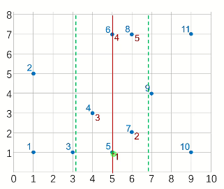

# 平面最近点对（加强版）

## 题目背景

[P7883](/problem/P7883) 平面最近点对（加强加强版）

## 题目描述

给定平面上 $n$ 个点，找出其中的一对点的距离，使得在这 $n$ 个点的所有点对中，该距离为所有点对中最小的

## 输入格式

第一行：$n$ ，保证 $2\le n\le 200000$ 。

接下来 $n$ 行：每行两个实数：$x\ y$ ，表示一个点的行坐标和列坐标，中间用一个空格隔开。

## 输出格式

仅一行，一个实数，表示最短距离，精确到小数点后面 $4$ 位。

## 样例 #1

### 样例输入 #1

```C++
3
1 1
1 2
2 2
```

### 样例输出 #1

```C++
1.0000
```

## 提示

数据保证 $0\le x,y\le 10^9$

## solu




模拟以下算法


先不断往下分，一直分到[1,2]和[3,3]

发现1,2是相邻点，1直接返回距离差，d→4

发现3,3是同一个点，距离无限→无限，的不变

接下来跨中线处理（在线上的看作属于左边），发现1,3比1,2近，d→2


分完[1,3]再分[4,6]

4,5同上，d→2

6,6同上，d不变

跨中线（图中斜线）处理，发现4,6距离>d，不管

返回到[1,6]，左右边的d最小值都已经处理好了，[1,3]为2.0，[4,6]为2.2

接下来跨中线处理（绿线）发现3,5距离和左边的d相同，不更新


但跨中线处理还是必要的！


在[7,9]和[1,11]中，d最小值都是由跨中线的情况得来的


**本题重点**

- 跨中线点的距离计算

- 分治思路

我们来详细看一下跨中线的算法


当计算到跨中线时，左右两边的d的最小值 $d_l,d_r$ 已经计算出来了

这时候计算 $d_l,d_r$ 的最小值为 $d_{min}$，将离中线水平距离≤d_{min}的点处理出来（即图中绿虚线范围内的点）

因为目前要找的是跨中线的两点间距离d，如果有一边的点到中线水平距离就>d_{min}的话，取d_{min}最优，就不需要考虑了，将这些点处理掉，等下直接跳过

**补充知识**

函数 double fabs (double x) 返回浮点数 x 的绝对值。. 注意： `fabs ()` 函数可以用于 double、float 和 long double 类型的参数。. 如果需要计算整数的绝对值，应该使用 `abs ()`

**复杂度分析**


## code `28 TLE`

```C++
/*////////ACACACACACACAC///////////
       . Code by Ntsc .
       . Love by Liye .
/*////////ACACACACACACAC///////////

#include<bits/stdc++.h>
#define ll long long
#define db double
#define rtn return
#define i1n int i=1;i<=n;i++
#define in1 int i=n;i>=1;i--
using namespace std;

const int N=2e5+5;
const int M=1e5;
const int Mod=1e5;
const int INF=1e5;

int n,ans;
struct node{
	db x,y;
}a[N],b[N];
bool cmp(node a,node b){
	return a.x<b.x;
}
bool cmpy(node a,node b){
	return a.y<b.y;
}
db dis(node a,node b){
	return sqrt((a.x-b.x)*(a.x-b.x)+(a.y-b.y)*(a.y-b.y));
}
db solve(int l,int r){
	if(l==r)return 2e9;//l和r是同一个点，不处理
	if(l==r-1)return dis(a[l],a[r]); //l,r两点相邻
	//分裂 
	int mid=(l+r)/2;
	db d=min(solve(l,mid),solve(mid+1,r));
	//跨中线寻找更优解
	int k=0;
	for(int i=1;i<=r;i++){
		if(fabs(a[i].x-a[mid].x)<d)b[++k]=a[i];//找出绿虚线范围内的点，加入数组b[] 
		
	}
	sort(b+1,b+k+1,cmpy);//按y排序 ,目的在于后面判定"b[i].y-b[i].y<d"时,只要发现一个不满足,后面的一定都不满足,循环终止 
	for(int i=1;i<k;i++){//暴力枚举5个点
		//从该点u上面的一个点v_1开始,逐渐向上枚举点v_i ,求u->v_i之间的距离
		//不需要枚举u下面的点v_j,因为这些情况在枚举v_j时就求过了v_j->u了(结合图像理解!) 
		for(int j=i+1;j<=k&&b[i].y-b[i].y<d;j++){//"b[i].y-b[i].y<d"即 两个点的y差值<d,如果y差值都>=d,它们间的距离不可能<d,没必要继续下去了 
			d=min(d,dis(b[i],b[j]));
		}
	}
	rtn d;
}
signed main(){
	cin>>n;
	for(i1n)cin>>a[i].x>>a[i].y;
	sort(a+1,a+n+1,cmp);
	printf("%.4lf",solve(1,n));
	return 0;
}

```

**P7883 平面最近点对（加强加强版）代码**

```C++

```

**原题：P1257 平面上的最接近点对 代码**

# 平面最近点对（加强加强版）

给定 $n$ 个二维欧几里得平面上的点 $p_1, p_2, \dots, p_n$，请输出距离最近的两个点的距离。

对于 $100 \%$ 的数据，$2 \leq n \leq 4 \times 10^5$，$-10^7 \leq x_i, y_i \leq 10^7$。

本题目标复杂度是 $O(n \log ^2 n)$。设置 350ms 时限的原因是：

1. $O(n \log ^2 n)$ 参考代码使用 `cin` 不会 TLE。最快的 std 能 $<$ 100ms。

## 思路

这题我们来用kd树解决。kd树模板——上线！

```C++

```

