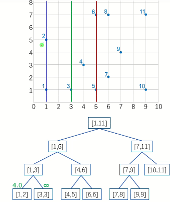
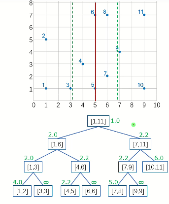
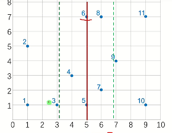
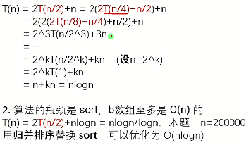

# 序列分治

## 例题 #1 平面最近点对（加强版）

题目描述

给定平面上 $n$ 个点，找出其中的一对点的距离，使得在这 $n$ 个点的所有点对中，该距离为所有点对中最小的

输入格式

第一行：$n$ ，保证 $2\le n\le 200000$ 。

接下来 $n$ 行：每行两个实数：$x\ y$ ，表示一个点的行坐标和列坐标，中间用一个空格隔开。

输出格式

仅一行，一个实数，表示最短距离，精确到小数点后面 $4$ 位。

数据保证 $0\le x,y\le 10^9$

### 思路


题意：给定平面上n个点，求最近点对之间的距离
分治算法——$O(n\log n)$

1. Devide: 将原问题划分成子问题

2. Conquer:在边界处得到子问题的解

3. Combine:将子问题的解逐层合并成原问题的解


子问题
以中间点为划分线，最近点对分三种情况：

1. 都在左边点集

2. 都在右边点集

3. 一个点在左边点集，另一个点在右边点集

算法流程

1. 对所有点按x为第一关键字，y为第二关键字进行排序

2. 分治求出中线两边的最小距离$d_1$和$d_2$，则 $d=\min(d_1,d_2)$

3. 划出中线左右距离为d的平行区域，搜集区域内的点；按纵坐标排序；检查纵坐标之差小于d的情况，更新d的值


模拟以下算法



先不断往下分，一直分到[1,2]和[3,3]

发现1,2是相邻点，1直接返回距离差，d→4

发现3,3是同一个点，距离无限→无限，的不变

接下来跨中线处理（在线上的看作属于左边），发现1,3比1,2近，d→2


分完[1,3]再分[4,6]

4,5同上，d→2

6,6同上，d不变

跨中线（图中斜线）处理，发现4,6距离>d，不管

返回到[1,6]，左右边的d最小值都已经处理好了，[1,3]为2.0，[4,6]为2.2

接下来跨中线处理（绿线）发现3,5距离和左边的d相同，不更新


但跨中线处理还是必要的！



在[7,9]和[1,11]中，d最小值都是由跨中线的情况得来的


**本题重点**

- 跨中线点的距离计算

- 分治思路

我们来详细看一下跨中线的算法



当计算到跨中线时，左右两边的d的最小值 $d_l,d_r$ 已经计算出来了

这时候计算 $d_l,d_r$ 的最小值为 $d_{min}$，将离中线水平距离$≤d_{min}$的点处理出来（即图中绿虚线范围内的点）

因为目前要找的是跨中线的两点间距离d，如果有一边的点到中线水平距离就$>d_{min}$的话，取$d_{min}$最优，就不需要考虑了，将这些点处理掉，等下直接跳过

**补充知识**

函数 double fabs (double x) 返回浮点数 x 的绝对值。. 注意： `fabs ()` 函数可以用于 double、float 和 long double 类型的参数。. 如果需要计算整数的绝对值，应该使用 `abs ()`

**复杂度分析**




### code `28 TLE`

```C++
/*////////ACACACACACACAC///////////
       . Code by Ntsc .
       . Love by Liye .
/*////////ACACACACACACAC///////////

#include<bits/stdc++.h>
#define ll long long
#define db double
#define rtn return
#define i1n int i=1;i<=n;i++
#define in1 int i=n;i>=1;i--
using namespace std;

const int N=2e5+5;
const int M=1e5;
const int Mod=1e5;
const int INF=1e5;

int n,ans;
struct node{
	db x,y;
}a[N],b[N];
bool cmp(node a,node b){
	return a.x<b.x;
}
bool cmpy(node a,node b){
	return a.y<b.y;
}
db dis(node a,node b){
	return sqrt((a.x-b.x)*(a.x-b.x)+(a.y-b.y)*(a.y-b.y));
}
db solve(int l,int r){
	if(l==r)return 2e9;//l和r是同一个点，不处理
	if(l==r-1)return dis(a[l],a[r]); //l,r两点相邻
	//分裂 
	int mid=(l+r)/2;
	db d=min(solve(l,mid),solve(mid+1,r));
	//跨中线寻找更优解
	int k=0;
	for(int i=1;i<=r;i++){
		if(fabs(a[i].x-a[mid].x)<d)b[++k]=a[i];//找出绿虚线范围内的点，加入数组b[] 
		
	}
	sort(b+1,b+k+1,cmpy);//按y排序 ,目的在于后面判定"b[i].y-b[i].y<d"时,只要发现一个不满足,后面的一定都不满足,循环终止 
	for(int i=1;i<k;i++){//暴力枚举5个点
		//从该点u上面的一个点v_1开始,逐渐向上枚举点v_i ,求u->v_i之间的距离
		//不需要枚举u下面的点v_j,因为这些情况在枚举v_j时就求过了v_j->u了(结合图像理解!) 
		for(int j=i+1;j<=k&&b[i].y-b[i].y<d;j++){//"b[i].y-b[i].y<d"即 两个点的y差值<d,如果y差值都>=d,它们间的距离不可能<d,没必要继续下去了 
			d=min(d,dis(b[i],b[j]));
		}
	}
	rtn d;
}
signed main(){
	cin>>n;
	for(i1n)cin>>a[i].x>>a[i].y;
	sort(a+1,a+n+1,cmp);
	printf("%.4lf",solve(1,n));
	return 0;
}

```

**P7883 平面最近点对（加强加强版）代码**

```C++

```

**原题：P1257 平面上的最接近点对 代码**

## 例题 #2 Imbalanced Array

题面翻译

对于给定由 n 个元素构成的数组。一个子数组的不平衡值是这个区间的最大值与最小值的差值。数组的不平衡值是它所有子数组的不平衡值的总和。

输入格式

The first line contains one integer $n$ ( $1<=n<=10^{6}$ ) — size of the array $a$ .

The second line contains $n$ integers $a_{1},a_{2}...\ a_{n}$ ( $1<=a_{i}<=10^{6}$ ) — elements of the array.

输出格式

Print one integer — the imbalance value of $a$ .

---

我们考虑分治。

因为我们要出每个区间的答案，所以我们考虑一次求出横跨中间的的所有区间的答案。

那么我们就考虑分治。

加上我们现在分治到的区间是 [l,r]，那么我们考虑一次性求出答案。

我们将答案表示位式子，那么就是

$\sum_l \sum_r (\max_{i\in[l,r]}a_i-\min_{i\in[l,r]}a[i])$

那么我们将这个式子拆开，就是$\sum_l\sum_r  \max_{i\in[l,r]}a_i-\sum_l\sum_r  \min_{i\in[l,r]}a_i$，我们考虑单独求两个部分。

先考虑求$\max$，那么当我们分治到一个区间[l,r] 时，我们考虑计算跨过mid的答案。那么我们可以枚举区间的左端点i，然后对于右端点直接计算。

那么怎么样计算呢？我们发现最大值可能来自两个区间：[l,mid][mid+1,r]，其中第一个区间是固定的，但是第二个区间不固定。

所以我们对[mid+1,r] 求出其前缀max，就记为pre_j。那么我们会有一个j'作为分界线，其前面的j满足$pre_j≤max[i,mid]$，后面满足$pre_j>max[i,mid]$。那么我们的答案就是$(j-mid)\times max[i,mid]+\sum_{k\in[j+1,r}pre_k$。后面一部分我们使用前缀和求即可。

那么怎么样求出我们的呢？我们从右到左枚举i，那么我们的$max[i,mid]$就是单调的，此时我们就可以让j指针单调的在右边跑了。

```C++
/*
                      Keyblinds Guide
     				###################
      @Ntsc 2024

      - Ctrl+Alt+getId then P : Enter luogu problem details
      - Ctrl+Alt+B : Run all cases in CPH
      - ctrl+D : choose this and dump to the next
      - ctrl+Shift+L : choose all like this
      - ctrl+K then ctrl+W: close all
      - Alt+la/ra : move mouse to pre/nxt pos'

*/
#include <bits/stdc++.h>
#include <queue>
using namespace std;

#define rep(i, l, r) for (int i = l, END##i = r; i <= END##i; ++i)
#define per(i, r, l) for (int i = r, END##i = l; i >= END##i; --i)
#define pb push_back
#define int long long
#define ull unsigned long long
#define pii pair<int, int>
#define ps second
#define pf first
#define mp make_pair

// #define innt int
#define itn int
// #define inr intw
// #define mian main
// #define iont int

#define rd read()
int read() {
	int xx = 0, ff = 1;
	char ch = getchar();
	while (ch < '0' || ch > '9') {
		if (ch == '-')
			ff = -1;
		ch = getchar();
	}
	while (ch >= '0' && ch <= '9')
		xx = xx * 10 + (ch - '0'), ch = getchar();
	return xx * ff;
}
void write(int out) {
	if (out < 0)
		putchar('-'), out = -out;
	if (out > 9)
		write(out / 10);
	putchar(out % 10 + '0');
}

#define ell dbg('\n')
const char el='\n';
const bool enable_dbg = 1;
template <typename T,typename... Args>
void dbg(T s,Args... args) {
	if constexpr (enable_dbg) {
		cerr << s;
		if(1)cerr<<' ';
		if constexpr (sizeof...(Args))
			dbg(args...);
	}
}

#define zerol = 1
#ifdef zerol
#define cdbg(x...) do { cerr << #x << " -> "; err(x); } while (0)
void err() {
	cerr << endl;
}
template<template<typename...> class T, typename t, typename... A>
void err(T<t> a, A... x) {
	for (auto v: a) cerr << v << ' ';
	err(x...);
}
template<typename T, typename... A>
void err(T a, A... x) {
	cerr << a << ' ';
	err(x...);
}
#else
#define dbg(...)
#endif


const int N = 2e6 + 10;
const int INF = 2e17;
const int M = 1e3 + 10;


/*
缩点先

*/


int p[N],pre[N],a[N];
int mx,mn;


void solveMax(int l,int r){
    if(l==r)return ;
    int mid=l+r>>1;
    solveMax(l,mid);
    solveMax(mid+1,r);

    p[mid]=0;
    pre[mid]=0;
    for(int i=mid+1;i<=r;i++){
        pre[i]=max(pre[i-1],a[i]);
        p[i]=p[i-1]+pre[i];
    }

    int mxl=0;
    int j=mid;//!not mid+1
    for(int i=mid;i>=l;i--){
        mxl=max(mxl,a[i]);
        while(j<r&&pre[j+1]<=mxl)j++;
        mx+=(j-mid)*mxl+p[r]-p[j];
    }
}


void solveMin(int l,int r){
    if(l==r)return ;
    int mid=l+r>>1;
    solveMin(l,mid);
    solveMin(mid+1,r);

    p[mid]=0;
    pre[mid]=INF;
    for(int i=mid+1;i<=r;i++){
        pre[i]=min(pre[i-1],a[i]);
        p[i]=p[i-1]+pre[i];
    }

    int mxl=INF;
    int j=mid;
    // cdbg(l,r,mn);
    for(int i=mid;i>=l;i--){
        mxl=min(mxl,a[i]);
        while(j<r&&pre[j+1]>=mxl)j++;
        mn+=(j-mid)*mxl+p[r]-p[j];
    }
    // cdbg(l,r,mn);
}

void solve(){
    int n=rd;
    for(int i=1;i<=n;i++){
        a[i]=rd;
    }


    solveMax(1,n);
    solveMin(1,n);
    cdbg(mx,mn);
    cout<<mx-mn<<endl;
    
}

signed main() {
    // freopen("kujou.in","r",stdin);
    // freopen("kujou.out","w",stdout);
    
    int T=1;
    while(T--){
    	solve();
    }

    return 0;
}
```

## 例题 #3 ADAGF - Ada and Greenflies

给一个数组，求数组的所有的子区间的最大公约数的和

对于全部数据，保证 $1\le N\le 3\times 10^5$，$0\le a_i\le 10^6$。

---

还是一样的序列分治。我们看区间 $[l,r]$。

我们还是从右到左枚举 $i$，然后考虑 $j$。但是这里我们不好在根据 $j$ 来将 $[mid+1,r]$ 划分位两个区间了，我们发现 gcd 这种东西不太好维护。

但是我们发现，如果固定左端点，那么区间的 gcd 的值只有 $O(\log V)$ 种。因此我们开 $2$ 个桶来记录 $\gcd(i,mid)$ 和 $\gcd(mid+1,j)$。最后我们枚举一下 $\gcd(i,mid)$ 和 $\gcd(mid+1,r)$ 中的值，就可以从桶中取出数量，相乘就是所有以这两个数为左部后缀，右部前缀的区间的个数，再乘上这两个数字的 gcd 即可。

这样的时间复杂度是 $O(n\log^2 n)$ 的，认为 $n$ 和 $V$ 同阶。

```C++
/*
                      Keyblinds Guide
     				###################
      @Ntsc 2024

      - Ctrl+Alt+getId then P : Enter luogu problem details
      - Ctrl+Alt+B : Run all cases in CPH
      - ctrl+D : choose this and dump to the next
      - ctrl+Shift+L : choose all like this
      - ctrl+K then ctrl+W: close all
      - Alt+la/ra : move mouse to pre/nxt pos'

*/
#include <bits/stdc++.h>
#include <queue>
using namespace std;

#define rep(i, l, r) for (int i = l, END##i = r; i <= END##i; ++i)
#define per(i, r, l) for (int i = r, END##i = l; i >= END##i; --i)
#define pb push_back
#define int long long
#define ull unsigned long long
#define pii pair<int, int>
#define ps second
#define pf first
#define mp make_pair

// #define innt int
#define itn int
// #define inr intw
// #define mian main
// #define iont int

#define rd read()
int read() {
	int xx = 0, ff = 1;
	char ch = getchar();
	while (ch < '0' || ch > '9') {
		if (ch == '-')
			ff = -1;
		ch = getchar();
	}
	while (ch >= '0' && ch <= '9')
		xx = xx * 10 + (ch - '0'), ch = getchar();
	return xx * ff;
}
void write(int out) {
	if (out < 0)
		putchar('-'), out = -out;
	if (out > 9)
		write(out / 10);
	putchar(out % 10 + '0');
}

#define ell dbg('\n')
const char el='\n';
const bool enable_dbg = 1;
template <typename T,typename... Args>
void dbg(T s,Args... args) {
	if constexpr (enable_dbg) {
		cerr << s;
		if(1)cerr<<' ';
		if constexpr (sizeof...(Args))
			dbg(args...);
	}
}

#define zerol = 1
#ifdef zerol
#define cdbg(x...) do { cerr << #x << " -> "; err(x); } while (0)
void err() {
	cerr << endl;
}
template<template<typename...> class T, typename t, typename... A>
void err(T<t> a, A... x) {
	for (auto v: a) cerr << v << ' ';
	err(x...);
}
template<typename T, typename... A>
void err(T a, A... x) {
	cerr << a << ' ';
	err(x...);
}
#else
#define dbg(...)
#endif


const int N = 2e6 + 10;
const int INF = 2e17;
const int M = 1e3 + 10;


/*

*/

itn stkl[N],stkr[N];
int topl,topr;
int a[N];
int cntl[N],cntr[N];
itn ans;  


void solve(int l,int r){
    int mid=l+r>>1;

    if(l==r){ans+=a[l];return ;}
    solve(l,mid);
    solve(mid+1,r);

    int gl=0;
    for(int i=mid;i>=l;i--){
        gl=__gcd(gl,a[i]);
        cntl[gl]++;
        if(cntl[gl]==1)stkl[++topl]=gl;
    }
    int gr=0;
    for(int i=mid+1;i<=r;i++){
        gr=__gcd(gr,a[i]);
        cntr[gr]++;
        if(cntr[gr]==1)stkr[++topr]=gr;
    }

    for(int i=1;i<=topl;i++){
        for(int j=1;j<=topr;j++){
            int g=__gcd(stkl[i],stkr[j]);
            ans+=g*cntl[stkl[i]]*cntr[stkr[j]];
        }

    }


    while(topl)cntl[stkl[topl--]]=0;
    while(topr)cntr[stkr[topr--]]=0;

}

void solve(){
    int n=rd;
    for(int i=1;i<=n;i++){
        a[i]=rd;
    }    

    solve(1,n);


    cout<<ans<<endl;
}

signed main() {
    // freopen("kujou.in","r",stdin);
    // freopen("kujou.out","w",stdout);
    
    int T=1;
    while(T--){
    	solve();
    }

    return 0;
}
```

## 练习 #1 平面最近点对（加强加强版）

给定 $n$ 个二维欧几里得平面上的点 $p_1, p_2, \dots, p_n$，请输出距离最近的两个点的距离。

对于 $100 \%$ 的数据，$2 \leq n \leq 4 \times 10^5$，$-10^7 \leq x_i, y_i \leq 10^7$。

本题目标复杂度是 $O(n \log ^2 n)$。设置 350ms 时限的原因是：

1. $O(n \log ^2 n)$ 参考代码使用 `cin` 不会 TLE。最快的 std 能 $<$ 100ms。

### 思路

这题我们来用kd树解决。kd树模板——上线！

[题解 | 平面最近点对](%E5%BA%8F%E5%88%97%E5%88%86%E6%B2%BB/%E9%A2%98%E8%A7%A3+++%E5%B9%B3%E9%9D%A2%E6%9C%80%E8%BF%91%E7%82%B9%E5%AF%B9%20cba00ceb-b309-4e66-9416-2405d85ac6e2.md)

## 练习 #2 Special Segments of Permutation

给定一个长度为 $n$ 的排列 $p$，求有多少区间 $[l,r]$ 满足，$p_l+p_r=\max\limits_{i=l}^r\{p_i\}$。

The first line contains one integer $n$ ( $3 \le n \le 2 \cdot 10^5$ ).

The second line contains $n$ integers $p_1$ , $p_2$ , ..., $p_n$ ( $1 \le p_i \le n$ ). All these integers are pairwise distinct.

---

我们考虑如何统计跨区间的答案。我们还是按照例题 #2 的套路，枚举i，维护指针j。

考虑求区间[l,r]跨mid的答案。

对于区间[mid+1,j]，我们要找到值a[j]=mx-a[i]

对于区间[j+1,r]，我们要找到值pre[j]-a[i]==a[j] 的满足的a[j]
，即 pre[j]-a[j]==a[i]

我们用两个桶分别维护它们出现的次数即可。


一遍过。

```C++
/*
                      Keyblinds Guide
     				###################
      @Ntsc 2024

      - Ctrl+Alt+getId then P : Enter luogu problem details
      - Ctrl+Alt+B : Run all cases in CPH
      - ctrl+D : choose this and dump to the next
      - ctrl+Shift+L : choose all like this
      - ctrl+K then ctrl+W: close all
      - Alt+la/ra : move mouse to pre/nxt pos'

*/
#include <bits/stdc++.h>
#include <queue>
using namespace std;

#define rep(i, l, r) for (int i = l, END##i = r; i <= END##i; ++i)
#define per(i, r, l) for (int i = r, END##i = l; i >= END##i; --i)
#define pb push_back
#define int long long
#define ull unsigned long long
#define pii pair<int, int>
#define ps second
#define pf first
#define mp make_pair

// #define innt int
#define itn int
// #define inr intw
// #define mian main
// #define iont int

#define rd read()
int read() {
	int xx = 0, ff = 1;
	char ch = getchar();
	while (ch < '0' || ch > '9') {
		if (ch == '-')
			ff = -1;
		ch = getchar();
	}
	while (ch >= '0' && ch <= '9')
		xx = xx * 10 + (ch - '0'), ch = getchar();
	return xx * ff;
}
void write(int out) {
	if (out < 0)
		putchar('-'), out = -out;
	if (out > 9)
		write(out / 10);
	putchar(out % 10 + '0');
}

#define ell dbg('\n')
const char el='\n';
const bool enable_dbg = 1;
template <typename T,typename... Args>
void dbg(T s,Args... args) {
	if constexpr (enable_dbg) {
		cerr << s;
		if(1)cerr<<' ';
		if constexpr (sizeof...(Args))
			dbg(args...);
	}
}

#define zerol = 1
#ifdef zerol
#define cdbg(x...) do { cerr << #x << " -> "; err(x); } while (0)
void err() {
	cerr << endl;
}
template<template<typename...> class T, typename t, typename... A>
void err(T<t> a, A... x) {
	for (auto v: a) cerr << v << ' ';
	err(x...);
}
template<typename T, typename... A>
void err(T a, A... x) {
	cerr << a << ' ';
	err(x...);
}
#else
#define dbg(...)
#endif


const int N = 2e6 + 10;
const int INF = 2e17;
const int M = 1e3 + 10;


/*

*/

int ans;
int pre[N];
int cntl[N],cntr[N];
int a[N];


void solve(int l,int r){
    int mid=l+r>>1;
    if(l==r)return ;
    solve(l,mid);
    solve(mid+1,r);

    pre[mid]=0;
    for(int i=mid+1;i<=r;i++){
        pre[i]=max(pre[i-1],a[i]);
        cntr[pre[i]-a[i]]++;
    }


    int mx=0;
    int j=mid;
    for(int i=mid;i>=l;i--){
        mx=max(mx,a[i]);
        while(j<r&&pre[j+1]<=mx){
            
            j++;
            cntl[a[j]]++;
            cntr[pre[j]-a[j]]--;
        }

    /*
    //统计答案
    对于区间[mid+1,j]，我们要找到值a[j]=mx-a[i]
    对于区间[j+1,r]，我们要找到值pre[j]-a[i]==a[j] 的满足的a[j]
        即 pre[j]-a[j]==a[i]
    */
        ans+=cntl[mx-a[i]];
        ans+=cntr[a[i]];
        
    }

    for(int i=mid+1;i<=r;i++){
        cntl[a[i]]=0;
        cntr[pre[i]-a[i]]=0;
    }
}


void solve(){
    int n=rd;
    for(int i=1;i<=n;i++){
        a[i]=rd;
    }


    solve(1,n);


    cout<<ans<<endl;
}
signed main() {
    // freopen("kujou.in","r",stdin);
    // freopen("kujou.out","w",stdout);
    
    int T=1;
    while(T--){
    	solve();
    }

    return 0;
}
```


## 练习 #3 [ABC282Ex] Min + Sum

给定序列 $A,B$，求有多少对 $(l,r)$ 满足 $1\le l\le r\le n$，且

$\sum_{i=l}^rB_i+\min_{i=l}^rA_i\le S$

- $1\ \leq\ N\ \leq\ 2\ \times\ 10^5$

- $0\ \leq\ S\ \leq\ 3\ \times\ 10^{14}$

- $0\ \leq\ A_i\ \leq\ 10^{14}$

- $0\ \leq\ B_i\ \leq\ 10^9$

---

考虑如何统计答案

对于枚举的i，对于：

- 如果min=mn，那么要求sum+preSum[j]+mn<=s

                即preSum[j]<=s-sum-mn

- 如果min=preMin[j]，那么要求sum+preSum[j]+preMin[j]<=s

                即preSum[j]+preMin[j]<=s-sum

考虑使用树状数组维护

还需要一个离散化。

一遍过。

```C++
/*
                      Keyblinds Guide
     				###################
      @Ntsc 2024

      - Ctrl+Alt+getId then P : Enter luogu problem details
      - Ctrl+Alt+B : Run all cases in CPH
      - ctrl+D : choose this and dump to the next
      - ctrl+Shift+L : choose all like this
      - ctrl+K then ctrl+W: close all
      - Alt+la/ra : move mouse to pre/nxt pos'

*/
#include <bits/stdc++.h>
#include <queue>
using namespace std;

#define rep(i, l, r) for (int i = l, END##i = r; i <= END##i; ++i)
#define per(i, r, l) for (int i = r, END##i = l; i >= END##i; --i)
#define pb push_back
#define int long long
#define ull unsigned long long
#define pii pair<int, int>
#define ps second
#define pf first
#define mp make_pair

// #define innt int
#define itn int
// #define inr intw
// #define mian main
// #define iont int

#define rd read()
int read() {
	int xx = 0, ff = 1;
	char ch = getchar();
	while (ch < '0' || ch > '9') {
		if (ch == '-')
			ff = -1;
		ch = getchar();
	}
	while (ch >= '0' && ch <= '9')
		xx = xx * 10 + (ch - '0'), ch = getchar();
	return xx * ff;
}
void write(int out) {
	if (out < 0)
		putchar('-'), out = -out;
	if (out > 9)
		write(out / 10);
	putchar(out % 10 + '0');
}

#define ell dbg('\n')
const char el='\n';
const bool enable_dbg = 1;
template <typename T,typename... Args>
void dbg(T s,Args... args) {
	if constexpr (enable_dbg) {
		cerr << s;
		if(1)cerr<<' ';
		if constexpr (sizeof...(Args))
			dbg(args...);
	}
}

#define zerol = 1
#ifdef zerol
#define cdbg(x...) do { cerr << #x << " -> "; err(x); } while (0)
void err() {
	cerr << endl;
}
template<template<typename...> class T, typename t, typename... A>
void err(T<t> a, A... x) {
	for (auto v: a) cerr << v << ' ';
	err(x...);
}
template<typename T, typename... A>
void err(T a, A... x) {
	cerr << a << ' ';
	err(x...);
}
#else
#define dbg(...)
#endif


const int N = 2e6 + 10;
const int INF = 2e17;
const int M = 1e3 + 10;


/*

*/

int ans,s;
int a[N],b[N];
int cl[N],cr[N];
int preMin[N];
int preSum[N];

struct ctree{
    int c[N];
    inline int lowbit(int x){
        return x&-x;
    }
    void change(int x,int v){
        // cdbg(x);;
        while(x<N){
            c[x]+=v;
            x+=lowbit(x);
        }
    }

    int query(int x){
        if(x<0)return 0;
        int res=0;
        while(x){
            res+=c[x];
            x-=lowbit(x);
        }
        return res;
    }
}cntl,cntr;


int num[N],tot;

int getId(int x){
    return upper_bound(num+1,num+tot+1,x)-num-1;// 返回<=x的最大元素的下标
}

void solve(int l,int r){
    int mid=l+r>>1;
    if(l==r){
        ans+=(a[l]+b[l]<=s);
        return ;
    }   
    
    solve(l,mid);
    solve(mid+1,r);

    preMin[mid]=INF;
    preSum[mid]=0;
    


    for(int i=mid+1;i<=r;i++){
        preMin[i]=min(preMin[i-1],a[i]);
        preSum[i]=preSum[i-1]+b[i];
    }

    tot=0;
    //离散化
    for(int i=l;i<=r;i++){
        num[++tot]=preSum[i];
        num[++tot]=preSum[i]+preMin[i];
    }


    sort(num+1,num+tot+1);
    tot=unique(num+1,num+tot+1)-num-1;


    for(int i=mid+1;i<=r;i++){

        cntr.change(getId(preSum[i]+preMin[i]),1);
        cr[getId(preSum[i]+preMin[i])]++;
    }
        


    int mn=INF;
    int sum=0;
    int j=mid;
    for(int i=mid;i>=l;i--){
        mn=min(mn,a[i]);
        sum+=b[i];
        while(j<r&&preMin[j+1]>=mn){
            j++;
            cntl.change(getId(preSum[j]),1);
            cl[getId(preSum[j])]++;
            cntr.change(getId(preSum[j]+preMin[j]),-1);
            cr[getId(preSum[j]+preMin[j])]--;
        }
        /*
        考虑如何统计答案
        对于枚举的i，对于：
            如果min=mn，那么要求sum+preSum[j]+mn<=s
                即preSum[j]<=s-sum-mn
            如果min=preMin[j]，那么要求sum+preSum[j]+preMin[j]<=s
                即preSum[j]+preMin[j]<=s-sum
            考虑使用树状数组维护
        */
        
        // cdbg(s-sum-mn,s-sum);
        int a=0,b=0;
        if(s-sum-mn>=0)a=cntl.query(getId(s-sum-mn));
        if(s-sum>=0)b=cntr.query(getId(s-sum));
        // cdbg(l,r,a,b);
        ans+=a+b;
        
    }

    for(int i=mid+1;i<=r;i++){
        // cdbg(preSum[i],preSum[i]+preMin[i]);;
        if(cl[getId(preSum[i])]){
            cntl.change(getId(preSum[i]),-cl[getId(preSum[i])]);
            cl[getId(preSum[i])]=0;
        }
        if(cr[getId(preSum[i]+preMin[i])]){
            cntr.change(getId(preSum[i]+preMin[i]),-cr[getId(preSum[i]+preMin[i])]);
            cr[getId(preSum[i]+preMin[i])]=0;
        }
    }


}


void solve(){
    int n=rd;
    s=rd;
    for(int i=1;i<=n;i++){
        a[i]=rd;
    }

    for(int i=1;i<=n;i++){
        b[i]=rd;
    }

    cdbg("OK");

    solve(1,n);

    cout<<ans<<endl;
}
signed main() {
    // freopen("kujou.in","r",stdin);
    // freopen("kujou.out","w",stdout);
    
    int T=1;
    while(T--){
    	solve();
    }

    return 0;
}
```

