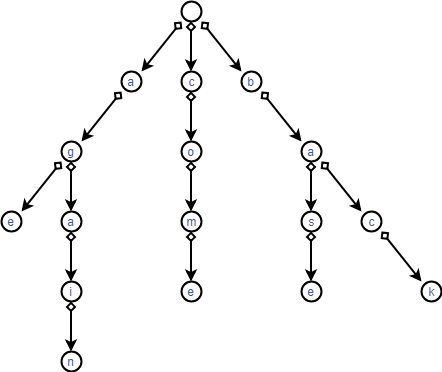

# 字典树 Trie

> 多模式串，多询问串

## 资料

[https://www.cnblogs.com/fusiwei/p/11972776.html](https://www.cnblogs.com/fusiwei/p/11972776.html)

**百科定义**

Trie树，是一种树形结构，是一种哈希树的变种。典型应用是用于统计，排序和保存大量的字符串（但不仅限于字符串），所以经常被搜索引擎系统用于文本词频统计。它的优点是：利用字符串的公共前缀来减少查询时间，最大限度地减少无谓的字符串比较，查询效率比哈希树高。

**性质**

它有3个基本性质：
根节点不包含字符，除根节点外每一个节点都只包含一个字符； 从根节点到某一节点，路径上经过的字符连接起来，为该节点对应的字符串； 每个节点的所有子节点包含的字符都不相同。

**基本操作**

其基本操作有：查找、插入和删除,当然删除操作比较少见。

**实现方法**

搜索字典项目的方法为：
(1) 从根结点开始一次搜索；
(2) 取得要查找关键词的第一个字母，并根据该字母选择对应的子树并转到该子树继续进行检索；
(3) 在相应的子树上，取得要查找关键词的第二个字母,并进一步选择对应的子树进行检索。
(4) 迭代过程……
(5) 在某个结点处，关键词的所有字母已被取出，则读取附在该结点上的信息，即完成查找。
其他操作类似处理

## 思路




**数据结构**
结构体实现

```C++
struct node {
	int nxt[27];
} trie[N];
```

**建树（插入）**

> 以下仅考虑包含 $a\to z$ 26个单词的 Trie

向Trie中插入一个单词 $s$

```C++
void add(char s[]) {
	int now=1,l=strlen(s);
	for(int i=0; i<l; i++) {
		int ch=s[i]-'a';
		if(!trie[now].nxt[ch]) {
			cnt++;
			trie[now].nxt[ch]=cnt;
		}
		now=trie[now].nxt[ch];
	}
}
```

**查询**
查询是否有单词 $s$ 或**以 $s$ 为前缀的单词**

```C++
int find(char s[]){
	int now=0,l=strlen(s);
	for(int i=0;i<l;i++){
		int ch=getch(s[i]);
		if(!tre[now].nxt[ch]){
			return 0;
		}
		now=tre[now].nxt[ch];
		 
	}
	return 1;
}
```

---

## 例题 #1

给定 $n$ 个模式串 $s_1, s_2, \dots, s_n$ 和 $q$ 次询问，每次询问给定一个文本串 $t_i$，请回答 $s_1 \sim s_n$ 中有多少个字符串 $s_j$ 满足 $t_i$ 是 $s_j$ 的**前缀**。

一个字符串 $t$ 是 $s$ 的前缀当且仅当从 $s$ 的末尾删去若干个（可以为 0 个）连续的字符后与 $t$ 相同。

输入的字符串大小敏感。例如，字符串 `Fusu` 和字符串 `fusu` 不同。

**本题单测试点内有多组测试数据**。

输入的第一行是一个整数，表示数据组数 $T$。

对于每组数据，格式如下：
第一行是两个整数，分别表示模式串的个数 $n$ 和询问的个数 $q$。
接下来 $n$ 行，每行一个字符串，表示一个**模式串**。
接下来 $q$ 行，每行一个字符串，表示一次询问（**询问串**）。

输出格式

按照输入的顺序依次输出各测试数据的答案。
对于每次询问，输出一行一个整数表示答案。

### 数据规模与约定

对于全部的测试点，保证 $1 \leq T, n, q\leq 10^5$，且输入字符串的总长度不超过 $3 \times 10^6$。输入的字符串只含大小写字母和数字，且不含空串。

### 说明

std 的 IO 使用的是关闭同步后的 cin/cout，本题不卡常。

---

```C++
#include<bits/stdc++.h>
using namespace std;
const int MAXN=3e6+5;
int cnt,n,q,T;
char s[MAXN];
struct tree{
	int nxt[63];
}tre[MAXN];
int nend[MAXN],sum[MAXN];
int getch(char c){
	int ch;
		if(c>='a')ch=c-'a'+10;// 10~35,a~z
		else if(c>='A')ch=c-'A'+36;//36~61,A~Z
		else ch=c-'0'; //0~9,0~9
		return ch;
}
void add(char s[]){
	int now=0,l=strlen(s);
	for(int i=0;i<l;i++){
		int ch=getch(s[i]);
		if(!tre[now].nxt[ch]){
			cnt++;
			tre[now].nxt[ch]=cnt;
		}
		now=tre[now].nxt[ch];sum[now]++;
	}
}
int find(char s[]){
	int now=0,l=strlen(s);
	for(int i=0;i<l;i++){
		int ch=getch(s[i]);
		if(!tre[now].nxt[ch]){
			return 0;
		}
		now=tre[now].nxt[ch];
		 
	}
	return sum[now];
}
int main(){
	scanf("%d",&T);
	while(T--){
		
		for(int i=0;i<=cnt;i++){
			sum[i]=0;
			for(int j=0;j<=61;j++)tre[i].nxt[j]=0;
		}
		cnt=0;
		
		cin>>n>>q;
		for(int i=1;i<=n;i++){
			scanf("%s",s);
			add(s);
		}for(int i=1;i<=q;i++){
			scanf("%s",s);
			printf("%d\n",find(s));
		}
	}
	return 0;
} 
```

## **匹配子串（后缀Trie）**

本题匹配的是前缀，但如果要匹配的是子串呢？那么我们就这样：假设一个模式串为acde，那么我们就把acde,cde,de,e都加入字典树即可。

**对应习题**

[练习 | 南外20230801](https://flowus.cn/dbb757e3-ed6a-49cc-9566-0593b4e65519)

## 01trie

01 trie 是一种特殊的 trie，字符集为 {0,1}，可以维护整数的二进制异或相关信息。

[www.luogu.com.cn](https://www.luogu.com.cn/problem/CF706D)


有q次操作和一个集合A，开始时集合中只有一个数0，下面有三种类型的操作：

- `+ x` 把x插入集合A

- `- x` 把x从集合A中删去，保证x已存在于集合A中

- `? x` 给一个数x在集合A中找一个y使得x^y最大，并求出这个值
数据范围:$1\leq q\leq 200000$ $1\leq x_i\leq10^9$

---

注意我们在建立trie树时应该是高位在上（即二进制的高位靠近树根），否则我们的贪心就失效了！

注意空间，和线段树一样是开死了的。

```C++
/*                                                                                
                      Keyblinds Guide
     				###################
      @Ntsc 2024

      - Ctrl+Alt+G then P : Enter luogu problem details
      - Ctrl+Alt+B : Run all cases in CPH
      - ctrl+D : choose this and dump to the next
      - ctrl+Shift+L : choose all like this
	  
*/
#include <bits/stdc++.h>
#include <queue>
using namespace std;

#define rep(i, l, r) for (int i = l, END##i = r; i <= END##i; ++i)
#define per(i, r, l) for (int i = r, END##i = l; i >= END##i; --i)
#define pb push_back
#define mp make_pair
#define int long long
#define pii pair<int, int>
#define ps second
#define pf first

// #define innt int
// #define inr int
// #define mian main
// #define iont int

#define rd read()
int read(){
    int xx = 0, ff = 1;
    char ch = getchar();
    while (ch < '0' || ch > '9') {
		if (ch == '-')
			ff = -1;
		ch = getchar();
    }
    while (ch >= '0' && ch <= '9')
      xx = xx * 10 + (ch - '0'), ch = getchar();
    return xx * ff;
}
void write(int out) {
	if (out < 0)
		putchar('-'), out = -out;
	if (out > 9)
		write(out / 10);
	putchar(out % 10 + '0');
}

// const char el='\n';
// const bool enable_dbg = 1;
// template <typename T,typename... Args>
// void dbg(T s,Args... args) {
// 	if constexpr (enable_dbg){
//     cerr << s << ' ';
// 		if constexpr (sizeof...(Args))
// 			dbg(args...);
// 	}
// }

const int N = 6e6 + 7;
const int INF = 1e18;
const int M = 1e7;
const int MOD = 1e9 + 7;


namespace trie{
    struct ndoe{
        int s[2];
        int cnt,val;
    }t[N];
    int idx=1;
    void insert(int m){
        int x=1;
        for(int i=63;~i;i--){
            int v=m>>i&1ll;
            if(!t[x].s[v])t[x].s[v]=++idx;
            x=t[x].s[v];
            t[x].cnt++;
        }
        t[x].val=m;

        // while(m){
        //     int cur=m&1;
        //     if(!t[x].s[cur])t[x].s[cur]=++idx;
        //     x=t[x].s[cur];
        //     t[x].cnt++;
        //     m>>=1;
        // }
    }

    void del(int m){
        int x=1;
        for(int i=63;~i;i--){
            int v=m>>i&1ll;
            x=t[x].s[v];
            t[x].cnt--;
        }

        // while(m--){
        //     int cur=m&1;
        //     x=t[x].s[cur];
        //     t[x].cnt--;
        //     m>>=1;
        // }
    }

    int query(int m){
        int x=1;
        // int res=0;
        // while(1){
        //     int cur=m&1;
        //     int f=0;
        //     if(t[x].s[1^cur]&&t[t[x].s[1^cur]].cnt)x=t[x].s[1^cur],f=1^cur;
        //     else x=t[x].s[cur],f=cur;
        //     if(!t[x].cnt)break;
        //     res<<=1;
        //     res|=cur^f;
        //     m>>=1;
        // }
        // return res;
        for(int i=63;~i;i--){
            int v=m>>i&1ll;
            if(t[x].s[v^1]&&t[t[x].s[v^1]].cnt)x=t[x].s[v^1];
            else x=t[x].s[v];
        }
        return m^t[x].val;
    }
}using namespace trie;

void solve(){
    int q=rd;
    insert(0);
    while(q--){
        char op;
        cin>>op;
        if(op=='-'){
            del(rd);
        }if(op=='+'){
            insert(rd);
        }if(op=='?'){
            cout<<query(rd)<<endl;
        }
    }
}

signed main() {
    int T=1;
    while(T--){
    	solve();
    }
    return 0;
}
```

[www.luogu.com.cn](https://www.luogu.com.cn/problem/P4735)


我们看到01trie是对每一个数字把其二进制加入trie树得到的。


当我们要查询所有数字中对x异或的最大值，那么我们就从低位到高位、同时从trie根节点往下按贪心策略（x当前位为1，那么走0，反之走1）走。

## 可持久化01trie

参考[课程 | 树上问题](https://flowus.cn/ef4b3baf-5965-403c-b945-941120260c4a)[TJOI2018] 异或


