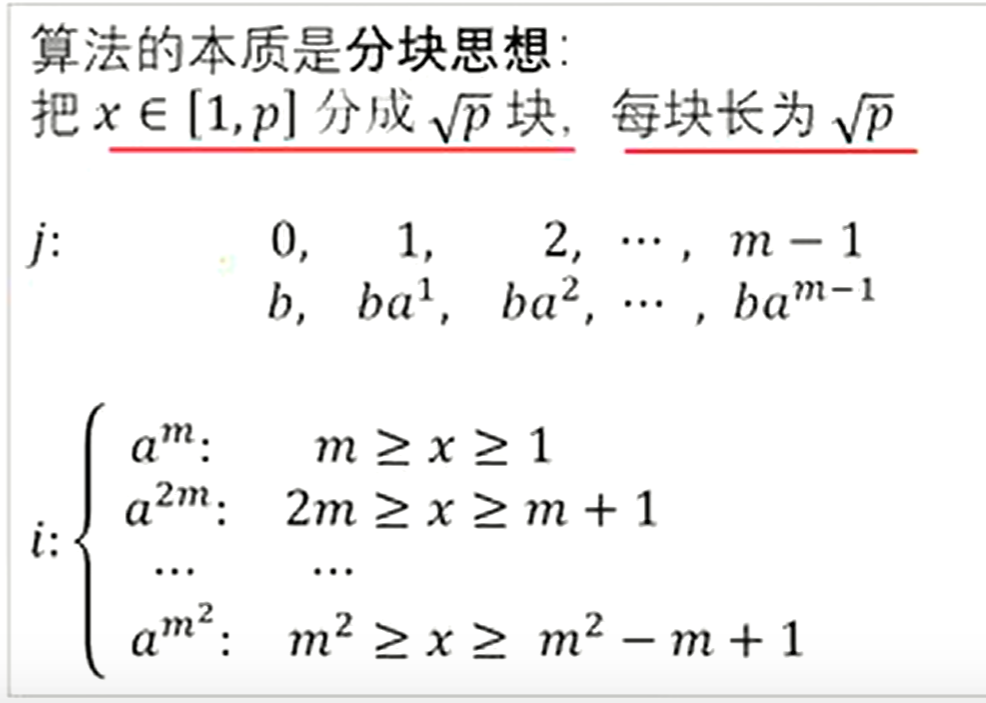

BSGS

# BSGS 北上广深算法（bushi

给定一个质数 $p$，以及一个整数 $b$，一个整数 $n$，现在要求你计算一个最小的非负整数 $l$，满足 $b^l \equiv n \pmod p$。

## 扩展欧拉定理

定义 $a^b \equiv \begin{cases} a^{b \bmod \varphi(m)},                &\gcd(a,m) =  1,                   \\ a^b,                                   &\gcd(a,m)\ne 1, b <   \varphi(m), \\ a^{(b \bmod \varphi(m)) + \varphi(m)}, &\gcd(a,m)\ne 1, b \ge \varphi(m). \end{cases} \pmod m$

欧拉定理：若 $\gcd(a, m) = 1$，则 $a^{\varphi(m)} \equiv 1 \pmod{m}$。

我们把ex欧拉的第一个性质拿出来，即$a^b \equiv a^{b \bmod \varphi(m)}   \pmod m,   \gcd(a,m) =  1$，那么我们知道，我们$a^b \pmod m$的循环节就应该是$\varphi(m)$。所以一个方法就是我们暴力枚举$b=0\sim \varphi(m)$即可。复杂度为 O(m)。

## 扩展欧拉定理的应用

给你三个正整数，$a,m,b$，你需要求：$a^b \bmod m$

【数据范围】
对于 $100\%$ 的数据，$1\le a \le 10^9$，$1\le b \le 10^{20000000}，1\le m \le 10^8$。

---

我们首先求出 $\varphi (m)$。对于求一个数字的phi值，我们可以直接根据定义来求解。

然后我们就可以在输入b时顺便对b取模了。注意次数在对phi取模后还要加上一个phi。不是对2\times phi取模！！

```C++
int getphi(int x)
{
	int ans=1,num=1;
	for(int i=2;i*i<=x;i++)
	{
		if(!(x%i))
		{
			num=i-1,x/=i;
			while(!(x%i)) num=num*i,x/=i;
			ans=num*ans;
		}
	}
	if(x!=1) ans=ans*(x-1);
	return ans;
}

int cal(string s,int MOD){
    int res=0,f=0;
    for(auto c:s){
        // dbg(c);
        res=(res*10+c-'0');
        if(res>=MOD)res%=MOD,f=1;
    }
    if(!f)return res;
    return res+MOD;
}
string s;
void solve(){
    a=rd,MOD=rd;
    cin>>s;
    int b=cal(s,getphi(MOD));

    cout<<ksm(a,b)<<endl;
}


signed main() {
    int T=1;
    while(T--){
    	solve();
    }
    return 0;
}
```

## BSGS

我们现在来考虑优化。令$b=ip-j,p=\lceil\sqrt m\rceil,i\in [1,p],j\in[0,p-1]$。这样的话我们b的取值恰好为$b\in[1,m]$，对于b=0我们特判即可。

那么这样的意义何在？

我们将 $b^l \equiv n \pmod m$表示为$b^{ip-j}\equiv n \pmod m$，变形$(b^i)^p\equiv nb^j \pmod m$其中p是定值。

首先，我们枚举i，用map记录二元组$(i,(b^i)^p\mod m)$，然后枚举j（独立），记录二元组$(j,nb^j\mod m)$。当我们第一次发现两个二元组$(i,(b^i)^p\mod m)(j,nb^j\mod m)$中第二元相同时，此时的i,j即答案。

这就相当于$i,j\in [1,n]$，求$f(i)=g(j)$时的i,j，我们不需要n^2枚举，只需要建立映射，看有没有i,j映射到同一个值是即可。

独立分开枚举$i,j$都是$O(\sqrt m)$的复杂度。



```C++
/*
Code bnxt Ntsc_Hodaka
*/

#include <bits/stdc++.h>
using namespace std;
#define int unsigned long long
#define mp make_pair
#define pii pair<int,int>

///----///
#define rd read()
inline int read() {
    int xx = 0, ff = 1;
    char ch = getchar();
    while (ch < '0' || ch > '9') {
        if (ch == '-')
            ff = -1;
        ch = getchar();
    }
    while (ch >= '0' && ch <= '9') xx = xx * 10 + (ch - '0'), ch = getchar();
    return xx * ff;
}
inline void write(int out) {
    if (out < 0)
        putchar('-'), out = -out;
    if (out > 9)
        write(out / 10);
    putchar(out % 10 + '0');
}

///----///
const int N = 2e6 + 5;
const int M = 1e7 + 5;
const int INF = 1e9 + 5;
int MOD=1e9+7;
const double eps=1e-7;

bool f1;
///----///
int n,a[N],b[N],x,ans;
bool f2;

int ksm(int a,int b){
	int res=1;
	while(b){
        if(b&1) (res*=a)%=MOD;
        (a*=a)%=MOD;
        b>>=1;
    }
	return res;
}

int bsgs(int a,int b,int p){
	a%=p;b%=p;
	if(b==1)return 0;
	int m=ceil(sqrt(p)),t=b;
	unordered_map<int,int> mp;
	mp[b]=0;
	for(int i=1;i<m;i++){
		t=t*a%p;
		mp[t]=i;
	}
	int res=ksm(a,m);
	t=1;
	for(int i=1;i<=m;i++){
		t=t*res%p;
		if(mp.count(t))return i*m-mp[t];
	}
	return -1;
}

signed main(){
	int p=rd,a=rd,b=rd;
	MOD=p;
	ans=bsgs(a,b,p);
	if(~ans)cout<<ans;
	else cout<<"no solution";
	return 0;
}


/*

*/
```

