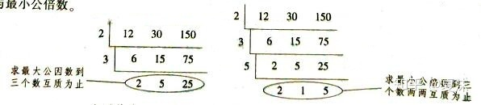

# GCD与LCM

### **最大公因数**



### **最小公倍数**

两个或多个整数公有的倍数叫做它们的公倍数，其中除0以外最小的一个公倍数就叫做这几个整数的最小公倍数。整数a，b的最小公倍数记为 $[a,b] $，同样的，a，b，c的最小公倍数记为$[a,b,c]$，多个整数的最小公倍数也有同样的记号。

与最小公倍数相对应的概念是最大公约数，a，b的最大公约数记为 **$(a,b)$** 。关于最小公倍数与最大公约数，我们有这样的定理： **$(a,b)\times[a,b]=ab$** ($a,b$均为整数)。

### **欧拉函数**

即 $\varphi(n)$，表示的是小于等于 n 和 n 互质的数的个数。 比如说 $\varphi(1) = 1$。

若 m 是素数，则$\varphi(m)=m-1$

若m=pq，其中p,q是质数且p≠q，则\varphi(m)=(p-1)(q-1)

若$m=\prod p_i^{l_i}$，即质因数分解，那么$\varphi(m)=m\times \prod (1-\frac{1}{p_i})$

求单点欧拉函数

```C++
int getphi(int x){
    int res=x;
    for(int i=2;i*i<=x;i++){
        if(x%i==0){
            res=res/i*(i-1);
            while(x%i==0)x/=i;
        }
    }
    if(x>1)res=res/x*(x-1);
    return res;
}

```

筛法求欧拉函数

```C++
int prime[N],notprime[N];
int cnt;
int phi[N];


void init(){
  phi[1]=1;
  for(int i=2;i<N;i++){
    if(!notprime[i]){
		prime[++cnt]=i;
		phi[i]=i-1;
    }
	for(int j=1;j<=cnt;j++){
		if(i*prime[j]>=N)break;
		notprime[i*prime[j]]=1;
		if(i%prime[j]==0){
			phi[i*prime[j]]=phi[i]*prime[j];break;
		}
		phi[i*prime[j]]=phi[i]*phi[prime[j]];
	}
  }
}


```

### 欧拉定理

若 $\gcd(a, m) = 1$，则 $a^{\varphi(m)} \equiv 1 \pmod{m}$。

是不是看着非常抽象？

### 辗转相除法

辗转相除法求`gcd(a,b)`算法实现

```C++
int gcd(int a, int b) {
    if (b == 0)
        return a;
    return gcd(b, a % b);
}
```

压行后（不知道对不对）

```C++
int gcd(int a, int b) {return b?gcd(b, a % b):a;}
```

### 更相减损术

gcd(a,b)=gcd(a-b,b)，递归条件你为a-b=0时返回b。

```C++
int gcd(int a,int b){
    if(a<b)swap(a,b);
    if(!b)return a;
    if((a&1)==0||(b&1)==0)return gcd(a>>1,b>>1)<<1;
    if((a&1)==0){a>>=1;return gcd(a,b);}
    if((b&1)==0){b>>=1;return gcd(a,b);}
    return gcd(a-b,b);
}
```


### STL

```C++
__gcd(int a,int b)
```

