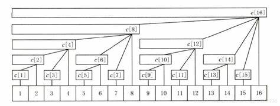

# 树状数组

再次强调，树状数组的change是**单点加**！！

[https://blog.csdn.net/weixin_43914593/article/details/107842628](https://blog.csdn.net/weixin_43914593/article/details/107842628)

[https://ntsc-yrx.github.io/2022/07/09/CPP%E8%BF%9B%E9%98%B6-%E6%A0%91%E7%8A%B6%E6%95%B0%E7%BB%84/](https://ntsc-yrx.github.io/2022/07/09/CPP%E8%BF%9B%E9%98%B6-%E6%A0%91%E7%8A%B6%E6%95%B0%E7%BB%84/)

## 例题 #1

如题，已知一个数列，你需要进行下面两种操作：

- 将某一个数加上 $x$

- 求出某区间每一个数的和

对于 $30\%$ 的数据，$1 \le n \le 8$，$1\le m \le 10$；
对于 $70\%$ 的数据，$1\le n,m \le 10^4$；
对于 $100\%$ 的数据，$1\le n,m \le 5\times 10^5$。

## 讲解

### 实现方法



### 关键函数 `lowbit(x)`

```C++
lowbit(x){return x&-x}
```

**作用：** 返回最后一位1的位置

**e.g.** 对`(11010)2`执行`lowbit`返回值为`(10)2`.
`x-lowbit(x)`操作可快速消去最后一位1

### `change(x,v)`

在树状数组意义下对x位置进行单点加v。

### `query(x)`

返回[1,x]的权值和。

### 应用

维护区间加，单点修改

这时我们应该使用change来维护差分数组并且使用query快速求出前缀和。

不可使用change来区间加而query(x)-query(x-1)，因为它根本没这功能！！

### 代码

```C++
#include<bits/stdc++.h>
using namespace std;


const int N=5e5+5;
//typedef long long ll;
int n,m,x,y;
int c[N];
int a;


int lowbit(int x) {
	return x&-x;
}


void add(int i,int x) {//在位置i加上x
	while(i<=N) {
		c[i]+=x;
		i+=lowbit(i);
	}
}


int sum(int x) {
	int res=0;
	while(x) {
		res+=c[x];
		x-=lowbit(x);
	}
	return res;
}
int main() {
	cin>>n>>m;
	for(int i=1; i<=n; i++){
		cin>>a;
		add(i,a);
	}
		//scanf("%d",&a[i]);
	while(m--) {
		int op;
		scanf("%d%d%d",&op,&x,&y);
		if(op==2)
			printf("%d\n",sum(y)-sum(x-1));	//sum(i)求的是a[i]~a[1]的和！！
		else {
			add(x,y);
		}
	}
	return 0;
}
```

