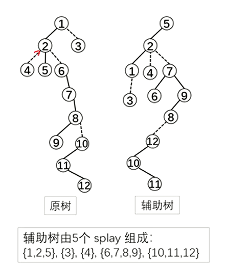
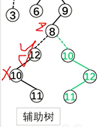
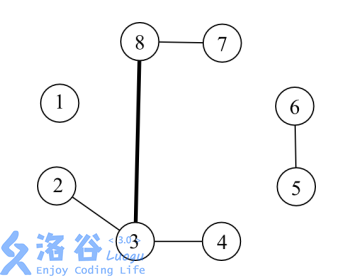

专题 | 高级の树上问题

[【详解】动态树 LCT_哔哩哔哩_bilibili](https://www.bilibili.com/video/BV18v4y1r7pd/?spm_id_from=333.337.search-card.all.click&vd_source=f45ea4e1e4b3b73d5f07c57b46c43aba)

[165 动态树 Link Cut Tree_哔哩哔哩_bilibili](https://www.bilibili.com/video/BV14S4y1x7rr/?spm_id_from=333.999.0.0)

# 动态树（LCT）

请先学习**Splay**  [其它平衡树](https://flowus.cn/9fdf7962-0706-4e16-9e5e-250e2f144e09)

给定 $n$ 个点以及每个点的权值，要你处理接下来的 $m$ 个操作。
操作有四种，操作从 $0$ 到 $3$ 编号。点从 $1$ 到 $n$ 编号。

- `0 x y` 代表询问从 $x$ 到 $y$ 的路径上的点的权值的 $\text{xor}$ 和。保证 $x$ 到 $y$ 是联通的。

- `1 x y` 代表连接 $x$ 到 $y$，若 $x$ 到 $y$ 已经联通则无需连接。

- `2 x y` 代表删除边 $(x,y)$，不保证边 $(x,y)$ 存在。

- `3 x y` 代表将点 $x$ 上的权值变成 $y$。

对于全部的测试点，保证：

- $1 \leq n \leq 10^5$，$1 \leq m \leq 3 \times 10^5$，$1 \leq a_i \leq 10^9$。

- 对于操作 $0, 1, 2$，保证 $1 \leq x, y \leq n$。

- 对于操作 $3$，保证 $1 \leq x \leq n$，$1 \leq y \leq 10^9$。

### XOR 异或运算

XOR 的运算真值表如下。

```C++
0 ^ 0 = 0
0 ^ 1 = 1
1 ^ 0 = 1
1 ^ 1 = 0
```

## 构建方法


辅助树：由若干 splay 构成，与原树是等价的，只需要维护辅助树

    性质：每条实链用一个 splay 维护中序遍历按深度严格递增

    注意

    - （ 1 ）区分树根（仅一个）和 splay 的根（多个）。

    - （ 2 ）虚边从下面 splay 的根指向上面 splay 中的父亲。（单向通道）

    - （ 3 ）实边和虚边是动态变化的。

一些辅助树构成了 Link cut Tree (LCT), 其维护的是整个森林





## 构造

### 预备函数

判断dianx是不是一个splay的树根，防止其向另外一颗splay连接实边

```C++
bool notrt(int x){
    return !(ls(fa(x))==x||rs(fa(x))==x);
}
```

### splay

先看旋转


原来的

```C++
void rotate(int x){
	int y=t[x].fa,z=t[y].fa;
	int k=(tr[y].s[1]==x);//这里很重要!如果true,说明x为y的左儿子,应该继续左旋
	//以下代码左右旋通用,我们以右旋为例
	tr[y].s[k]=tr[x].s[k^1];//将y的左儿子设置为x的右儿子(1)
	tr[tr[y].s[k]].fa=y;
	tr[x].s[k^1]=y;//将x的右儿子设置为y(2)
	tr[y].fa=x;
	tr[z].s[(tr[z].s[1]==y)]=x;//自动判断原来的y是z的左/右儿子
	tr[x].fa=z;//更新z的儿子,x的新父亲(3)
	pushup(x);pushup(y);//别忘了修改信息
}
```


新的

```C++
void rotate(int x){
	int y=t[x].fa,z=t[y].fa;
	int k=(tr[y].s[1]==x);//这里很重要!如果true,说明x为y的左儿子,应该继续左旋
	if(notrt(y)tr[z].s[(tr[z].s[1]==y)]=x;//自动判断原来的y是z的左/右儿子
	tr[x].fa=z;//更新z的儿子,x的新父亲(3)
	tr[y].s[k]=tr[x].s[k^1];//将y的左儿子设置为x的右儿子(1)
	tr[tr[y].s[k]].fa=y;
	tr[x].s[k^1]=y;//将x的右儿子设置为y(2)
	tr[y].fa=x;
	
	pushup(x);pushup(y);//别忘了修改信息
}
```

为什么要把第3部放到第一步并且还要判断呢？我们看这个例子





判断：假设不判根，那么我们就会将z向y连边，这样我们就把两颗splay错误合并了！

提前：如果我们不提前，那么我们就会在前面的旋转中把x←10,y←12，此时y的父亲变成了x，我们查看if发现是成立的，那么我们就会把z向x连边就又寄了。

看splay


原来的

```C++
void splay(int x,int k){//将x旋转到k下方
	while(tr[x].fa!=k){
		int y=tr[x].fa,z=tr[y].fa;
		//第一次旋转,要分情况
		if(z!=k)//若z=k,说明只需要做单旋了(说明目标点就为x的父亲)
			if((tr[y].s[0]==x)^(tr[z].s[0]==y)){//若y为z左,x为y左或者y为z右,x为y右,异或和均为0,表示是直线型
				rotate(x);
			}else rotate(y);
		//第二次旋转,都是旋转x 
		rotata(x);
	}
	if(k==0)rt=x;//如果k=0说明x被旋转到了根节点
}
```


新的

```C++
void pushall(int x){
    if(notrt(x))pushall(fa(X));
    pushdown(X);
}

void splay(int x){//将x旋转到k下方
    pushall(x);
	while(notrt(x)){
		int y=tr[x].fa,z=tr[y].fa;
		//第一次旋转,要分情况
		if(notrt(y))//若z=k,说明只需要做单旋了(说明目标点就为x的父亲)
			if((tr[y].s[0]==x)^(tr[z].s[0]==y)){//若y为z左,x为y左或者y为z右,x为y右,异或和均为0,表示是直线型
				rotate(x);
			}else rotate(y);
		//第二次旋转,都是旋转x 
		rotata(x);
	}
}
```

### access

打通从 x 到树根的路径，把路径变成一条实链。（为了维护性质，同时也伴随着一些实际边变成虚拟边）

从下到逐步更新 splay

1. 把当前点转到当前 splay 的根

2 ．把当前点的右儿子换成之前的节点

3 ，更新当前点的信息

4 ．把当前点换成当前点的父亲，继续操作

功能：完成实链的拆分与重组把不在路径上的点踢出去，把路径上的虚边变实际边。

```C++
void access(int x){
    for(int y=0;x;){
        splay(x);
        rs(x)=y;
        pushup(x);
        y=x,x=fa(x);
    }
}
```

### makert

换根．把指定点 x 变成树根。

把 x 提起来，让 x 成为深度最小的点

在辅助树上，换根=access+splay+翻转

步骤：

1. 使x到rt成为一条实际链，使x和rt在同一颗splay中

2. 将x旋转到rt的位置

3. 将整棵splay翻转（为什么？？）

```C++
void makert(x){
    access(x);
  splay(x);
  tr[x].tag^=1;//翻转标记
}
```

### split

把从×到 y 的路径分离出平，把路径变成一条实链，把 y 转到根

```C++
void split(int x,int y){
    makert(x);
    access(y);
    splay(y);
}
```

### findroot(x)

找根．把x在辅助树上的根找出来，并转到根（？？什么意思）

```C++
int findrt(int x){
    access(x);
    splay(x);
    while(ls(x))pushdown(x),x=ls(x);
    splay(x);
    return x;
}
```

### link

条件： y 与×不再同一颗splay中

原因：x是 splay 的根 ，y 不是 splay的根，故虚边应该从x指向 y

```C++
void link(int x,int y){
  makert(x);
  if(findrt(y)!=x)fa(x)=y;
 // makert(x);
  //if(finrt(y)==x&&fa(y)==x&&!ls(y))rs(x)=fa(y)=0,pushup(x);
}
```

### cut

状态：×必在 根的位置 

条件： y 与又在同一棵树中且 y 是x的后继

```C++
void link(int x,int y){
  makert(x);
  if(finrt(y)==x&&fa(y)==x&&!ls(y))rs(x)=fa(y)=0,pushup(x);
}
```

### change

修改点x的权值

```C++
void change(int x,int v){
  splay(x);//把x转到splay的根上（为何）
  tr[x].v=v;
  pushup(x);
}
```

## LCT搭建动态结构线段树

[国家集训队] Tree II

一棵 $n$ 个点的树，每个点的初始权值为 $1$。
对于这棵树有 $q$ 个操作，每个操作为以下四种操作之一：

- `+ u v c`：将 $u$ 到 $v$ 的路径上的点的权值都加上自然数 $c$；

- `- u1 v1 u2 v2`：将树中原有的边 $(u_1,v_1)$ 删除，加入一条新边 $(u_2,v_2)$，保证操作完之后仍然是一棵树；

- `* u v c`：将 $u$ 到 $v$ 的路径上的点的权值都乘上自然数 $c$；

- `/ u v`：询问 $u$ 到 $v$ 的路径上的点的权值和，将答案对 $51061$ 取模。

【数据范围】
对于 $100\%$ 的数据，$1\le n,q \le 10^5$，$0\le c \le 10^4$。

By (伍一鸣)

---

应该说是LCT板子了，在splay的某个节点上维护tag和区间信息，在pushup和pushdown上做一些修改。

```C++
// 动态线段树的LCT实现

#include <bits/stdc++.h>
#define rep(l, tagr, i) for (int i = l, END##i = tagr; i <= END##i; ++i)
#define per(tagr, l, i) for (int i = tagr, END##i = l; i >= END##i; --i)
using namespace std;
#define pb push_back
// #define mpy make_pair
#define int long long
#define pii pair<int, int>
#define ps b
#define pf a

#define X(j) i[j]
#define Y(j) (dp[j] + (i[j] + L) * (i[j] + L))
#define lc tr[x][0]
#define rc tr[x][1]
#define rd read()
int read() {
  int xx = 0, ff = 1;
  char ch = getchar();
  while (ch < '0' || ch > '9') {
    if (ch == '-')
      ff = -1;
    ch = getchar();
  }
  while (ch >= '0' && ch <= '9')
    xx = xx * 10 + (ch - '0'), ch = getchar();
  return xx * ff;
}
void write(int out) {
  if (out < 0)
    putchar('-'), out = -out;
  if (out > 9)
    write(out / 10);
  putchar(out % 10 + '0');
}

#define MOD 51061
const int N=100009;

#define mul(x) x*=tr;x%=MOD
#define add(x,tr) x+=tr;x%=MOD
unsigned int n,fa[N],tr[N][2],v[N],s[N],sz[N],tagm[N],taga[N],stk[N];
bool tagr[N];

namespace LCT{

    bool notrt(int x){
        return tr[fa[x]][0]==x||tr[fa[x]][1]==x;
    }
    void pushup(int x){
        s[x]=(s[lc]+s[rc]+v[x])%MOD;
        sz[x]=sz[lc]+sz[rc]+1;
    }
    void revtag(int x){//翻转
        int t=lc;lc=rc;rc=t;tagr[x]^=1;
    }
    void multag(int x,int tr){//乘
        mul(s[x]);mul(v[x]);mul(tagm[x]);mul(taga[x]);
    }
    void addtag(int x,int tr){//加
        add(s[x],tr*sz[x]);add(v[x],tr);add(taga[x],tr);
    }
    void pushdown(int x){
        if(tagm[x]!=1)multag(lc,tagm[x]),multag(rc,tagm[x]),tagm[x]=1;
        if(taga[x])   addtag(lc,taga[x]),addtag(rc,taga[x]),taga[x]=0;
        if(tagr[x])   {if(lc)revtag(lc);if(rc)revtag(rc);tagr[x]=0;}
    }
    void rotate(int x){
        int y=fa[x],z=fa[y],k=tr[y][1]==x,w=tr[x][!k];
        if(notrt(y))tr[z][tr[z][1]==y]=x;tr[x][!k]=y;tr[y][k]=w;
        if(w)fa[w]=y;fa[y]=x;fa[x]=z;
        pushup(y);
    }
    void splay(int x){
        int y=x,z=0;
        stk[++z]=y;
        while(notrt(y))stk[++z]=y=fa[y];
        while(z)pushdown(stk[z--]);
        while(notrt(x)){
            y=fa[x];z=fa[y];
            if(notrt(y))
                rotate((tr[y][0]==x)^(tr[z][0]==y)?x:y);
            rotate(x);
        }
        pushup(x);
    }
    void access(int x){
        for(int y=0;x;x=fa[y=x])
            splay(x),rc=y,pushup(x);
    }
    void makeroot(int x){
        access(x);
        splay(x);
        revtag(x);
    }
    void split(int x,int y){
        makeroot(x);
        access(y);
        splay(y);
    }
    void link(int x,int y){
        makeroot(x);fa[x]=y;
    }
    void cut(int x,int y){
        split(x,y);fa[x]=tr[y][0]=0;
    }
}

using namespace LCT;
signed main()
{
    char ch;
    n=rd;
    int q=rd,i,a,b,k;

    for(i=1;i<=n;++i)v[i]=sz[i]=tagm[i]=1;
    for(i=1;i<n;++i){
        a=rd,b=rd;
        link(a,b);
    }
    while(q--){
        cin>>ch;
        switch(ch){
        case '+':
            a=rd,b=rd,k=rd;
            split(a,b);addtag(b,k);
            break;
        case '-':
            a=rd,b=rd;cut(a,b);
            a=rd,b=rd;link(a,b);
            break;
        case '*':
            a=rd,b=rd,k=rd;
            split(a,b);multag(b,k);
            break;
        case '/':
            a=rd,b=rd;
            split(a,b);
            printf("%lld\n",s[b]);
        }
    }
    return 0;
}

```

## 动态维护连通性&双联通分量

可以说是并查集的升级，因为并查集只能连不能断

---


[SDOI2008] 洞穴勘测

辉辉热衷于洞穴勘测。

某天，他按照地图来到了一片被标记为JSZX的洞穴群地区。经过初步勘测，辉辉发现这片区域由n个洞穴（分别编号为1到n）以及若干通道组成，并且每条通道连接了恰好两个洞穴。假如两个洞穴可以通过一条或者多条通道按一定顺序连接起来，那么这两个洞穴就是连通的，按顺序连接在一起的这些通道则被称之为这两个洞穴之间的一条路径。 洞穴都十分坚固无法破坏，然而通道不太稳定，时常因为外界影响而发生改变，比如，根据有关仪器的监测结果，123号洞穴和127号洞穴之间有时会出现一条通道，有时这条通道又会因为某种稀奇古怪的原因被毁。

辉辉有一台监测仪器可以实时将通道的每一次改变状况在辉辉手边的终端机上显示：

如果监测到洞穴u和洞穴v之间出现了一条通道，终端机上会显示一条指令 `Connect u v`

如果监测到洞穴u和洞穴v之间的通道被毁，终端机上会显示一条指令 `Destroy u v`

经过长期的艰苦卓绝的手工推算，辉辉发现一个奇怪的现象：无论通道怎么改变，任意时刻任意两个洞穴之间至多只有一条路径。

因而，辉辉坚信这是由于某种本质规律的支配导致的。因而，辉辉更加夜以继日地坚守在终端机之前，试图通过通道的改变情况来研究这条本质规律。 然而，终于有一天，辉辉在堆积成山的演算纸中崩溃了……他把终端机往地面一砸（终端机也足够坚固无法破坏），转而求助于你，说道：“你老兄把这程序写写吧”。

辉辉希望能随时通过终端机发出指令 `Query u v`，向监测仪询问此时洞穴u和洞穴v是否连通。现在你要为他编写程序回答每一次询问。 已知在第一条指令显示之前，JSZX洞穴群中没有任何通道存在。

输入格式

第一行为两个正整数n和m，分别表示洞穴的个数和终端机上出现过的指令的个数。 以下m行，依次表示终端机上出现的各条指令。每行开头是一个表示指令种类的字符串s（"Connect”、”Destroy”或者”Query”，区分大小写），之后有两个整数u和v (1≤u, v≤n) 分别表示两个洞穴的编号。

输出格式

对每个Query指令，输出洞穴u和洞穴v是否互相连通：是输出”Yes”，否则输出”No”。（不含双引号）

100%的数据满足n≤10000, m≤200000

保证所有Destroy指令将摧毁的是一条存在的通道

本题输入、输出规模比较大，建议c\c++选手使用scanf和printf进行I\O操作以免超时

---

```C++
// 动态线段树的LCT实现

#include <bits/stdc++.h>
#define rep(l, tagr, i) for (int i = l, END##i = tagr; i <= END##i; ++i)
#define per(tagr, l, i) for (int i = tagr, END##i = l; i >= END##i; --i)
using namespace std;
#define pb push_back
// #define mpy make_pair
#define int long long
#define pii pair<int, int>
#define ps b
#define pf a

#define X(j) i[j]
#define Y(j) (dp[j] + (i[j] + L) * (i[j] + L))
#define lc tr[x][0]
#define rc tr[x][1]
#define rd read()
int read() {
  int xx = 0, ff = 1;
  char ch = getchar();
  while (ch < '0' || ch > '9') {
    if (ch == '-')
      ff = -1;
    ch = getchar();
  }
  while (ch >= '0' && ch <= '9')
    xx = xx * 10 + (ch - '0'), ch = getchar();
  return xx * ff;
}
void write(int out) {
  if (out < 0)
    putchar('-'), out = -out;
  if (out > 9)
    write(out / 10);
  putchar(out % 10 + '0');
}

#define MOD 51061
const int N = 300005;

int n, m;
int val[N];
namespace LCT {
  int fa[N];
  int sons[N][2];
  int rev[N];
  int q[N];
  int top;
  void pushdown(int id) {
    int l = sons[id][0], r = sons[id][1];
    if (rev[id]) {
      rev[l] ^= 1;
      rev[r] ^= 1;
      rev[id] ^= 1;
      swap(sons[id][0], sons[id][1]);
    }
  }
  bool notrt(int id) { return sons[fa[id]][0] == id || sons[fa[id]][1] == id; }
  void rotate(int id) {
    int f = fa[id], ff = fa[f], l, r;
    if (sons[f][0] == id)
      l = 0;
    else
      l = 1;
    r = l ^ 1;
    if (notrt(f)) {
      if (sons[ff][0] == f)
        sons[ff][0] = id;
      else
        sons[ff][1] = id;
    }
    fa[id] = ff;
    fa[f] = id;
    fa[sons[id][r]] = f;
    sons[f][l] = sons[id][r];
    sons[id][r] = f;
  }
  void splay(int id) {
    top = 1;
    q[top] = id;
    for (int i = id; notrt(i); i = fa[i])
      q[++top] = fa[i];
    for (int i = top; i; --i)
      pushdown(q[i]);
    int f, ff;
    while (notrt(id)) {
      f = fa[id];
      ff = fa[f];
      if (notrt(f)) {
        if ((sons[f][0] == id) ^ (sons[ff][0] == f))
          rotate(id);
        else
          rotate(f);
      }
      rotate(id);
    }
  }
  void access(int id) {
    for (int t = 0; id; t = id, id = fa[id])
      splay(id), sons[id][1] = t;
  }
  void makeroot(int id) {
    access(id);
    splay(id);
    rev[id] ^= 1;
  }
  int findroot(int id) {
    access(id);
    splay(id);
    while (sons[id][0])
      id = sons[id][0];
    return id;
  }
  void split(int x, int y) {
    makeroot(x);
    access(y);
    splay(y);
  }
  void cut(int x, int y) {
    split(x, y);
    if (sons[y][0] == x && sons[x][1] == 0)
      sons[y][0] = 0, fa[x] = 0;
  }
  void link(int x, int y) {
    makeroot(x);
    fa[x] = y;
  }
} // namespace LCT

using namespace LCT;
signed main() {
  scanf("%d%d", &n, &m);
  while (m--) {
    char op;
    cin >> op;
    int x = rd, y = rd;
    if (op == 'Q')
      puts((findroot(x) == findroot(y)) ? "Yes" : "No");
    if (op == 'D')
      cut(x, y);
    if (op == 'C')
      link(x, y);
  }
}

```

## 维护边权（常用于维护生成树）

[NOI2014] 魔法森林

[hack数据的提交link](https://www.luogu.com.cn/problem/U163126)

为了得到书法大家的真传，小 E 同学下定决心去拜访住在魔法森林中的隐士。魔法森林可以被看成一个包含 $n$ 个节点 $m$ 条边的无向图，节点标号为 $1,2,3,…,n$，边标号为 $1,2,3,…,m$。初始时小 E 同学在 $1$ 号节点，隐士则住在 $n$ 号节点。小 E 需要通过这一片魔法森林，才能够拜访到隐士。

魔法森林中居住了一些妖怪。每当有人经过一条边的时候，这条边上的妖怪 就会对其发起攻击。幸运的是，在 $1$ 号节点住着两种守护精灵：A 型守护精灵与 B 型守护精灵。小 E 可以借助它们的力量，达到自己的目的。

只要小 E 带上足够多的守护精灵，妖怪们就不会发起攻击了。具体来说，无向图中的每一条边 $e_i$ 包含两个权值 $a_i$ 与 $b_i$ 。若身上携带的 A 型守护精灵个数不少于 $a_i$ ，且 B 型守护精灵个数不少于 $b_i$ ，这条边上的妖怪就不会对通过这条边的人发起攻击。当且仅当通过这片魔法森林的过程中没有任意一条边的妖怪向 小 E 发起攻击，他才能成功找到隐士。

由于携带守护精灵是一件非常麻烦的事，小 E 想要知道，要能够成功拜访到 隐士，最少需要携带守护精灵的总个数。守护精灵的总个数为 A 型守护精灵的个数与 B 型守护精灵的个数之和。

输入格式

输入文件的第 $1$ 行包含两个整数 $n,m$，表示无向图共有 $n$ 个节点，$m$ 条边。 接下来 $m$ 行，第 $i+1$ 行包含 $4$ 个正整数 $X_i,Y_i,a_i,b_i$，描述第 $i$ 条无向边。 其中 $X_i$ 与 $Y_i$ 为该边两个端点的标号，$a_i$ 与 $b_i$ 的含义如题所述。 注意数据中可能包含重边与自环。

输出格式

输出一行一个整数：如果小 E 可以成功拜访到隐士，输出小 E 最少需要携 带的守护精灵的总个数；如果无论如何小 E 都无法拜访到隐士，输出 `-1`。


```C++
// 维护边权（维护生成树）的LCT实现

#include <bits/stdc++.h>
#define rep(l, tagr, i) for (int i = l, END##i = tagr; i <= END##i; ++i)
#define per(tagr, l, i) for (int i = tagr, END##i = l; i >= END##i; --i)
using namespace std;
#define pb push_back
// #define mpy make_pair
#define int long long
#define pii pair<int, int>
#define ps b
#define pf a

#define X(j) i[j]
#define Y(j) (dp[j] + (i[j] + L) * (i[j] + L))
#define lc tr[x][0]
#define rc tr[x][1]
#define rd read()
int read() {
  int xx = 0, ff = 1;
  char op = getchar();
  while (op < '0' || op > '9') {
    if (op == '-')
      ff = -1;
    op = getchar();
  }
  while (op >= '0' && op <= '9')
    xx = xx * 10 + (op - '0'), op = getchar();
  return xx * ff;
}
void write(int out) {
  if (out < 0)
    putchar('-'), out = -out;
  if (out > 9)
    write(out / 10);
  putchar(out % 10 + '0');
}

const int N = 200000;
const int MOD = 131072;
const int INF = 1e9;

int f[N], tr[N][2], mx[N];
bool r[N];

struct edge {
  int u, v, a, b;
  inline bool operator<(edge x) const { return a < x.a; }

} e[N]; 

namespace LCT{

  inline bool notrt(int x) { return tr[f[x]][0] == x || tr[f[x]][1] == x; }
  void pushup(int x) {
    mx[x] = x;
    if (e[mx[x]].b < e[mx[lc]].b)
      mx[x] = mx[lc];
    if (e[mx[x]].b < e[mx[rc]].b)
      mx[x] = mx[rc]; 
  }
  void pushdown(int x) {
    if (r[x]) {
      int t = lc;
      lc = rc;
      rc = t;
      r[lc] ^= 1;
      r[rc] ^= 1;
      r[x] = 0;
    }
  }
  void pushall(int x) {
    if (notrt(x))
      pushall(f[x]);
    pushdown(x);
  }
  void rotate(int x) {
    int y = f[x], z = f[y], k = tr[y][1] == x, w = tr[x][!k];
    if (notrt(y))
      tr[z][tr[z][1] == y] = x;
    tr[x][!k] = y;
    tr[y][k] = w;
    f[w] = y;
    f[y] = x;
    f[x] = z;
    pushup(y);
  }
  void splay(int x) {
    int y = x;
    pushall(x);
    while (notrt(x)) {
      if (notrt(y = f[x]))
        rotate((tr[y][0] == x) ^ (tr[f[y]][0] == y) ? x : y);
      rotate(x);
    }
    pushup(x);
  }
  void access(int x) {
    for (int y = 0; x; x = f[y = x])
      splay(x), rc = y, pushup(x);
  }
  void makert(int x) {
    access(x);
    splay(x);
    r[x] ^= 1;
  }
  inline int findrt(int x) {
    access(x);
    splay(x);
    while (lc)
      x = lc;
    return x;
  }
  void link(int x) {
    int y = e[x].u, z = e[x].v;
    makert(z);
    f[f[z] = x] = y;
  } 
  void cut(int x) {
    access(e[x].v);
    splay(x);
    lc = rc = f[lc] = f[rc] = 0;
    pushup(x);
  }
}

using namespace LCT;
signed main() {
  int n = rd, m = rd, i, y, z, ans = INF; 

  for (i = 1; i <= m; ++i)
    e[i].u = rd, e[i].v = rd, e[i].a = rd, e[i].b = rd, e[i].u |= MOD,
    e[i].v |= MOD; 
  sort(e + 1, e + m + 1);
  for (i = 1; i <= m; ++i) {
    if ((y = e[i].u) == (z = e[i].v))
      continue;
    makert(y);
    if (y != findrt(z))
      link(i);
    else if (e[i].b < e[mx[z]].b)
      cut(mx[z]), link(i);
    makert(1 | MOD);
    if ((1 | MOD) == findrt(n | MOD))
      ans=min(ans, e[i].a + e[mx[n | MOD]].b);
  }
  printf("%lld\n", ans == INF ? -1 : ans);
  return 0;
}

```

## 维护子树信息

[BJOI2014] 大融合

题目描述

小强要在 $N$ 个孤立的星球上建立起一套通信系统。这套通信系统就是连接 $N$ 个点的一个树。

这个树的边是一条一条添加上去的。

在某个时刻，一条边的负载就是它所在的当前能够联通的树上路过它的简单路径的数量。



例如，在上图中，现在一共有了 $5$ 条边。其中，$(3,8)$ 这条边的负载是 $6$，因为有六条简单路径 $2-3-8$,$2-3-8-7$,$3-8,3-8-7$,$4-3-8$,$4-3-8-7$ 路过了 $(3,8)$。

现在，你的任务就是随着边的添加，动态的回答小强对于某些边的负载的询问。

输入格式

第一行包含两个整数  $N, Q$,表示星球的数量和操作的数量。星球从 $1$ 开始编号。

接下来的 $Q$  行，每行是如下两种格式之一：

- `A x y` 表示在 $x$ 和 $y$ 之间连一条边。保证之前 $x$ 和 $y$ 是不联通的。

- `Q x y`表示询问 $(x,y)$ 这条边上的负载。保证 $x$ 和 $y$ 之间有一条边。

 输出格式

对每个查询操作，输出被查询的边的负载。

对于所有数据，$1≤N,Q≤10^5$

---

```C++
// 动态线段树的LCT实现

#include <bits/stdc++.h>
#define rep(l, tagr, i) for (int i = l, END##i = tagr; i <= END##i; ++i)
#define per(tagr, l, i) for (int i = tagr, END##i = l; i >= END##i; --i)
using namespace std;
#define pb push_back
// #define mpy make_pair
#define int long long
#define pii pair<int, int>
#define ps b
#define pf a

#define X(j) i[j]
#define Y(j) (dp[j] + (i[j] + L) * (i[j] + L))
#define lc tr[x][0]
#define rc tr[x][1]
#define rd read()
int read() {
  int xx = 0, ff = 1;
  char op = getchar();
  while (op < '0' || op > '9') {
    if (op == '-')
      ff = -1;
    op = getchar();
  }
  while (op >= '0' && op <= '9')
    xx = xx * 10 + (op - '0'), op = getchar();
  return xx * ff;
}
void write(int out) {
  if (out < 0)
    putchar('-'), out = -out;
  if (out > 9)
    write(out / 10);
  putchar(out % 10 + '0');
}


const int N=100009;
int fa[N],tr[N][2],sz[N],sum[N];
bool rtag[N];

namespace LCT{

  inline bool notrt(int x){return tr[fa[x]][0]==x||tr[fa[x]][1]==x;}
  void pushup(int x){
    sum[x]=sum[lc]+sum[rc]+sz[x]+1;
  }
  void pushdown(int x){
    if(rtag[x]){
      int t=lc;lc=rc;rc=t;
      rtag[lc]^=1;rtag[rc]^=1;rtag[x]=0;
    }
  }
  void pushall(int x){
    if(notrt(x))pushall(fa[x]);
    pushdown(x);
  }
  void rotate(int x){
    int y=fa[x],z=fa[y],k=tr[y][1]==x,w=tr[x][!k];
    if(notrt(y))tr[z][tr[z][1]==y]=x;tr[x][!k]=y;tr[y][k]=w;
    fa[w]=y;fa[y]=x;fa[x]=z;
    pushup(y);
  }
  void slope(int x){
    pushall(x);
    while(notrt(x))rotate(x);
    pushup(x);
  }
  void access(int x){
    for(int y=0;x;x=fa[y=x]){
      slope(x);
      sz[x]+=sum[rc];
      sz[x]-=sum[rc=y];
    }
  }
  void makeroot(int x){
    access(x);slope(x);
    rtag[x]^=1;
  }
  void split(int x,int y){
    makeroot(x);
      access(y);slope(y);
  }
  void link(int x,int y){
    split(x,y);
    fa[x]=y;
    sz[y]+=sum[x];
    pushup(y);
  }
}

using namespace LCT;

signed main(){
	int n=rd,q=rd,u,v;
	for(int i=1;i<=n;++i)sum[i]=1;
	while(q--){
    char op;
    cin>>op;
    u=rd,v=rd;
		if(op=='A')link(u,v);
		else{
			split(u,v);
			printf("%lld\n",(long long)(sz[u]+1)*(sz[v]+1));
		}
	}
	return 0;
}

```

## 练习

[LCT总结——应用篇（附题单）（LCT） - Flash_Hu - 博客园](https://www.cnblogs.com/flashhu/p/9498517.html)


