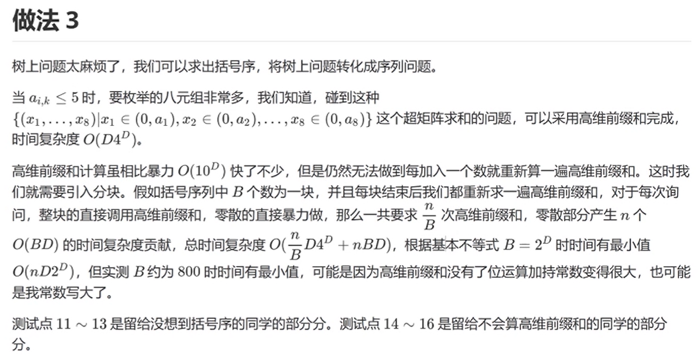

# CDQ分治（偏序问题）

【模板】三维偏序（陌上花开）

这是一道模板题，可以使用 bitset，CDQ 分治，KD-Tree 等方式解决。本题我们使用CDQ分治。

有 $n$ 个元素，第 $i$ 个元素有 $a_i,b_i,c_i$ 三个属性，设 $f(i)$ 表示满足 $a_j \leq a_i$ 且 $b_j \leq b_i$ 且 $c_j \leq c_i$ 且 $j \ne i$ 的 $j$ 的数量。

对于 $d \in [0, n)$，求 $f(i) = d$ 的数量。

输出 $n$ 行，第 $d + 1$ 行表示 $f(i) = d$ 的 $i$ 的数量。

$ 1 \leq n \leq 10^5$，$1 \leq a_i, b_i, c_i \le k \leq 2 \times 10^5 $。


## CDQ分治

[https://oi-wiki.org/misc/cdq-divide/](https://oi-wiki.org/misc/cdq-divide/)

我们先从二维偏序来引入。

## **二维偏序**


****给你一个长度为$n$的序列，每个序列都有$a,b$两种属性，让你求具有某些关系的点对$(i,j)$个数。一般思路是先确定一维的顺序，在此基础上用树状数组维护第二维。

逆序对的树状数组做法其实就是应用了二维偏序的思想。

**逆序对**

对于给定的一段正整数序列，逆序对就是序列中 $a_i>a_j$ 且 $i<j$ 的有序对。请算出给定的一段正整数序列中逆序对的数目。注意序列中可能有重复数字。

```C++
#include<bits/stdc++.h>
using namespace std;
#define N 100010
#define int long long
int a[N], tmp[N];
int cnt;

void merge(int left, int mid, int right) {
	int i, j, k;
	i = left;
	j = mid + 1;
	k = left;
	while (i <= mid && j <= right) {
		if (a[i] > a[j]) {
			cnt += j - k;//或者cnt += mid-i+1;
			tmp[k++] = a[j++];
		} else {
			tmp[k++] = a[i++];
		}
	}
	while (i <= mid)
		tmp[k++] = a[i++];
	while (j <= right)
		tmp[k++] = a[j++];

	for (i = left; i <= right; i++)
		a[i] = tmp[i];
}

void merge_sort(int left, int right) {
	int mid;
	if (left == right)
		return;
	mid = (left + right) / 2;
	merge_sort(left, mid);
	merge_sort(mid + 1, right);
	merge(left, mid, right);
}

signed main() {
	int i, n;

	scanf("%lld", &n);
	for (i = 1; i <= n; i++)
		scanf("%lld", &a[i]);

	merge_sort(1, n);
	
	printf("%lld\n", cnt);
	
	for(int i=1;i<=n;i++){
		cout<<a[i]<<' ';
	}
	return 0;
}
```

对于所有数据，$n \leq 5 \times 10^5$

**思路**

我们维护值域树状数组，从左往右逐渐加入$a_i$，并且求出树状数组中值域在$1\sim a_i$的前缀和$q_i$即可（树状数组维护前缀和），然后用$i-q_i$就求出了下标在i之前且值比a_i大的数的个数。

为了优化空间，我们离散化一下即可。

先将数据排序，再用 $1 \sim n$ 分别对应 $n$ 个数表示它们的相对大小，对新的序列建树状数组空间就够了。对于相等的值，我们让越靠近左边的相对大小越小即可。

**练习**

[www.luogu.com.cn](https://www.luogu.com.cn/problem/CF1311F)


在数轴 $OX$ 上有 $n$ 个点。第 $i$ 个点最初在坐标 $x_i$， 并且有一个速度 $v_i$，$x_i$ 互不相同。第 $i$ 个点在 $t$ 时刻的坐标为 $x_i + t \cdot v_i$ （$t$ 可能不是整数）。

对于两个点 $i$ 和 $j$，设 $d(i,j)$ 为 $i$ 和 $j$ 在任意时刻下的可能的最小距离（时刻可能不是整数）。如果 $i$ 和 $j$ 在某一时刻重合，那么 $d(i,j)=0$。

你的任务是计算出下面这个式子的值（对于任意两个点的最小距离之和）：

$\sum_{1\leq i < j \leq n}d(i,j)$

本题要求任意两点中间的最小距离之和，并且没有说要在同一时间取到。所以我们可以想到，这两个点的最小距离要么是 $0$，要么是初始距离。

那么什么时候是 $0$ 呢？很容易可以知道，设这两个点为 $i,j$，如果 $x_i<x_j$ 且 $v_i>v_j$，那么 $d(i,j)=0$。就是常说的追及问题。

那么什么时候是初始距离呢？当然就是追不上的情况，即 $x_i<x_j$ 且 $v_i<v_j$。

所以本题就变成了：求所有 $i,j$ 使得 $x_i<x_j$ 且 $v_i≤v_j$，求 $x_j-x_i$。

乍一看前面的条件，那不就是二维偏序嘛（类似逆序对，只不过是顺序对）。那么我们就往二维偏序上去想。

二维偏序最常用的是什么？树状数组。回顾一下逆序对的树状数组做法是怎么样的。我们维护值域树状数组，从左往右逐渐加入 $a_i$（即在 $a_i$ 处 $+1$），并且求出树状数组中值域在 $1\sim a_i$ 的前缀和 $q_i$ 即可（树状数组维护前缀和），然后用 $i-q_i$ 就求出了下标在 $i$ 之前且值比 $a_i$ 大的数的个数。

那么本题要求的是值，而不是个数，我们就可以考虑维护两个树状数组，一个记录 $x_i$ 的大小关系，为权值树状数组，我们称之为 $A$；一个记录 $x_i$ 的值，我们称之为 $B$。

按照 $v_i$ 从小到大排序，我们遍历 $i$。当我们遍历到一个 $x_i$，我们就在 $A$ 中查询满足 $x_j<x_i$ 的 $x_j$ 的个数，记为 $cnt_i$，然后在 $B$ 中求出这些 $x_j$ 的和，我们记为 $sum_i$。那么很显然，答案应该加上 $x_i\times cnt_i-sum_i$。

最后我们将 $x_i$ 分别插入 $A,B$ 中。注意，$x_i$ 在 $B$ 中插入的相对位置应该和 $A$ 中的一样。

```C++
/*////////ACACACACACACAC///////////
       . Coding by Ntsc .
       . FancyKnowledge .
       . Prove Yourself .
/*////////ACACACACACACAC///////////

//
#include<bits/stdc++.h>

//
#define int long long
#define ull unsigned long long
#define db double
#define endl '\n'
#define err(fmt, ...) fprintf(stderr, "[%d] : " fmt "\n", __LINE__, ##__VA_ARGS__)
///*
#define pr pair<double,int>
#define pf first
#define ps second
#define pb push_back
//*/

//
using namespace std;
//
const int N=2e5+5;
const int M=1e3;
const int MOD=1e9+7;
const int MMOD=903250223;
const int INF=1e9;
const int IINF=1e18;
const db eps=1e-9;
//
int n,m,x,y;

int to[N],ans;
int c[2][N<<2];//两棵树状数组

struct node{
	int x,v;
}a[N];


int lowbit(int x) {
	return x&-x;
}


void add(int f,int i,int x) {//在位置i加上x
	while(i<=n) {
		c[f][i]+=x;
		i+=lowbit(i);
	}
}


int query(int f,int x) {
	int res=0;
	while(x) {
		res+=c[f][x];
		x-=lowbit(x);
	}
	return res;
}

bool cmp(node a,node b){
	if(a.v==b.v)return a.x<b.x;//v相同时也追不上
	return a.v<b.v;
}

signed main() {
	cin>>n;
	for(int i=1;i<=n;i++){
		cin>>a[i].x;
		to[i]=a[i].x;
	}
	for(int i=1;i<=n;i++){
		cin>>a[i].v;
	}
	sort(to+1,to+n+1);
	for(int i=1;i<=n;i++){
		a[i].x=lower_bound(to+1,to+n+1,a[i].x)-to;//离散化，将值a_i离散为第x大
	}
	
	sort(a+1,a+n+1,cmp);
	
	for(int i=1;i<=n;i++){
		int sum=query(1,a[i].x-1);
		add(1,a[i].x,to[a[i].x]);
		int cnt=query(0,a[i].x-1);
		add(0,a[i].x,1);
		ans+=cnt*to[a[i].x]-sum;
		
		
	}
	
	cout<<ans<<endl;
	return 0;
}
```

注意本题需要离散化。

||||||
|-|-|-|-|-|
|a.x|2|5|13|9|
|to排序后|2|5|9|13|
|a.x离散化后|1|2|4|3|

$a_i.x$ 离散化后的值即 $a_i.x$ 在所有 $x$ 中按从小到大排序后的排名。这样即可把值域映射到 $n$。

注意树状数组空间大小不能只开 $n$。

## **三维偏序**

CDQ 分治是一种特殊的分治方法，通常用来解决一类“存在修改，但修改独立、允许离线”的数据结构题。实际上它的本质是按时间分治，若要处理时间$[l,r]$上的修改与询问操作，就先处理$[l,mid]$上的修改对$[mid+1,r]$上的询问的影响，之后再递归处理$[l,mid][mid+1,r]$，根据问题的不同，这几个步骤的顺序有时也会不一样。

CDQ 分治适用于满足以下两个条件的数据结构题：

（ 1 ）修改操作对询问的贡献独立，修改操作之问互不影响效果。

（ 2 ）题目允许使用离线算法。


**总结**

三维偏序就是在二维偏序的基础上加上一维。
给你一个长度为n的序列，每个序列都有a，b，c三种属性，让你求具有某些关系的点对（i，j）个数。一般思路是先确定一维的顺序，分治维护第二维，再结合上边的二维偏序中的树状数组维护第三维。

- 找到这个序列的中点 mid

- 将所有点对（i,j）划分为 3 类
第一类是$[l,i,j,mid,r]$
第二类是$[l,i,mid,j,r]$
第三类是$[l,mid,i,j,r]$


- 将 这个序列拆成两个序列（1，mid）和 (mid+1,n) 会发现第一类点对和第三类点对都在这两个序列之中，递归的去解决这两类点对


通过分治来解决第二类点对


**本题思路**

先按$x$排序。

分治时每次将前半边、后半边分别按$y$排序。虽然现在$x$的顺序被打乱了，但是前半边还是都小于后半边的，所以要是只计算前半边对后半边的偏序关系，是不会受到$x$的影响的。

维护后一半的指针$i$，前一半的指针$j$，每次将i后移一位时，若$y_j≤y_i$则不断后移$j$，并不断将$z_j$加入树状数组。然后再查询树状数组中有多少数小于等于$z_i$（树状数组求前缀和）。 

最后要清空树状数组。

**代码**

暴力

```C++
/*////////ACACACACACACAC///////////
       . Coding by Ntsc .
       . FancyKnowledge .
       . Prove Yourself .
/*////////ACACACACACACAC///////////

//
#include<bits/stdc++.h>

//
#define int long long
#define ull unsigned long long
#define db double
#define endl '\n'
#define err(fmt, ...) fprintf(stderr, "[%d] : " fmt "\n", __LINE__, ##__VA_ARGS__)
///*
#define pr pair<double,int>
#define pf first
#define ps second
#define pb push_back
//*/

//
using namespace std;
//
const int N=2e5+5;
const int M=1e3;
const int MOD=1e9+7;
const int MMOD=903250223;
const int INF=1e9;
const int IINF=1e18;
const db eps=1e-9;
//
int n,m,a[N],b[N],c[N],q,s[N],k,idx,len[N],ans,res,tmp,cnt[N],id[N];

int d(int x){
	int res=0;
	for(int i=1;i<=n;i++){
		if(i==x)continue;
		if(a[i]<=a[x]&&b[i]<=b[x]&&c[i]<=c[x])res++;
	}
	return res;
}

signed main(){

//	freopen(".in","r",stdin);
//	freopen(".out","w",stdout);
//	freopen(".txt","w",stderr);

	cin>>n>>k;
	for(int i=1;i<=n;i++){
		cin>>a[i]>>b[i]>>c[i];
		
	}
	
	for(int i=1;i<=n;i++){
		cnt[d(i)]++;
	}
	
	for(int i=0;i<n;i++){
		cout<<cnt[i]<<endl;
	}
	return 0;
}

//check your long long and the size of memery!!!

```

CDQ 分治嵌套

```C++
/*////////ACACACACACACAC///////////
       . Coding by Ntsc .
       . FancyKnowledge .
       . Prove Yourself .
/*////////ACACACACACACAC///////////

//
#include<bits/stdc++.h>

//
#define int long long
#define ull unsigned long long
#define db double
#define endl '\n'
#define err(fmt, ...) fprintf(stderr, "[%d] : " fmt "\n", __LINE__, ##__VA_ARGS__)
///*
#define pr pair<double,int>
#define pf first
#define ps second
#define pb push_back
//*/

//
using namespace std;


#define rd read()
inline int read() {
    int xx = 0, ff = 1;
    char ch = getchar();
    while (ch < '0' || ch > '9') {
        if (ch == '-')
            ff = -1;
        ch = getchar();
    }
    while (ch >= '0' && ch <= '9') xx = xx * 10 + (ch - '0'), ch = getchar();
    return xx * ff;
}
inline void write(int out) {
    if (out < 0)
        putchar('-'), out = -out;
    if (out > 9)
        write(out / 10);
    putchar(out % 10 + '0');
}
//
const int N=2e5+5;
const int M=1e3;
const int MOD=1e9+7;
const int MMOD=903250223;
const int INF=1e9;
const int IINF=1e18;
const db eps=1e-9;
//
int n,m,ans[N],q,d[N],k,idx,len[N],res,tmp,cnt[N],id[N];

struct node{
    int a,b,c,f;
    int *ans;
}a[N],b[N],c[N];

bool cmp(node x,node y){
    if(x.a == y.a&&x.b==y.b)return x.c<y.c;
    if(x.a==y.a)return x.b<y.b;
    return x.a<y.a;
}

void cdq2(int l,int r){
    if(l==r)return;
    int mid = (l+r)/2;
    cdq2(l,mid);
    cdq2(mid+1,r);
    int i=l,k=mid+1,j=l,cnt=0;
    for(;i<=r;i++){
        if((k>r||b[j].c<=b[k].c)&&j<=mid)c[i]=b[j++],cnt+=c[i].f;
        else{
            c[i]=b[k++];
            if(!c[i].f)*c[i].ans+=cnt;
        }
    }
    for(i=l;i<=r;i++)b[i]=c[i];

}

void cdq1(int l,int r){
    if(l==r)return;
    int mid = (l+r)/2;
    cdq1(l,mid);
    cdq1(mid+1,r);
    
    int i=l,k=mid+1,j=l;
    for(;i<=r;i++){
        if((k>r||a[j].b<=a[k].b)&&j<=mid)b[i]=a[j++],b[i].f=1;
        else b[i]=a[k++],b[i].f=0;
    }
    for(int i=l;i<=r;i++)a[i]=b[i];

    cdq2(l,r);
}
signed main(){

//	freopen(".in","r",stdin);
//	freopen(".out","w",stdout);
//	freopen(".txt","w",stderr);

	cin>>n>>k;
	for(int i=1;i<=n;i++){
		a[i].a=rd;a[i].b=rd;a[i].c=rd;
		a[i].ans=&ans[i];
        
	}sort(a+1,a+n+1,cmp);

    for(int i=n-1;i;i--){
        if(a[i].a==a[i+1].a&&a[i].b==a[i+1].b&&a[i].c==a[i+1].c)*a[i].ans=*a[i+1].ans+1;
    }

    cdq1(1,n);

    for(int i=1;i<=n;i++)d[ans[i]]++;
    for(int i=0;i<n;i++)cout<<d[i]<<endl;
	return 0;
}

//check your long long and the size of memery!!!

```

树状数组cdq分治

[www.luogu.com.cn](https://www.luogu.com.cn/blog/hbxblog/solution-p3810)


```C++
/*
CB Ntsc111
*/

#include <bits/stdc++.h> m
using namespace std;

#define ull unsigned int
#define pii pair<int, int>
#define pf to
#define ps second
#define pb push_back
#define int long long

#define err cerr << "Error"
#define rd read()

#define ot write
#define nl putchar('\n')
int read() {
  int xx = 0, ff = 1;
  char ch = getchar();
  while (ch < '0' || ch > '9') {
    if (ch == '-')
      ff = -1;
    ch = getchar();
  }
  while (ch >= '0' && ch <= '9')
    xx = xx * 10 + (ch - '0'), ch = getchar();
  return xx * ff;
}
void write(int out) {
  if (out < 0)
    putchar('-'), out = -out;
  if (out > 9)
    write(out / 10);
  putchar(out % 10 + '0');
}

const int mxxlog = 10;
int INF = 1e18 + 7;
const int N = 5e5 + 5;

int n, k;
int ans[N], d[N];
int tr[N];
struct node {
  int a, b, c, *id;
} a[N], b[N], c[N], tmp[N];

int stk[N], top;

inline int lowbit(int x) { return x & -x; }

void add(int x, int v = 1) {
  while (x <= N) {
    // cerr << x << endl;
    tr[x] += v;
    x += lowbit(x);
  }
}

int query(int x) {
  int res = 0;
  while (x) {
    res += tr[x];
    x -= lowbit(x);
  }
  return res;
}

void cdq(int l, int r) {
  // cout << l << ' ' << r << endl;
  if (l == r)
    return;
  int mid = l + r >> 1;
  cdq(l, mid);
  cdq(mid + 1, r);

  int i = l, j = mid + 1, k = l - 1;

  while (i <= mid && j <= r) {
    if (a[i].b <= a[j].b) {
      // *a[i].id += query(a[i].c);
      add(a[i].c);
      stk[++top] = a[i].c;
      tmp[++k] = a[i];
      i++;
    } else {
      *a[j].id += query(a[j].c);
      // cerr<<a[j].id-ans<<':'<< query(a[j].c)<<endl;
      // add(a[j].c);
      // stk[++top] = a[j].c;
      tmp[++k] = a[j];
      j++;
    }
  }

  while (i <= mid)
    tmp[++k] = a[i++];
  while (j <= r) {
    tmp[++k] = a[j];
      // cerr<<j<<'-'<< query(a[j].c)<<endl;
    *a[j].id += query(a[j].c);
    j++;
  }
  while (top) {
    add(stk[top--], -1);
  }
  memset(tr,0,sizeof tr);
  // cerr << "dbg:" << l << ' ' << r << endl;
  for (int i = l; i <= r; i++) {
    // cerr << tmp[i].a << ' ' << tmp[i].b << ' ' << tmp[i].c << endl;
    a[i] = tmp[i];
  }
}
bool cmp(node x, node y) {
  if (x.a == y.a && x.b == y.b)
    return x.c < y.c;
  if (x.a == y.a)
    return x.b < y.b;
  return x.a < y.a;
}
signed main() {
  n = rd, k = rd;
  for (int i = 1; i <= n; i++) {
    a[i].a = rd, a[i].b = rd, a[i].c = rd, a[i].id = &ans[i];
  }

  sort(a + 1, a + n + 1, cmp);
  
  for (int i = n - 1; i; i--) {
    if (a[i].a == a[i + 1].a && a[i].b == a[i + 1].b && a[i].c == a[i + 1].c)
      *a[i].id = *a[i + 1].id + 1;
  }

  // cerr << "OK";
  cdq(1, n);
  for (int i = 1; i <= n; i++)
    d[ans[i]]++;
  for (int i = 0; i < n; i++)
    printf("%lld\n",d[i]);
}
```

## **扩展：四维偏序**

维护四维偏序，我们恐怕不能按排序+分治+树状数组这三种不同的方法组合来解决了。

其实我们的CDQ分治是可以嵌套的，如下：

[www.luogu.com.cn](https://www.luogu.com.cn/blog/user39216/solution-p3810)


我们假设四维偏序的4个关键字为$x,y,z,k$。

我们按$x$从小到大（也有可能是别的顺序）排序，然后从中间分治。那么对于区间$[l,mid][mid+1,r]$中分别按照$y$从小到大排序。

这样我们能保证左边的$x$一定小于右边的x。那么对于左右区间，我们有可以继续分治，然后按$z$的从小到大排序。继续分治下去，按照$k$从小到大排序。这样我们就可以把区间分成8块，满足左边的块中的$x,y,z$都小于右边的块。

这就是CDQ的嵌套。对于处理4个关键字的偏序（四维偏序），我们就需要三层嵌套。对于高维偏序，我们也可以这样嵌套下去。

## 练习

[www.luogu.com.cn](https://www.luogu.com.cn/problem/P2365)


高维偏序特殊性质的求解

[题目详情 - 有根树上求八维偏序 - 云斗学院](https://yundouxueyuan.com/p/YDRG001F)


利用偏序值域非常小而实现偏序条件多的情况，此时应该直接使用桶来记录答案，并且考虑如何快速地统计答案。





