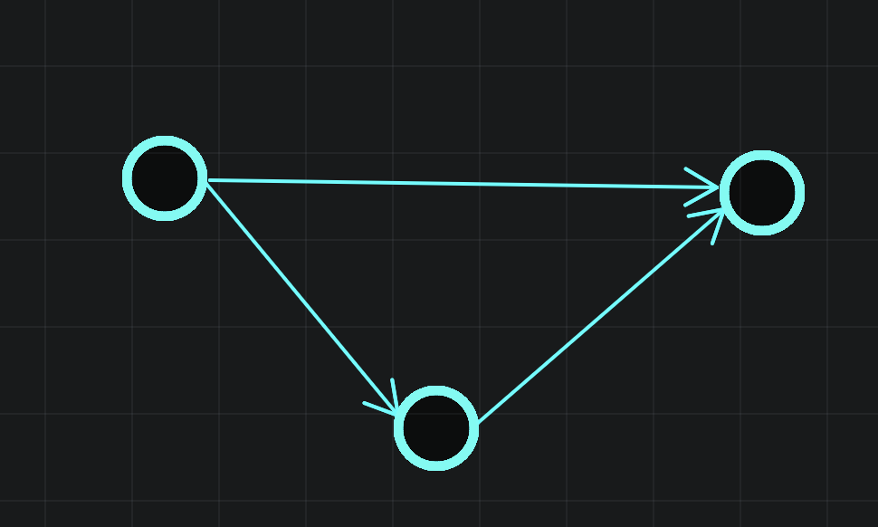

专题 | 分治&排序&偏序

# 排序

## 简单排序

**堆排序**

全部入优先队列，然后全部出。

**sort**

不用多说了。 

## 计数排序

先统计一遍~~塔姬娅~~桶，然后将桶前缀和，最后从桶中得到排序。

```C++
for(int i=1;i<=n;i++)cnt[a[i]]++;
for(int i=1;i<M;i++)cnt[i]+=cnt{i-1};
for(int i=1;i<=n;i++)rk[i]=cnt[a[i]],b[cnt[a[i]]--]=a[i];
```

## 基数排序

基数排序通过若干个关键字排序。假设对int数字进行排序，那么我们可以把每个数字n的二进制小16位作为第二关键字，大16位作为第一关键字。然后先对第二关键字进行计数排序，然后对第一关键字进行计数排序。这样的排序是稳定的，因为计数排序的从前往后，对于值相同的数相对顺序不会改变的。

代码可以参考[学习笔记 | SA](https://flowus.cn/cdc2f36a-560c-4abe-aed9-a36439b488d5)后缀数组计算函数


## 归并排序

```C++
#include<bits/stdc++.h>
using namespace std;
#define N 100010
#define int long long
int a[N], tmp[N];
int cnt;

void merge(int left, int mid, int right) {
	int i, j, k;
	i = left;
	j = mid + 1;
	k = left;
	while (i <= mid && j <= right) {
		if (a[i] > a[j]) {
			cnt += j - k;//或者cnt += mid-i+1;
			tmp[k++] = a[j++];
		} else {
			tmp[k++] = a[i++];
		}
	}
	while (i <= mid)
		tmp[k++] = a[i++];
	while (j <= right)
		tmp[k++] = a[j++];

	for (i = left; i <= right; i++)
		a[i] = tmp[i];
}

void merge_sort(int left, int right) {
	int mid;
	if (left == right)
		return;
	mid = (left + right) / 2;
	merge_sort(left, mid);
	merge_sort(mid + 1, right);
	merge(left, mid, right);
}

signed main() {
	int i, n;

	scanf("%lld", &n);
	for (i = 1; i <= n; i++)
		scanf("%lld", &a[i]);

	merge_sort(1, n);
	
	printf("%lld\n", cnt);
	
	for(int i=1;i<=n;i++){
		cout<<a[i]<<' ';
	}
	return 0;
}
```

## 自定义规则排序 | [NOIP1998 提高组] 拼数

题目描述

设有 $n$ 个正整数 $a_1 \dots a_n$，将它们联接成一排，相邻数字首尾相接，组成一个最大的整数。

---

按a+b>b+a排序！不要按a>b排序（hack：）


```C++
6
321 32 407 135 13 217
 
```


```C++
4073232121713513

```


WA ans：

4073213221713513

```C++
string s[N];

bool cmp(string a,string b){
	return a+b>b+a;
}
signed main() {
//    freopen("tree.in", "r", stdin);
//    freopen("tree.out", "w", stdout);
	cin>>n;
	for(int i=1;i<=n;i++)cin>>s[i];
	sort(s+1,s+n+1,cmp);
	for(int i=1;i<=n;i++)cout<<s[i];
    return 0;
}
```

## 排序

一个不同的值的升序排序数列指的是一个从左到右元素依次增大的序列，例如，一个有序的数列 $A,B,C,D$ 表示 $A<B,B<C,C<D$。在这道题中，我们将给你一系列形如 $A<B$ 的关系，并要求你判断是否能够根据这些关系确定这个数列的顺序。

输入格式

第一行有两个正整数 $n,m$，$n$ 表示需要排序的元素数量，$2\leq n\leq 26$，第 $1$ 到 $n$ 个元素将用大写的 $A,B,C,D,\dots$ 表示。$m$ 表示将给出的形如 $A<B$ 的关系的数量。

接下来有 $m$ 行，每行有 $3$ 个字符，分别为一个大写字母，一个 `<` 符号，一个大写字母，表示两个元素之间的关系。

输出格式

若根据前 $x$ 个关系即可确定这 $n$ 个元素的顺序 `yyy..y`（如 `ABC`），输出

`Sorted sequence determined after xxx relations: yyy...y.`

若根据前 $x$ 个关系即发现存在矛盾（如 $A<B,B<C,C<A$），输出

`Inconsistency found after x relations.`

若根据这 $m$ 个关系无法确定这 $n$ 个元素的顺序，输出

`Sorted sequence cannot be determined.`

（提示：确定 $n$ 个元素的顺序后即可结束程序，可以不用考虑确定顺序之后出现矛盾的情况）

$2 \leq n \leq 26,1 \leq m \leq 600$。

---

这题你可能会想到链表+搜索，但这样复杂度不太稳定，要剪枝。

其实这道题是拓扑排序。我们每次给出一个关系A>B就按连边A→B，然后跑一次拓扑排序。

对应每次拓扑排序，可能有以下的情况

- 拓扑不成立：提出

- 单链：可以继续

- 多条链：可能会有多种情况，可以继续。

到最后，可能会有以下情况

- 单链：根据前 $x$ 个关系即可确定这 $n$ 个元素的顺序

- 多条链：可能会有多种情况，若根据这 $m$ 个关系无法确定这 $n$ 个元素的顺序，输出`Sorted sequence cannot be determined.`


无非是可以出现这种情况，拓扑排序可以处理。





```C++
#include <bits/stdc++.h>
#define rep(l, r, i) for (int i = l, END##i = r; i <= END##i; ++i)
#define per(r, l, i) for (int i = r, END##i = l; i >= END##i; --i)
using namespace std;
#define pb push_back
#define mp make_pair
#define int long long
#define pii pair<int, int>
#define ps second
#define pf first

#define lc(x) (x << 1)
#define rc(x) (x << 1 | 1)

#define X(j) S[j]
#define Y(j) (dp[j] + (S[j] + L) * (S[j] + L))

#define rd read()
int read() {
  int xx = 0, ff = 1;
  char ch = getchar();
  while (ch < '0' || ch > '9') {
    if (ch == '-')
      ff = -1;
    ch = getchar();
  }
  while (ch >= '0' && ch <= '9')
    xx = xx * 10 + (ch - '0'), ch = getchar();
  return xx * ff;
}
void write(int out) {
  if (out < 0)
    putchar('-'), out = -out;
  if (out > 9)
    write(out / 10);
  putchar(out % 10 + '0');
}

const int N = 6e2 + 15;
const int INF = 1e9 + 5;
const int MOD = 1 << 30;

int n, m;
vector<int> e[N];
int ind[N];
int a[N];
stack<int> s;
bool vis[N];
int f;

bool topo(int r) {
  int sz = 0;
  bool finished = 1;
  int t[N];
  for (int i = 0; i < n; i++) {
    t[i] = ind[i];
    if (!ind[i])
      s.push(i), vis[i] = 1;
  }
  while (!s.empty()) {
    if (s.size() > 1)
      finished = 0;
    int k = s.top();
    a[sz++] = k;
    s.pop();
    for (int i = 0; i < e[k].size(); i++)
      t[e[k][i]]--;
    for (int i = 0; i < n; i++)
      if (!t[i] && !vis[i])
        s.push(i), vis[i] = 1;
    ;
  }
  if (sz < n)
    return 0;
  if (finished && !f)
    f = r;
  return 1;
}

signed main() {
  n = rd, m = rd;
  for (int i = 1; i <= m; i++) {
    char c[3];
    scanf("%s", c);
    int x = c[0] - 'A', y = c[2] - 'A';
    e[x].push_back(y);
    ind[y]++;
    if (!topo(i)) {
      cout << "Inconsistency found after " << i << " relations.";
      return 0;
    }else if(f)break;
    memset(vis, 0, sizeof(vis));
  }
  if (f) {
    cout << "Sorted sequence determined after " << f << " relations: ";
    for (int i = 0; i < n; i++)
      cout << char(a[i] + 'A');
    cout << ".";
  } else
    cout << "Sorted sequence cannot be determined.";
  return 0;
}

```

## 练习

使用拓扑排序来解决统计从DAG中所有最长路径的数量。这适用于当我们在dp时需要知道来点的信息来更新到点的信息时。

[www.luogu.com.cn](https://www.luogu.com.cn/problem/P4017)


拓扑排序的基本流程：

- 使用队列q动态维护图中所有入度为0的点的编号

- 先找到所有入度=0的点，加入q

- 知道q为空：从q中拿出一个点，删除该点的所有出边，并时刻维护q。

## Timsort排序

$O(n)$的极其优秀排序！

[timsort的c++实现_timsort c语言_熊掌鱼儿的博客-CSDN博客](https://blog.csdn.net/az1112/article/details/127787971)


